# SEMS Process Flow Specification

| รายการ | รายละเอียด |
|---|---|
| ชื่อระบบ | Scholarship Evaluation Management System (SEMS) |
| รหัสเอกสาร | SEMS-DES-FLOW-001 |
| Version | **v1.2** |
| Last Updated | **2026-07-24** |
| Author | **SEMS Design Team** |
| Status | **Draft for Review** |
| ตำแหน่งไฟล์ | `Design/Architecture/SEMS_Process_Flows.md` |

## 1. วัตถุประสงค์

เอกสารนี้กำหนด Process Flow ของกระบวนการหลักในระบบ SEMS เพื่อใช้เป็นข้อมูลอ้างอิงสำหรับออกแบบหน้าจอ ออกแบบ API กำหนด Business Logic จัดทำ Test Case และตรวจสอบความครบถ้วนของ Requirement

## 2. ขอบเขตและกฎร่วม

1. ระบบยืนยันตัวตนผ่าน KKU SSO โดย SEMS ไม่รับหรือจัดเก็บรหัสผ่าน KKU Account
2. SEMS เป็นผู้ตรวจสอบบัญชีภายใน สถานะ Active บทบาท และสิทธิ์การเข้าถึง
3. ผู้สมัครหนึ่งคนมี Evaluation ที่ยังไม่ถูกยกเลิกได้สูงสุด 3 รายการต่อรอบทุน
4. ผู้ประเมินคนเดิมมี Evaluation ที่ยังไม่ถูกยกเลิกสำหรับผู้สมัครคนเดิมได้ไม่เกิน 1 รายการต่อรอบทุน
5. ใช้เฉพาะ Evaluation สถานะ `Submitted` ในการคำนวณคะแนนสรุป
6. เมื่อมี Submitted ครบ 2 คนในรอบที่ยังเปิด ผู้สมัครมีสถานะ `Minimum Complete`
7. เมื่อมี Submitted ครบ 3 คนในรอบที่ยังเปิด ผู้สมัครมีสถานะ `Fully Complete`
8. เมื่อปิดรอบ ผู้สมัครที่มี Submitted อย่างน้อย 2 คนเป็น `Finalized`
9. เมื่อปิดรอบ ผู้สมัครที่มี Submitted น้อยกว่า 2 คนเป็น `Closed Incomplete` และไม่มีคะแนนสรุปสุดท้าย
10. การแก้ไขผลหลัง Submit ต้องผ่าน Reopen Policy และบันทึก Audit Log
11. การคำนวณคะแนน น้ำหนัก และการปัดเศษให้ยึด Scoring Rule Specification ฉบับที่ได้รับอนุมัติ
12. การทำงานที่กระทบจำนวนผู้ประเมิน คะแนนสรุป หรือสถานะรอบทุนต้องใช้ Database Transaction

## 3. รายการ Process Flow

| Flow ID | Process | ผู้ใช้งานหลัก | ผลลัพธ์สำคัญ |
|---|---|---|---|
| PF-AUTH-001 | Admin Login Flow | Admin | Session สำหรับบทบาท Admin |
| PF-AUTH-002 | Evaluator Login Flow | Evaluator | Session สำหรับบทบาท Evaluator |
| PF-IMP-001 | Import Applicant Flow | Admin | Applicant Import Batch |
| PF-IMP-002 | Import Validation Flow | System/Admin | Validation Result และ Error Report |
| PF-CRI-001 | Criteria Setup Flow | Admin | Criteria Version พร้อมใช้งาน |
| PF-EVA-001 | Evaluator Select Applicant Flow | Evaluator | Evaluation สถานะ Draft |
| PF-EVA-002 | Draft–Review–Submit Flow | Evaluator | Evaluation สถานะ Submitted |
| PF-SCR-001 | Score Calculation Flow | System | Result Summary ล่าสุด |
| PF-SCR-002 | Third Evaluator Recalculation Flow | System | Result Summary จากผู้ประเมิน 3 คน |
| PF-RND-001 | Close Scholarship Round Flow | Admin/System | Finalized หรือ Closed Incomplete |
| PF-RPT-001 | Export Report Flow | Admin | Excel หรือ CSV |
| PF-EVA-003 | Reopen Evaluation Flow | Admin/Evaluator | Evaluation เปิดแก้ไขและคำนวณใหม่ |
| PF-AUTH-003 | SSO Error Flow | System/User | Error Handling และ Audit Event |

---

## 4. PF-AUTH-001: Admin Login Flow

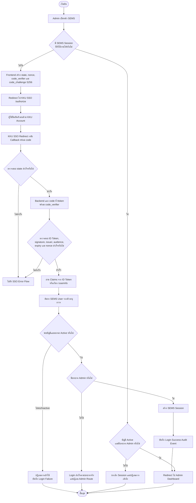

### เงื่อนไขสำคัญ

- ต้องตรวจสอบสิทธิ์ซ้ำที่ Backend ทุก Request ไม่อาศัยเฉพาะการซ่อนเมนู
- Audit Log ต้องไม่บันทึก password, access token, refresh token หรือ client secret
- การเข้าหน้า Admin ด้วยบัญชี Evaluator ให้ตอบ `403 Forbidden`

---

## 5. PF-AUTH-002: Evaluator Login Flow

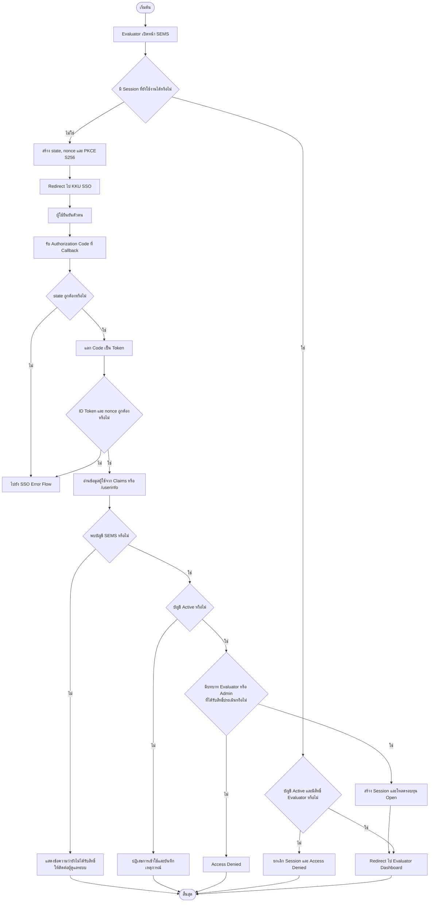

---

## 6. PF-IMP-001: Import Applicant Flow

> ข้อเสนอเชิงออกแบบ: อนุญาตให้นำเข้าข้อมูลในรอบสถานะ `Draft` เป็นหลัก หากต้องนำเข้าในรอบ `Open` ต้องกำหนดสิทธิ์และผลกระทบเพิ่มเติมอย่างชัดเจน

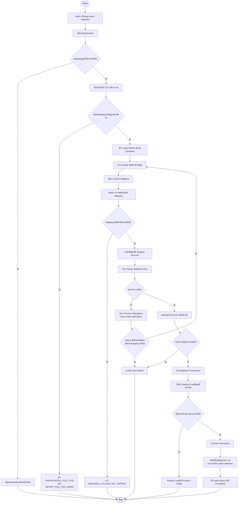

---

## 7. PF-IMP-002: Import Validation Flow

```mermaid
flowchart TD
    A([รับ Staging Records]) --> B["Normalize ชื่อคอลัมน์ ช่องว่าง<br/>รูปแบบตัวเลข และค่าว่าง"]
    B --> C["ระบุ Primary Row และ Continuation Row"]
    C --> D{"Continuation Row<br/>มี Primary Row ที่เชื่อมโยงได้หรือไม่"}
    D -- ไม่ --> E["เพิ่ม ORPHAN_CONTINUATION_ROW"]
    D -- ใช่ --> F["รวมข้อมูลหลายแถวเป็น Applicant เดียว"]
    E --> F
    F --> G["ตรวจฟิลด์บังคับ"]
    G --> H{"ข้อมูลบังคับครบหรือไม่"}
    H -- ไม่ --> I["เพิ่ม REQUIRED_FIELD_MISSING"]
    H -- ใช่ --> J["ตรวจรูปแบบรหัสนักศึกษา GPA วันที่<br/>โทรศัพท์ อีเมล และข้อมูลตัวเลข"]
    I --> J
    J --> K{"รูปแบบถูกต้องหรือไม่"}
    K -- ไม่ --> L["เพิ่ม Error Code ตามฟิลด์<br/>เช่น INVALID_GPA หรือ INVALID_DATE"]
    K -- ใช่ --> M["แปลงวันที่ พ.ศ. เป็น ค.ศ.<br/>และแปลงชนิดข้อมูล"]
    L --> M
    M --> N["ตรวจพิกัด latitude และ longitude"]
    N --> O{"พิกัดอยู่ในช่วงที่กำหนดหรือไม่"}
    O -- ไม่ --> P["เพิ่ม INVALID_COORDINATE"]
    O -- ใช่ --> Q["แยกข้อมูล กยศ. และประวัติทุนหลายปี"]
    P --> Q
    Q --> R["ตรวจข้อมูลซ้ำภายในไฟล์"]
    R --> S{"ซ้ำภายในไฟล์หรือไม่"}
    S -- ใช่ --> T["เพิ่ม DUPLICATE_STUDENT_IN_FILE"]
    S -- ไม่ --> U["ตรวจข้อมูลซ้ำกับรอบทุนในฐานข้อมูล"]
    T --> U
    U --> V{"ซ้ำกับฐานข้อมูลหรือไม่"}
    V -- ใช่ --> W["เพิ่ม DUPLICATE_STUDENT"]
    V -- ไม่ --> X["ตรวจ Referential และ Business Rules"]
    W --> X
    X --> Y["จัดกลุ่มผลเป็น Valid, Warning และ Error"]
    Y --> Z["สร้าง Validation Summary<br/>พร้อมเลขแถวและค่าที่ผิด"]
    Z --> AA{"มี Error ระดับ Blocker หรือไม่"}
    AA -- ใช่ --> AB["ส่งผล Validation Failed"]
    AA -- ไม่ --> AC["ส่งผล Validation Passed"]
    AB --> AD([คืนผลให้ Import Flow])
    AC --> AD
```

### Error Code ขั้นต่ำ

| Error Code | ความหมาย |
|---|---|
| `REQUIRED_FIELD_MISSING` | ข้อมูลบังคับว่าง |
| `REQUIRED_COLUMN_NOT_MAPPED` | ยังไม่ได้จับคู่คอลัมน์บังคับ |
| `INVALID_STUDENT_ID` | รหัสนักศึกษาผิดรูปแบบ |
| `INVALID_GPA` | GPA ไม่ใช่ตัวเลขหรืออยู่นอกช่วง 0.00–4.00 |
| `INVALID_DATE` | วันที่ไม่สามารถแปลงได้ |
| `INVALID_PHONE` | เบอร์โทรศัพท์ผิดรูปแบบ |
| `INVALID_EMAIL` | อีเมลผิดรูปแบบ |
| `INVALID_COORDINATE` | พิกัดผิดรูปแบบหรืออยู่นอกช่วง |
| `DUPLICATE_STUDENT_IN_FILE` | ผู้สมัครซ้ำภายในไฟล์ |
| `DUPLICATE_STUDENT` | ผู้สมัครซ้ำในรอบทุน |
| `ORPHAN_CONTINUATION_ROW` | แถวต่อเนื่องไม่มีแถวหลัก |
| `UNSUPPORTED_FILE_TYPE` | ชนิดไฟล์ Import ไม่รองรับ |
| `IMPORT_FILE_TOO_LARGE` | ขนาดไฟล์ Import เกินกำหนด |

---

## 8. PF-CRI-001: Criteria Setup Flow

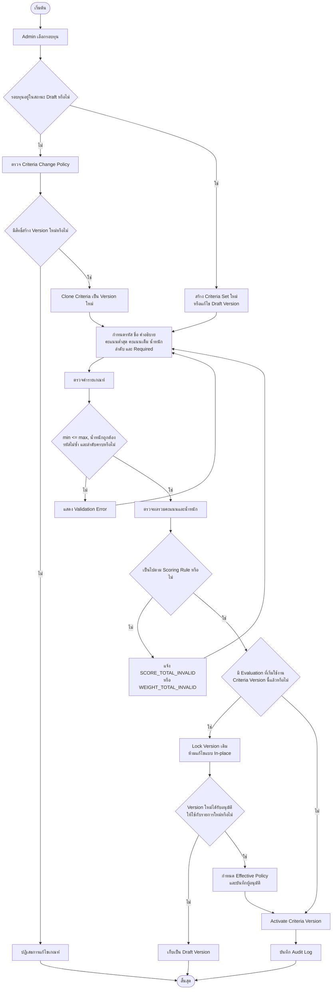

### ข้อควรยืนยัน

- เกณฑ์ที่มี Evaluation ใช้งานแล้วควรถูกล็อกถาวร
- การเปลี่ยน Criteria Version ระหว่างรอบต้องกำหนดว่าจะใช้กับ Evaluation ใหม่เท่านั้น หรือห้ามเปลี่ยนจนกว่าจะสร้างรอบใหม่
- ผลรวมของน้ำหนักและหลักการปัดเศษต้องอ้างอิง Scoring Rule Specification

---

## 9. PF-EVA-001: Evaluator Select Applicant Flow

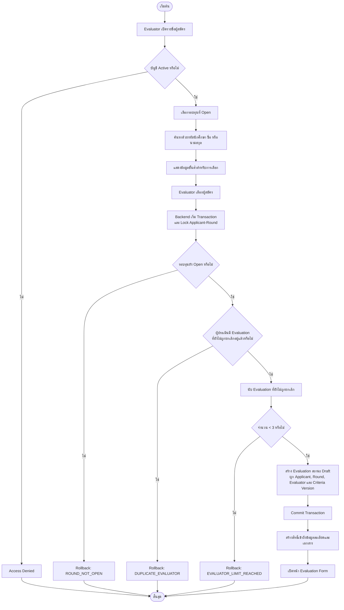

### Concurrency Control

การตรวจจำนวนผู้ประเมินและการสร้าง Evaluation ต้องอยู่ใน Transaction เดียวกัน เพื่อป้องกันอาจารย์หลายคนเลือกผู้สมัครพร้อมกันจนเกิน 3 คน

---

## 10. PF-EVA-002: Draft–Review–Submit Flow

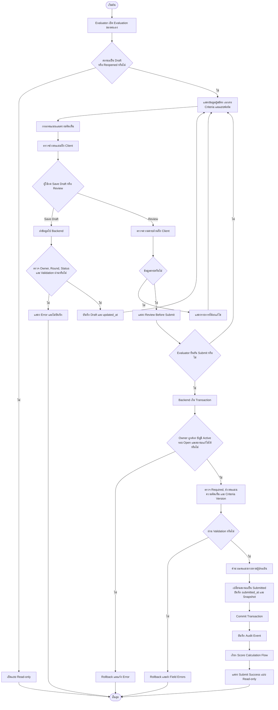

---

## 11. PF-SCR-001: Score Calculation Flow

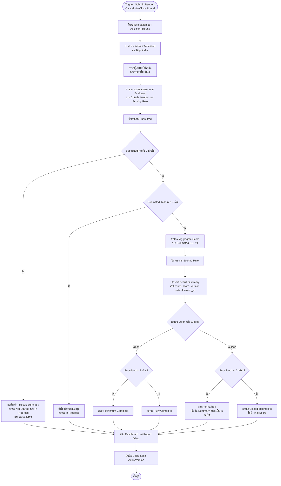

### หลักการคำนวณ

- Draft, Reopened ที่ยังไม่ Submit และรายการที่ถูกยกเลิกต้องไม่ถูกนำมาคำนวณ
- Result Summary มีได้ไม่เกิน 1 รายการต่อ Applicant-Round แต่ควรมี `calculation_version` หรือประวัติการคำนวณ
- สูตร น้ำหนัก ค่าเฉลี่ย และการปัดเศษต้องอ่านจาก Scoring Rule Specification ที่อนุมัติแล้ว

---

## 12. PF-SCR-002: Third Evaluator Recalculation Flow

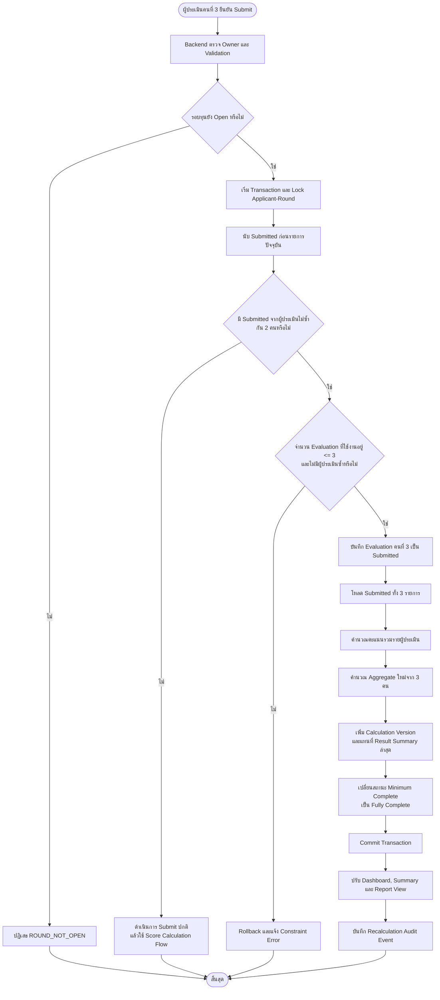

---

## 13. PF-RND-001: Close Scholarship Round Flow

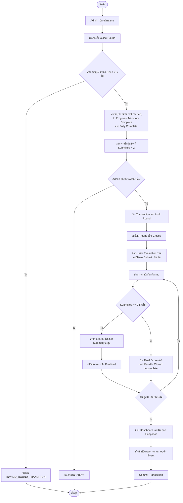

### ผลหลังปิดรอบ

- ห้ามสร้าง Evaluation ใหม่
- ห้าม Submit เพิ่มเติม
- ผู้สมัครที่ Submitted อย่างน้อย 2 คนเป็น `Finalized`
- ผู้สมัครที่ Submitted น้อยกว่า 2 คนเป็น `Closed Incomplete`
- การแก้ไขภายหลังต้องผ่าน Reopen Policy และอาจต้องเปิดรอบตามกระบวนการอนุมัติ

---

## 14. PF-RPT-001: Export Report Flow

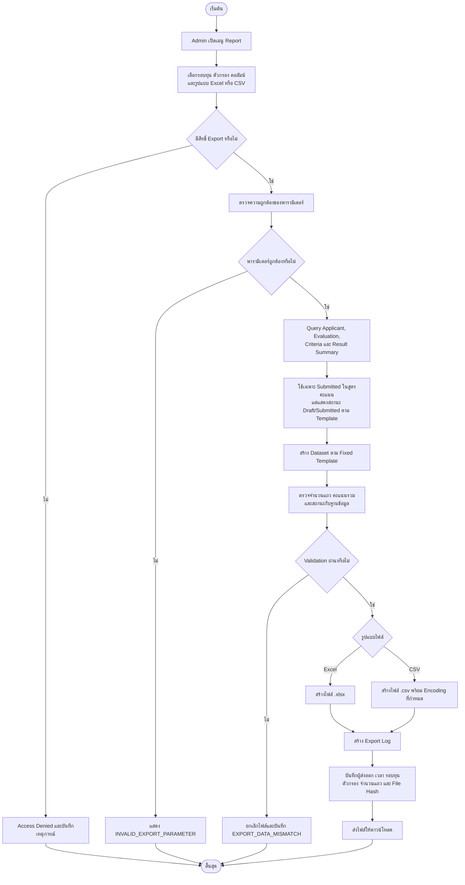

---

## 15. PF-EVA-003: Reopen Evaluation Flow

> Confirmed response: owner requests (or staff acts on behalf with reason); Head/delegate independently approves; preserve immutable submitted revision; technical Admin cannot self-approve.

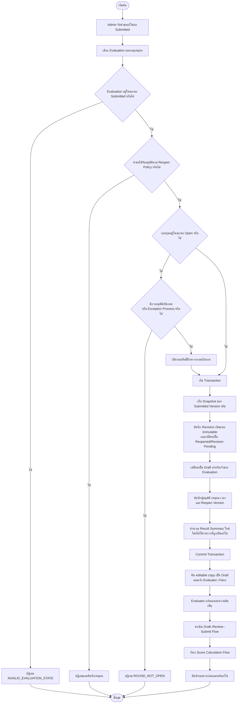

### Audit Data ที่ควรจัดเก็บ

- Evaluation ID และ Version เดิม
- ผู้ร้องขอ ผู้อนุมัติ และผู้แก้ไข
- เหตุผลการ Reopen
- เวลา Reopen และเวลา Submit ใหม่
- คะแนนและความคิดเห็นก่อน–หลัง
- ผลกระทบต่อ Result Summary และสถานะผู้สมัคร

---

## 16. PF-AUTH-003: SSO Error Flow

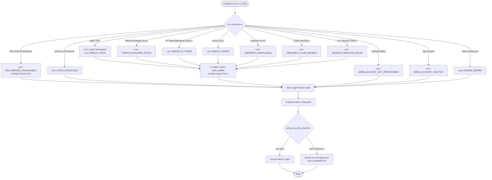

### แนวทาง Error Handling

- ข้อผิดพลาดด้าน `state`, `nonce`, signature และ token ต้องยกเลิกกระบวนการทันที
- ข้อความที่แสดงต่อผู้ใช้ไม่ควรเปิดเผย token, stack trace, client secret หรือรายละเอียดภายใน
- Log ควรมี `traceId`, เวลา, endpoint, error category และ user identifier เท่าที่จำเป็น
- เมื่อ KKU SSO ไม่พร้อมใช้งาน ควรแยกจากกรณีบัญชี SEMS ไม่มีสิทธิ์ เพื่อให้ผู้ใช้แก้ปัญหาได้ถูกจุด

---

## 17. Traceability กับ Requirement หลัก

| Requirement/Rule | Process Flow ที่ครอบคลุม |
|---|---|
| KKU SSO, Session, RBAC | PF-AUTH-001, PF-AUTH-002, PF-AUTH-003 |
| Import CSV/Excel, Mapping, Preview, Validation | PF-IMP-001, PF-IMP-002 |
| Criteria Versioning และ Lock หลังเริ่มประเมิน | PF-CRI-001 |
| ผู้ประเมินไม่ซ้ำและไม่เกิน 3 คน | PF-EVA-001 |
| Draft, Review, Submit | PF-EVA-002 |
| ใช้เฉพาะ Submitted ในการคำนวณ | PF-SCR-001 |
| คำนวณใหม่เมื่อผู้ประเมินคนที่ 3 Submit | PF-SCR-002 |
| Finalized และ Closed Incomplete | PF-RND-001 |
| Excel/CSV Export และ Export Audit | PF-RPT-001 |
| Reopen หลัง Submit | PF-EVA-003 |

## 18. ประเด็นที่ต้องยืนยันก่อนอนุมัติเอกสาร

1. อนุญาตให้นำเข้าผู้สมัครเฉพาะรอบ `Draft` หรืออนุญาตในรอบ `Open` ด้วย
2. Criteria Version ใหม่สามารถเริ่มใช้กลางรอบได้หรือไม่

3. ผู้มีอำนาจอนุมัติ Reopen Evaluation คือใคร
4. เมื่อรอบ `Closed` ต้องการแก้ Evaluation จะเปิดรอบกลับเป็น `Open` หรือใช้ Exception เฉพาะรายการ
5. ความคิดเห็นเป็นข้อมูลบังคับก่อน Submit หรือไม่
6. สูตรคะแนน น้ำหนัก และหลักการปัดเศษฉบับสุดท้าย
7. Template และ Encoding ของ CSV
8. ระยะเวลาจัดเก็บ Export File, Import File และ Audit Log
9. รูปแบบ Logout ที่ใช้: ออกจาก SEMS เท่านั้น หรือ Full KKU SSO Logout

## Confirmed additional controlled flows

### PF-COR-001 — Controlled Correction

`Admin request → verify application/version → reject student/round/type change → authorize → store before/after snapshot + reason → apply transaction → recalculate affected summaries → audit`.

### PF-RND-002 — Round Reopen and report replacement

`Head/System Owner request → designated approval → reject Archived → mark prior Final snapshot Superseded → reopen Closed round → permitted corrections/resubmissions → recalculate → create new immutable Final snapshot`.

### PF-DOC-001 — Quarantine and malware scan

`Validate extension/MIME/signature/size → store private Quarantined → scan → Clean enables authorized short-lived download; Rejected/Unavailable remains inaccessible → audit`.

### PF-AUTH-004 — Pre-provisioned account and inactive account

`KKU callback → find pre-provisioned SEMS account → bind stable sub on first login → deny USER_NOT_PROVISIONED or inactive → enforce 30-minute idle/8-hour absolute session → revoke on inactive`.

## Revision History

| Version | Date | Author | Change |
|---|---|---|---|
| v0.3 | 2026-07-24 | SEMS Design Team | Confirmed reopen and added Controlled Correction, round/report, quarantine and account/session flows. |
| v1.2 | 2026-07-24 | SEMS Design Team | Aligned import and closed-round errors with module-specific canonical codes. |
| v1.1 | 2026-07-23 | SEMS Design Team | Standardized observability correlation on `traceId`. |
| v1.0 | 2026-07-23 | SEMS Design Team | Initial process flow specification draft. |
