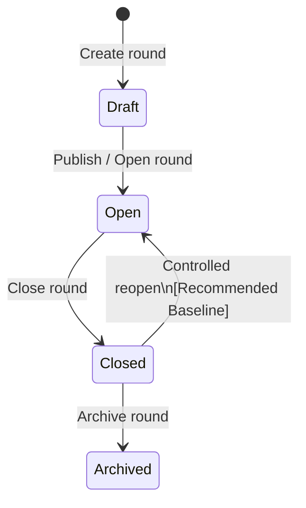
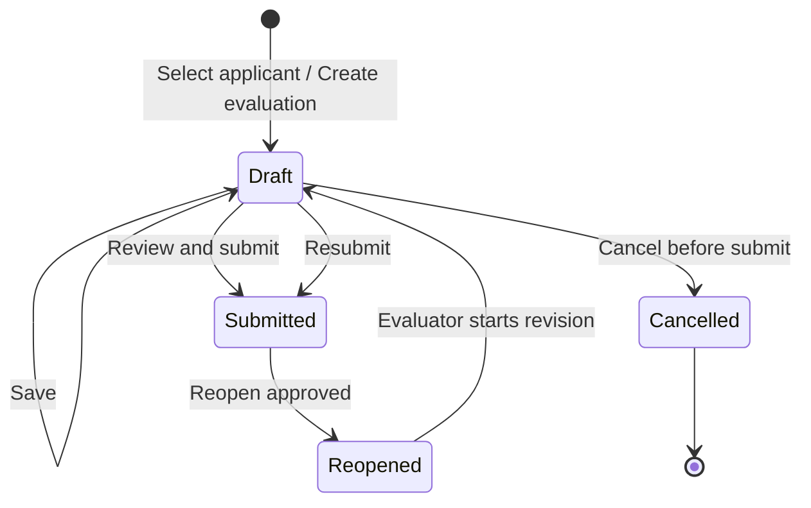

# SEMS State Transition Specification

| Metadata | Value |
| :--- | :--- |
| Document ID | `SEMS-STS-001` |
| Version | **v0.3** |
| Last Updated | **2026-07-24** |
| Author | **SEMS Design Team** |
| Status | **Confirmed Response — Pending Formal Approval** |

---

## 1. วัตถุประสงค์

เอกสารนี้กำหนดสถานะ เงื่อนไขการเปลี่ยนสถานะ การดำเนินการที่อนุญาต ผลกระทบต่อข้อมูล และกฎตรวจสอบสำหรับองค์ประกอบหลักของระบบ SEMS ได้แก่

1. รอบทุน (`Scholarship Round`)
2. ผลการประเมินรายผู้ประเมิน (`Evaluation`)
3. สถานะความคืบหน้าของผู้สมัคร (`Applicant Evaluation Status`)
4. ผลสรุปคะแนน (`Result Summary`)

วัตถุประสงค์หลักคือป้องกันการเปลี่ยนสถานะที่ไม่ถูกต้อง ทำให้การคำนวณคะแนนสอดคล้องกัน และรองรับการตรวจสอบย้อนหลังผ่าน Audit Log

---

## 2. เอกสารอ้างอิงและกฎพื้นฐาน

เอกสารนี้อ้างอิงจาก:

- [`SEMS-project-proposal.pdf`](../../Requirements/Proposal/SEMS-project-proposal.pdf)
- [`SEMS_Requirement_Decision_Analysis.md`](../../Requirements/SEMS_Requirement_Decision_Analysis.md)
- กฎผู้ประเมินขั้นต่ำ 2 คน สูงสุด 3 คนต่อผู้สมัครต่อรอบทุน
- ใช้เฉพาะ Evaluation สถานะ `Submitted` ในการคำนวณคะแนนสรุป
- ผู้ประเมินคนที่ 3 สามารถส่งผลเพิ่มเติมได้ก่อนรอบทุนปิด
- ผู้สมัครที่รอบปิดและมี Submitted น้อยกว่า 2 รายการต้องเป็น `Closed Incomplete` และไม่มี Final Score

### 2.1 การระบุแหล่งที่มาของข้อกำหนด

- **[Confirmed from Proposal]** หมายถึงมีข้อกำหนดรองรับใน Proposal
- **[Confirmed Response]** means the transition is supported by the stakeholder response; formal baseline approval evidence is still pending.

---

## 3. หลักการทั่วไปของ State Transition

1. การเปลี่ยนสถานะทุกครั้งต้องดำเนินการผ่าน Business Service ของ Backend ห้ามแก้ค่า `status` ในฐานข้อมูลโดยตรง
2. ระบบต้องตรวจสอบสถานะปัจจุบัน สิทธิ์ผู้ใช้ เงื่อนไขธุรกิจ และข้อมูลที่เกี่ยวข้องก่อนเปลี่ยนสถานะ
3. การเปลี่ยนสถานะที่กระทบจำนวนผู้ประเมิน คะแนนสรุป หรือสถานะผู้สมัครต้องดำเนินการภายใน Database Transaction
4. การเปลี่ยนสถานะสำคัญต้องบันทึก Audit Event อย่างน้อย: ผู้ดำเนินการ สถานะเดิม สถานะใหม่ เหตุผล เวลา และข้อมูลอ้างอิง
5. สถานะที่คำนวณจากข้อมูลอื่น เช่น Applicant Evaluation Status ควรคำนวณจากแหล่งข้อมูลจริง หรือเก็บเป็น Cache ที่สามารถคำนวณใหม่ได้
6. รายการสถานะ `Cancelled` ไม่นับรวมในจำนวนผู้ประเมินและไม่นำไปคำนวณคะแนน
7. ห้ามเปลี่ยนสถานะแบบข้ามขั้นตอน เว้นแต่ระบุไว้ในเอกสารนี้

---

# 4. Scholarship Round State Machine

## 4.1 รายการสถานะรอบทุน

| State | ความหมาย | การแก้ไขข้อมูล | การประเมิน | ลักษณะสถานะ |
|---|---|---|---|---|
| `Draft` | รอบทุนอยู่ระหว่างเตรียมข้อมูล ผู้สมัคร เกณฑ์ และการตั้งค่า | แก้ไขได้ตามสิทธิ์ผู้ดูแล | ห้ามสร้างหรือ Submit Evaluation | Initial State |
| `Open` | เปิดให้ผู้ประเมินค้นหา เลือกผู้สมัคร บันทึก Draft และ Submit | จำกัดการแก้ไขข้อมูลที่กระทบการประเมิน | อนุญาตตามกฎระบบ | Active State |
| `Closed` | ปิดรับการเลือกและส่งผลเพิ่มเติม ระบบตรึงผลล่าสุด | แก้ไขเฉพาะข้อมูลที่ไม่กระทบผล หรือผ่านกระบวนการอนุมัติ | ห้ามสร้างหรือ Submit ใหม่ | Finalization State |
| `Archived` | จัดเก็บรอบทุนที่สิ้นสุดแล้วเพื่อการอ้างอิง | Read-only | ห้ามดำเนินการประเมิน | Terminal State |

## 4.2 แผนภาพสถานะรอบทุน



> `Closed → Open` เป็น Transition กรณีพิเศษ ไม่ใช่กระบวนการปกติ ต้องมีสิทธิ์อนุมัติ เหตุผล และ Audit Log ส่วน `Archived` ไม่สามารถย้อนกลับได้ใน Baseline นี้

## 4.3 ตาราง Transition ของรอบทุน

| Transition ID | From | To | ผู้ดำเนินการ | Guard Conditions | System Effects |
|---|---|---|---|---|---|
| `TR-RND-001` | ไม่มี | `Draft` | ผู้ดูแลระบบ | ผู้ใช้ Active และมีสิทธิ์จัดการรอบทุน | สร้าง `round_id`, กำหนด `created_at`, บันทึก Audit |
| `TR-RND-002` | `Draft` | `Open` | ผู้ดูแลระบบ | ข้อมูลรอบทุนครบ, วันที่ถูกต้อง, มี Active Criteria Version, ผ่าน Pre-open Validation และมี Application ≥1; ไม่มี Application เป็น Blocking Error `NO_APPLICANTS` | กำหนด `opened_at`, เปิดการค้นหา/เลือก และล็อก Criteria Version ที่ใช้งาน |
| `TR-RND-003` | `Open` | `Closed` | ผู้ดูแลระบบ/ผู้มีสิทธิ์ปิดรอบ | ยืนยันการปิดรอบ, ไม่มี Transition อื่นกำลังทำงาน, ผ่านการตรวจสอบรายการค้างที่ระบบแสดง | กำหนด `closed_at`, ห้ามสร้าง/Submit Evaluation ใหม่, คำนวณสถานะผู้สมัครทุกคน, Finalize ผู้สมัครที่ Submitted ≥ 2 |
| `TR-RND-004` | `Closed` | `Archived` | ผู้ดูแลระบบ | ผลสรุปและรายงานผ่านการตรวจสอบ, ไม่มีคำขอ Reopen ค้าง, ยืนยันการ Archive | กำหนด `archived_at`, เปลี่ยนเป็น Read-only, คง Audit และข้อมูลทั้งหมด |
| `TR-RND-005` | `Closed` | `Open` | ผู้อนุมัติที่ได้รับมอบหมาย | **[Confirmed Response]** มีคำขอ เหตุผล เลขอ้างอิง, ยังไม่ Archived, ผู้อนุมัติมีสิทธิ์ | กำหนด `reopened_at`, ทำ Final Report เดิมเป็น immutable `Superseded`, คำนวณ Application Status ใหม่, เปิดเฉพาะกิจกรรมที่อนุมัติ |

## 4.4 เงื่อนไขก่อนเปิดรอบทุน

ก่อน `Draft → Open` ระบบต้องตรวจสอบอย่างน้อย:

- ชื่อและรหัสรอบทุนไม่ว่างและไม่ซ้ำตามกฎที่กำหนด
- วันเริ่มต้นไม่มากกว่าวันสิ้นสุด
- มี Criteria Version ที่ Active และผ่าน Validation
- มี Application อย่างน้อย 1 ราย (Blocking Error เมื่อไม่มี)
- คะแนนต่ำสุด คะแนนเต็ม น้ำหนัก และลำดับของทุกเกณฑ์ถูกต้อง
- ผู้ดูแลยืนยันว่าข้อมูลรอบทุนพร้อมใช้งาน
- ไม่มีการเปลี่ยนแปลง Criteria ที่ยังไม่ได้บันทึกหรือ Publish

**[Confirmed Response — RD-023]** ไม่มี Application เป็น Blocking Error `NO_APPLICANTS`; หลังเปิดรอบยัง Import ใบสมัครใหม่ได้

## 4.5 การดำเนินการที่อนุญาตตามสถานะรอบทุน

| Operation | Draft | Open | Closed | Archived |
|---|:---:|:---:|:---:|:---:|
| แก้ไขข้อมูลพื้นฐานรอบทุน | Yes | Limited | No* | No |
| Import ผู้สมัคร | Yes | Yes** | No | No |
| แก้ไข/เปลี่ยน Criteria Version | Yes | No เมื่อมี Evaluation | No | No |
| ค้นหาและเลือกผู้สมัคร | No | Yes | No | No |
| สร้าง Evaluation | No | Yes | No | No |
| บันทึก Draft | No | Yes | No*** | No |
| Submit Evaluation | No | Yes | No | No |
| Export รายงาน | Preview | Yes | Yes | Yes |
| Archive | No | No | Yes | No |

`*` การแก้ไขข้อมูลที่ไม่กระทบผล เช่นคำอธิบาย อาจอนุญาตตามสิทธิ์และต้อง Audit
`**` ต้องไม่ทำให้ข้อมูลผู้สมัครที่มี Evaluation อยู่แล้วเปลี่ยนตัวตนหรือความสัมพันธ์
`***` Draft เดิมอ่านได้ แต่ห้ามแก้ไข เว้นแต่มีการ Controlled Reopen รอบทุน

---

# 5. Evaluation State Machine

## 5.1 รายการสถานะ Evaluation

| State | ความหมาย | นับเป็น Active Evaluation | นับเป็น Submitted | ใช้คำนวณคะแนน |
|---|---|:---:|:---:|:---:|
| `Draft` | ผู้ประเมินเริ่มรายการแล้วและยังแก้ไขได้ | Yes | No | No |
| `Submitted` | ผู้ประเมินตรวจสอบและยืนยันส่งสำเร็จ | Yes | Yes | Yes |
| `Reopened` | ผลที่เคย Submitted ได้รับอนุมัติให้เปิดแก้ไข | Yes | No | No |
| `Cancelled` | รายการถูกยกเลิกและไม่ใช้งานแล้ว | No | No | No |

> `Reopened` และ `Cancelled` เป็นสถานะเพิ่มเติมที่จำเป็นต่อการควบคุม Reopen Policy และการคืนช่องผู้ประเมิน

## 5.2 แผนภาพสถานะ Evaluation



## 5.3 ตาราง Transition ของ Evaluation

| Transition ID | From | To | ผู้ดำเนินการ | Guard Conditions | System Effects |
|---|---|---|---|---|---|
| `TR-EVA-001` | ไม่มี | `Draft` | อาจารย์ผู้ประเมิน | รอบ `Open`, บัญชี Active, ไม่มี Active Evaluation ซ้ำของผู้ประเมินคนเดิม, Active Evaluation ของผู้สมัคร < 3, Criteria Version พร้อมใช้งาน | สร้าง Evaluation ภายใน Transaction, จองช่องผู้ประเมิน, บันทึก `created_at` |
| `TR-EVA-002` | `Draft` | `Draft` | เจ้าของ Evaluation | รอบ `Open`, ผู้ใช้เป็นเจ้าของ, Evaluation ไม่ถูกยกเลิก | บันทึกคะแนน/ความคิดเห็น, ปรับ `updated_at`, ไม่คำนวณ Result Summary |
| `TR-EVA-003` | `Draft` | `Submitted` | เจ้าของ Evaluation | รอบ `Open`, คะแนนบังคับครบ, คะแนนอยู่ในช่วง, Validation ผ่าน, ผู้ใช้ยืนยันหน้า Review | กำหนด `submitted_at`, ล็อกการแก้ไข, คำนวณคะแนนรายผู้ประเมิน, คำนวณ Applicant Status และ Result Summary ใหม่ |
| `TR-EVA-004` | `Draft` | `Cancelled` | เจ้าของ Evaluation หรือผู้ดูแลตามสิทธิ์ | ยังไม่เคย Submitted, ผู้ใช้ยืนยันการยกเลิก | กำหนด `cancelled_at`, บันทึกเหตุผล, คืนช่องผู้ประเมินภายใน Transaction, คำนวณ Applicant Status ใหม่ |
| `TR-EVA-005` | `Submitted` | `Reopened` | Head/delegate | **[Confirmed Response]** owner/staff-on-behalf request, reason/reference, round `Open`; approver independent from technical requester; immutable Snapshot เดิม | ผลเดิมหยุดถูกนำไปคำนวณ, กำหนด `reopened_at`, เพิ่ม Revision Number, คำนวณ Result Summary และ Application Status ใหม่ |
| `TR-EVA-006` | `Reopened` | `Draft` | เจ้าของ Evaluation | Reopen ยังไม่หมดอายุ, รอบ `Open`, ผู้ใช้เป็นเจ้าของ | เปิดฟอร์มแก้ไขจากสำเนาข้อมูลล่าสุด, บันทึก `revision_started_at` |
| `TR-EVA-007` | `Draft` | `Submitted` | เจ้าของ Evaluation | เงื่อนไขเดียวกับ `TR-EVA-003`; กรณี Revision ต้องอ้างอิง Snapshot ก่อนหน้า | สร้าง Revision Audit, คำนวณผลใหม่, ปิดคำขอ Reopen |

## 5.4 กฎการสร้าง Evaluation

ระบบต้องตรวจสอบภายใน Transaction เดียวกันว่า:

```text
round.status == OPEN
AND evaluator.account_status == ACTIVE
AND active_evaluation(round, applicant, evaluator) == 0
AND active_evaluation_count(round, applicant) < 3
```

โดย `active_evaluation` หมายถึง Evaluation สถานะ `Draft`, `Submitted` หรือ `Reopened` และไม่รวม `Cancelled`

ระบบต้องใช้กลไก Database Lock, Serializable Transaction, Advisory Lock หรือแนวทางที่ให้ผลเทียบเท่า เพื่อป้องกันผู้ประเมินหลายคนเลือกผู้สมัครพร้อมกันแล้วเกิน 3 รายการ

## 5.5 กฎการ Submit

ก่อน `Draft → Submitted` ระบบต้องตรวจสอบ:

1. รอบทุนเป็น `Open`
2. ผู้ใช้เป็นเจ้าของ Evaluation และบัญชี Active
3. Evaluation ยังไม่ถูกยกเลิก
4. คะแนนทุกเกณฑ์ที่บังคับกรอกครบถ้วน
5. คะแนนแต่ละเกณฑ์อยู่ระหว่างค่าต่ำสุดและคะแนนเต็ม
6. ฟิลด์ความคิดเห็นผ่านกฎ Required/Length ที่ยืนยันไว้
7. Criteria Version ของ Evaluation ตรงกับ Version ที่ถูกล็อกตอนสร้างรายการ
8. Request ไม่ใช่การ Submit ซ้ำจาก Double Click หรือ Retry เดิม

ระบบควรรองรับ `idempotency_key` หรือการตรวจสอบสถานะซ้ำ เพื่อไม่ให้เกิดการ Submit ซ้ำ

## 5.6 Reopen Policy — Confirmed Response

**สถานะ:** รอผู้มีอำนาจยืนยัน

แนวทางที่แนะนำ:

- เจ้าของ Evaluation ส่งคำขอ; เจ้าหน้าที่งานทุนอาจส่งแทนโดยระบุผู้รับการดำเนินการแทนและเหตุผล
- Head of Scholarship Office หรือผู้ได้รับมอบหมายอนุมัติ; technical Admin ห้ามอนุมัติคำขอของตนเอง
- ผู้อนุมัติเป็นหัวหน้างานทุนหรือบทบาทที่ได้รับมอบหมาย
- อนุญาตเฉพาะขณะที่รอบทุนเป็น `Open`
- หากรอบปิดแล้ว ต้องดำเนินการ `Closed → Open` แบบ Controlled Reopen ก่อน
- ระบบต้องเก็บ Snapshot คะแนน ความคิดเห็น คะแนนรวม สถานะ ผู้แก้ไข และเวลาของ Revision เดิม
- เมื่อเปลี่ยน `Submitted → Reopened` ผลรายการนั้นต้องหยุดถูกใช้คำนวณทันที
- เมื่อ Submit ใหม่ ระบบต้องคำนวณ Result Summary, Dashboard และรายงานใหม่
- ห้ามแก้ค่าใน Revision เดิมโดยตรง

## 5.7 Transition ที่ไม่อนุญาต

| Invalid Transition | เหตุผล |
|---|---|
| `Submitted → Draft` โดยตรง | ต้องผ่านกระบวนการอนุมัติ Reopen |
| `Submitted → Cancelled` โดยเจ้าของรายการ | ผลที่ส่งแล้วต้องใช้ Reopen/Void Policy |
| `Cancelled → Draft` | ต้องสร้าง Evaluation ใหม่เพื่อคง Audit ที่ชัดเจน |
| `Draft → Submitted` เมื่อรอบ Closed | ปิดรับผลแล้ว |
| สร้าง Evaluation เมื่อผู้สมัครมี Active Evaluation ครบ 3 | เกินจำนวนสูงสุด |
| สร้าง Evaluation ซ้ำโดยผู้ประเมินคนเดิม | ผิด Unique Business Rule |
| `Reopened → Submitted` โดยไม่ผ่าน Draft/Review | ต้องบันทึก Revision และผ่าน Validation ใหม่ |

---

# 6. Applicant Evaluation Status

## 6.1 ลักษณะของสถานะ

Applicant Evaluation Status เป็น **Derived State** ต่อ `round_application_id` (หนึ่งใบสมัครต่อประเภททุน) ไม่ใช่สถานะที่ผู้ใช้แก้ไขโดยตรง ระบบคำนวณจาก:

- สถานะรอบทุน
- จำนวน Active Evaluation
- จำนวน Evaluation สถานะ `Submitted`
- การมี Result Summary ที่พร้อมใช้งาน

## 6.2 นิยามตัวแปร

```text
active_count    = จำนวน Evaluation ที่ไม่ถูกยกเลิก
                  และมีสถานะ Draft, Submitted หรือ Reopened

submitted_count = จำนวน Evaluation สถานะ Submitted
                  จากผู้ประเมินไม่ซ้ำกันและไม่ถูกยกเลิก
```

Constraint:

```text
0 <= submitted_count <= active_count <= 3
```

## 6.3 ตารางตัดสินสถานะผู้สมัคร

ระบบต้องประเมินกฎตามลำดับความสำคัญจากบนลงล่าง:

| Priority | Round State | submitted_count | active_count / เงื่อนไขเพิ่ม | Applicant Status | Final Score |
|---:|---|---:|---|---|---|
| 1 | `Closed` หรือ `Archived` | `>= 2` | ไม่เกี่ยวข้อง | `Finalized` | มี |
| 2 | `Closed` หรือ `Archived` | `< 2` | ไม่เกี่ยวข้อง | `Closed Incomplete` | ไม่มี |
| 3 | `Open` | `3` | `active_count = 3` | `Fully Complete` | Confirmed Response |
| 4 | `Open` | `2` | `active_count >= 2` | `Minimum Complete` | Confirmed Response |
| 5 | `Open` | `< 2` | `active_count >= 1` | `In Progress` | ไม่มี |
| 6 | `Draft` หรือ `Open` | `0` | `active_count = 0` | `Not Started` | ไม่มี |

### 6.3.1 Pseudocode

```text
if round.status in [CLOSED, ARCHIVED]:
    if submitted_count >= 2:
        return FINALIZED
    return CLOSED_INCOMPLETE

if round.status == OPEN:
    if submitted_count == 3:
        return FULLY_COMPLETE
    if submitted_count == 2:
        return MINIMUM_COMPLETE
    if active_count >= 1:
        return IN_PROGRESS
    return NOT_STARTED

# Draft round
return NOT_STARTED
```

## 6.4 คำอธิบายแต่ละสถานะ

| Status | เงื่อนไข | ความหมายทางธุรกิจ | การดำเนินการถัดไป |
|---|---|---|---|
| `Not Started` | ไม่มี Active Evaluation | ยังไม่มีผู้ประเมินเลือกผู้สมัคร | รอผู้ประเมินเลือกเมื่อรอบ Open |
| `In Progress` | Active Evaluation ≥ 1 และ Submitted < 2 | เริ่มประเมินแล้วแต่ยังไม่ครบขั้นต่ำ | รอ Draft/Submit เพิ่มเติม |
| `Minimum Complete` | Submitted = 2 และรอบ Open | ครบขั้นต่ำและมีคะแนนสรุปล่าสุด แต่ยังรับคนที่ 3 ได้ | อนุญาตผู้ประเมินคนที่ 3 หาก Active Count < 3 |
| `Fully Complete` | Submitted = 3 และรอบ Open | ครบจำนวนสูงสุด | ห้ามสร้าง Evaluation เพิ่ม |
| `Finalized` | รอบ Closed/Archived และ Submitted ≥ 2 | ผลสรุปล่าสุดถูกตรึงเป็นผลสุดท้าย | อ่านและ Export ได้ |
| `Closed Incomplete` | รอบ Closed/Archived และ Submitted < 2 | ปิดรอบโดยผลไม่ครบขั้นต่ำ | ไม่มี Final Score; แสดงข้อมูลที่มีเพื่อ Audit ได้ |

## 6.5 ตัวอย่างกรณีสำคัญ

| เหตุการณ์ | ก่อน | หลัง |
|---|---|---|
| ผู้ประเมินคนแรกเลือกผู้สมัคร | `Not Started` | `In Progress` |
| คนแรก Submit | `In Progress` | `In Progress` |
| คนที่สอง Submit | `In Progress` | `Minimum Complete` |
| คนที่สามสร้าง Draft | `Minimum Complete` | `Minimum Complete` |
| คนที่สาม Submit | `Minimum Complete` | `Fully Complete` |
| ปิดรอบเมื่อมี Submitted 2 | `Minimum Complete` | `Finalized` |
| ปิดรอบเมื่อมี Submitted 1 | `In Progress` | `Closed Incomplete` |
| Reopen หนึ่งผลจาก Submitted 2 | `Minimum Complete` | `In Progress` |
| Reopen หนึ่งผลจาก Submitted 3 | `Fully Complete` | `Minimum Complete` |
| ยกเลิก Draft รายการเดียว | `In Progress` | `Not Started` |

---

# 7. Result Summary Lifecycle

Result Summary ไม่จำเป็นต้องมี State Machine ที่ผู้ใช้สั่งเปลี่ยนโดยตรง แต่ระบบควรกำหนดสถานะเพื่อแยกผลชั่วคราวออกจากผลสุดท้าย

| Summary State | เงื่อนไข | การแสดงผล |
|---|---|---|
| `Unavailable` | Submitted < 2 | ไม่มีคะแนนสรุป |
| `Provisional` | รอบ Open และ Submitted 2–3 | แสดงคะแนนล่าสุด พร้อมข้อความว่าอาจเปลี่ยนแปลงได้ |
| `Final` | รอบ Closed/Archived และ Submitted ≥ 2 | แสดงเป็น Final Score |
| `Invalidated` | ผลที่เคยใช้คำนวณถูก Reopen/ยกเลิกจน Submitted < 2 | ซ่อนคะแนนสรุปปัจจุบัน แต่เก็บ Revision/Audit เดิม |

## 7.1 กฎการคำนวณใหม่

ระบบต้อง Recalculate Result Summary เมื่อเกิดเหตุการณ์ต่อไปนี้:

- Evaluation เปลี่ยนเป็น `Submitted`
- Evaluation เปลี่ยนจาก `Submitted` เป็น `Reopened`
- Evaluation ที่ Reopen ถูก Submit ใหม่
- Evaluation ถูก Void/Cancelled ตามนโยบายที่อนุมัติ
- รอบทุนเปลี่ยน `Open → Closed`
- รอบทุนเปลี่ยน `Closed → Open`

ระบบต้องปรับปรุง Result Summary, Dashboard, Applicant Status และข้อมูลสำหรับ Export ภายใน Transaction หรือผ่าน Reliable Event Processing ที่รับประกันความสอดคล้องกัน

---

# 8. Transition Permission Matrix

| Action | Evaluator | Admin | Process Approver |
|---|:---:|:---:|:---:|
| สร้างรอบ Draft | No | Yes | Optional |
| เปิด/ปิดรอบ | No | Yes* | Yes* |
| Archive รอบ | No | Yes* | Yes* |
| สร้าง Evaluation | Yes | No** | No |
| แก้ไข Draft ของตนเอง | Yes | No | No |
| Submit ของตนเอง | Yes | No | No |
| ยกเลิก Draft ของตนเอง | Yes*** | Yes | No |
| ขอ Reopen | Yes | Yes | No |
| อนุมัติ Reopen | No | No**** | Yes |
| ดูผลของผู้อื่น | No | Yes | ตามสิทธิ์ |

`*` ต้องกำหนดสิทธิ์เฉพาะและบันทึก Audit
`**` Admin ไม่ควรสร้าง Evaluation แทนอาจารย์ เว้นแต่นโยบายระบุเป็นกรณีพิเศษ
`***` [Recommended Baseline] อนุญาตก่อน Submit พร้อม Confirmation
`****` หากองค์กรไม่มีบทบาท Approver แยก อาจมอบหมาย Admin บางบัญชีได้ แต่ต้องแยก Permission

---

# 9. Audit Requirements

ระบบต้องบันทึกเหตุการณ์อย่างน้อย:

| Audit Event Code | เหตุการณ์ |
|---|---|
| `ROUND_CREATED` | สร้างรอบทุน |
| `ROUND_OPENED` | เปิดรอบทุน |
| `ROUND_CLOSED` | ปิดรอบทุน |
| `ROUND_REOPENED` | เปิดรอบทุนที่ปิดแล้ว |
| `ROUND_ARCHIVED` | Archive รอบทุน |
| `EVALUATION_CREATED` | สร้าง Draft และจองช่องผู้ประเมิน |
| `EVALUATION_DRAFT_SAVED` | บันทึก Draft |
| `EVALUATION_SUBMITTED` | Submit สำเร็จ |
| `EVALUATION_CANCELLED` | ยกเลิก Draft |
| `REOPEN_REQUESTED` | ส่งคำขอ Reopen |
| `REOPEN_APPROVED` | อนุมัติ Reopen |
| `REOPEN_REJECTED` | ปฏิเสธ Reopen |
| `EVALUATION_REOPENED` | เปลี่ยน Submitted เป็น Reopened |
| `EVALUATION_RESUBMITTED` | Submit Revision ใหม่ |
| `RESULT_RECALCULATED` | คำนวณคะแนนสรุปใหม่ |
| `APPLICANT_STATUS_CHANGED` | สถานะผู้สมัครเปลี่ยน |

ข้อมูล Audit ขั้นต่ำ:

```text
audit_id
event_code
entity_type
entity_id
round_id
applicant_id (ถ้ามี)
evaluation_id (ถ้ามี)
actor_user_id
actor_role
previous_state
new_state
reason
request_reference
occurred_at
trace_id
metadata
```

ห้ามจัดเก็บรหัสผ่าน Token หรือข้อมูลลับใน Audit Log

---

# 10. Error Codes

| Error Code | HTTP แนวทาง | เงื่อนไข |
|---|---:|---|
| `INVALID_ROUND_STATUS_TRANSITION` | 409 | สถานะต้นทางไม่อนุญาตให้ไปสถานะเป้าหมาย |
| `ROUND_NOT_OPEN` | 409 | พยายามสร้าง แก้ไข หรือ Submit ขณะรอบไม่ Open |
| `ROUND_ARCHIVED_READ_ONLY` | 409 | พยายามแก้ข้อมูลรอบ Archived |
| `ROUND_NOT_READY_TO_OPEN` | 422 | ข้อมูลหรือ Criteria ยังไม่พร้อม |
| `EVALUATOR_ACCOUNT_INACTIVE` | 403 | บัญชีผู้ประเมินไม่ Active |
| `EVALUATION_NOT_OWNER` | 403 | แก้หรือ Submit รายการของผู้อื่น |
| `DUPLICATE_EVALUATION` | 409 | ผู้ประเมินคนเดิมมี Active Evaluation อยู่แล้ว |
| `EVALUATOR_LIMIT_REACHED` | 409 | ผู้สมัครมี Active Evaluation ครบ 3 |
| `EVALUATION_ALREADY_SUBMITTED` | 409 | Submit รายการที่ Submitted แล้ว |
| `EVALUATION_CANCELLED` | 409 | ดำเนินการกับรายการ Cancelled |
| `EVALUATION_VALIDATION_FAILED` | 422 | คะแนนหรือข้อมูลบังคับไม่ครบ/ผิดช่วง |
| `REOPEN_APPROVAL_REQUIRED` | 403 | พยายามแก้ Submitted โดยไม่มีอนุมัติ |
| `REOPEN_NOT_ALLOWED` | 409 | ขอ Reopen Evaluation ขณะรอบ Closed/Archived หรือไม่ผ่านคำขออนุมัติ |
| `CONCURRENCY_CONFLICT` | 409 | Revision/version เปลี่ยนก่อนดำเนินการ |
| `CONCURRENCY_CONFLICT` | 409 | มีการแข่งขันเลือกผู้สมัครพร้อมกัน |
| `RESULT_SUMMARY_NOT_AVAILABLE` | 422 | Submitted ยังไม่ครบ 2 |

Error Response ใช้ `{code, message, details[], traceId, timestamp}` จาก [`SEMS_Error_Code_Catalog.md`](../API/SEMS_Error_Code_Catalog.md)

---

# 11. Data Model Recommendations

## 11.1 Enum ที่แนะนำ

```text
RoundStatus:
- DRAFT
- OPEN
- CLOSED
- ARCHIVED

EvaluationStatus:
- DRAFT
- SUBMITTED
- REOPENED
- CANCELLED

ApplicantEvaluationStatus:
- NOT_STARTED
- IN_PROGRESS
- MINIMUM_COMPLETE
- FULLY_COMPLETE
- FINALIZED
- CLOSED_INCOMPLETE

ResultSummaryStatus:
- UNAVAILABLE
- PROVISIONAL
- FINAL
- INVALIDATED
```

## 11.2 Timestamp และข้อมูลประกอบ

### Scholarship Round

```text
status
opened_at
closed_at
reopened_at
archived_at
status_changed_by
status_change_reason
version
```

### Evaluation

```text
status
created_at
updated_at
submitted_at
cancelled_at
reopened_at
revision_number
reopen_request_id
status_changed_by
status_change_reason
version
```

### Reopen Request

```text
id
evaluation_id
requested_by
requested_at
reason
reference_no
status: PENDING | APPROVED | REJECTED | EXPIRED
approved_by
approved_at
approval_note
expires_at
```

## 11.3 Constraint ที่แนะนำ

- Active Evaluation ต่อ `round_application_id` ต้องไม่เกิน 3
- ผู้ประเมินคนเดิมมี Active Evaluation ต่อ `round_application_id + evaluator_id` ได้ไม่เกิน 1
- ผู้สมัครมี Result Summary ต่อรอบทุนได้ไม่เกิน 1 รายการปัจจุบัน
- Status Update ต้องใช้ Optimistic Lock (`version`) หรือเทคนิคเทียบเท่า
- การสร้าง Evaluation ต้องทำพร้อมการตรวจนับและ Lock ภายใน Transaction

---

# 12. Acceptance Criteria

## 12.1 Scholarship Round

1. เมื่อสร้างรอบทุนใหม่ ระบบต้องกำหนดสถานะ `Draft`
2. ระบบต้องปฏิเสธ `Draft → Open` หาก Criteria ไม่ครบหรือไม่ผ่าน Validation
3. เมื่อรอบเป็น `Open` ผู้ประเมิน Active ต้องสามารถสร้าง Evaluation ได้ตามข้อจำกัด 3 คน
4. เมื่อ `Open → Closed` ระบบต้องห้ามสร้าง Evaluation ใหม่ บันทึก Draft เพิ่ม หรือ Submit เพิ่ม
5. เมื่อปิดรอบ ระบบต้องเปลี่ยนผู้สมัครที่ Submitted ≥ 2 เป็น `Finalized`
6. เมื่อปิดรอบ ระบบต้องเปลี่ยนผู้สมัครที่ Submitted < 2 เป็น `Closed Incomplete` และไม่มี Final Score
7. ระบบต้องปฏิเสธการแก้ไขรอบ `Archived`
8. การ `Closed → Open` ต้องทำได้เฉพาะผู้มีสิทธิ์ พร้อมเหตุผลและ Audit

## 12.2 Evaluation

1. เมื่อผู้ประเมินเลือกผู้สมัครสำเร็จ ระบบต้องสร้าง Evaluation สถานะ `Draft`
2. ผู้ประเมินคนเดิมต้องไม่สามารถสร้าง Active Evaluation ซ้ำสำหรับผู้สมัครคนเดิมในรอบเดียวกัน
3. ระบบต้องป้องกันจำนวน Active Evaluation เกิน 3 แม้มีคำขอพร้อมกัน
4. Draft ต้องไม่ถูกใช้คำนวณคะแนนสรุป
5. เมื่อ Submit ผ่าน Validation ระบบต้องเปลี่ยนเป็น `Submitted` และล็อกการแก้ไข
6. Submitted ต้องไม่สามารถเปลี่ยนเป็น Draft โดยตรง
7. เมื่อ Submitted ถูก Reopen ระบบต้องหยุดใช้ผลนั้นคำนวณจนกว่าจะ Submit ใหม่
8. เมื่อ Submit Revision ใหม่ ระบบต้องเก็บ Snapshot เดิมและคำนวณผลสรุปใหม่
9. เมื่อยกเลิก Draft ระบบต้องไม่นับรายการนั้นใน Active Count และต้องคืนช่องผู้ประเมิน

## 12.3 Applicant Status

1. Active Evaluation = 0 ต้องเป็น `Not Started`
2. Active Evaluation ≥ 1 และ Submitted < 2 ขณะ Open ต้องเป็น `In Progress`
3. Submitted = 2 ขณะ Open ต้องเป็น `Minimum Complete`
4. Submitted = 3 ขณะ Open ต้องเป็น `Fully Complete`
5. ปิดรอบและ Submitted ≥ 2 ต้องเป็น `Finalized`
6. ปิดรอบและ Submitted < 2 ต้องเป็น `Closed Incomplete`
7. เมื่อ Evaluation ถูก Reopen ระบบต้องลด `submitted_count` และคำนวณสถานะใหม่ทันที
8. Dashboard, Result Summary และ Export ต้องแสดงสถานะตรงกัน

---

# 13. Test Scenario ขั้นต่ำ

| Test ID | Scenario | Expected Result |
|---|---|---|
| `ST-TC-001` | สร้างรอบใหม่ | สถานะ `Draft` |
| `ST-TC-002` | เปิดรอบโดย Criteria ไม่ครบ | ปฏิเสธด้วย `ROUND_NOT_READY_TO_OPEN` |
| `ST-TC-003` | เปิดรอบที่พร้อม | สถานะ `Open`, บันทึก `opened_at` |
| `ST-TC-004` | ผู้ประเมินคนแรกเลือกผู้สมัคร | สร้าง `Draft`, ผู้สมัคร `In Progress` |
| `ST-TC-005` | ผู้ประเมินเดิมเลือกซ้ำ | ปฏิเสธ `DUPLICATE_EVALUATION` |
| `ST-TC-006` | ผู้ประเมินคนที่ 4 เลือก | ปฏิเสธ `EVALUATOR_LIMIT_REACHED` |
| `ST-TC-007` | หลายคนเลือกพร้อมกันจนเสี่ยงเกิน 3 | สำเร็จไม่เกินจำนวนช่องที่เหลือ |
| `ST-TC-008` | คนแรก Submit | ผู้สมัครยัง `In Progress`, ไม่มี Summary |
| `ST-TC-009` | คนที่สอง Submit | `Minimum Complete`, Summary `Provisional` |
| `ST-TC-010` | คนที่สามสร้าง Draft | ยังคง `Minimum Complete` |
| `ST-TC-011` | คนที่สาม Submit | `Fully Complete`, คำนวณ Summary ใหม่ |
| `ST-TC-012` | ยกเลิก Draft | คืนช่องผู้ประเมินและคำนวณสถานะใหม่ |
| `ST-TC-013` | แก้ Submitted โดยไม่มี Reopen | ปฏิเสธ `REOPEN_APPROVAL_REQUIRED` |
| `ST-TC-014` | Reopen หนึ่งผลจาก Submitted 2 | สถานะลดเป็น `In Progress`, Summary `Invalidated/Unavailable` |
| `ST-TC-015` | Reopen หนึ่งผลจาก Submitted 3 | สถานะลดเป็น `Minimum Complete`, คำนวณจาก 2 ผลที่ยัง Submitted |
| `ST-TC-016` | Resubmit Revision | คำนวณ Summary และสถานะใหม่, เก็บ Snapshot เดิม |
| `ST-TC-017` | ปิดรอบเมื่อ Submitted 2 | `Finalized`, Summary `Final` |
| `ST-TC-018` | ปิดรอบเมื่อ Submitted 1 | `Closed Incomplete`, ไม่มี Final Score |
| `ST-TC-019` | Submit หลังรอบ Closed | ปฏิเสธ `ROUND_NOT_OPEN` |
| `ST-TC-020` | Archive รอบ Closed | `Archived`, Read-only |

---

# 14. ประเด็นที่ต้องยืนยันก่อนล็อก v1.0

| Decision ID | ประเด็น | Proposed Baseline | ผู้ยืนยัน |
|---|---|---|---|
| `STD-001` | อนุญาต `Closed → Open` หรือไม่ | อนุญาตแบบ Controlled Reopen พร้อมเหตุผลและ Audit | หัวหน้างานทุน |
| `STD-002` | ใครอนุมัติ Reopen Evaluation | หัวหน้างานทุนหรือ Process Approver | หัวหน้างานทุน |
| `STD-003` | Reopen ได้ถึงเมื่อใด | เฉพาะรอบ `Open`; รอบ Closed ต้องเปิดรอบก่อน | หัวหน้างานทุน |
| `STD-004` | ผู้ประเมินยกเลิก Draft เองได้หรือไม่ | ได้ก่อน Submit พร้อม Confirmation | งานทุน |
| `STD-005` | Import ผู้สมัครขณะรอบ Open | อนุญาตโดยห้ามเปลี่ยนข้อมูลสัมพันธ์ของผู้ที่เริ่มประเมินแล้ว | งานทุน / ทีมพัฒนา |
| `STD-006` | Reopened ควรเป็นสถานะชั่วคราวหรือ Editable State | ใช้เป็นสถานะชั่วคราวก่อนเข้าสู่ Draft Revision | ทีมพัฒนา / งานทุน |
| `STD-007` | อายุคำอนุมัติ Reopen | กำหนด `expires_at` เช่น 24–72 ชั่วโมง | งานทุน |

---

# 15. Definition of Done

State Transition Specification ถือว่าพร้อมล็อกเป็น `v1.0` เมื่อ:

1. งานทุนยืนยัน Transition ที่เป็น Proposed Baseline
2. ไม่มีประเด็น Critical ในหัวข้อ Reopen, Round Reopen, Draft Cancellation และ Finalization ที่ยัง Open
3. SRS, User Stories, ER Diagram, Prisma Schema, API Contract และ Test Cases ใช้ชื่อสถานะและกฎเดียวกัน
4. ทีมพัฒนากำหนดวิธี Transaction/Lock เพื่อป้องกันผู้ประเมินเกิน 3 คน
5. ทีมทดสอบมี Test Case ครอบคลุมทุก Transition ที่อนุญาตและไม่อนุญาต
6. Audit Event และ Error Code ได้รับการบันทึกในเอกสารที่เกี่ยวข้อง

---

## Revision History

| Version | Date | Author | Change |
|---|---|---|---|
| `v0.3` | 2026-07-24 | SEMS Design Team | Confirmed round/evaluation reopen, blocking open rule, immutable revisions and canonical errors while keeping formal approval pending. |
| `v0.3` | 2026-07-24 | SEMS Design Team | Removed the redundant `ROUND_CLOSED` error; closed-round mutations use canonical `ROUND_NOT_OPEN` while `ROUND_CLOSED` remains an audit event. |
| `v0.2` | 2026-07-23 | SEMS Design Team | ทำ Round baseline ให้เป็น DRAFT→OPEN→CLOSED→ARCHIVED, กำหนด Applicant ≥1 เป็น Provisional blocking และใช้ canonical error contract/code |
| `v0.1` | 2026-07-23 | SEMS Requirements Team / AI-assisted draft | จัดทำ State Machine สำหรับรอบทุน Evaluation ผู้สมัคร และ Result Summary พร้อม Transition, Guard, Audit, Error Code และ Test Scenario |
