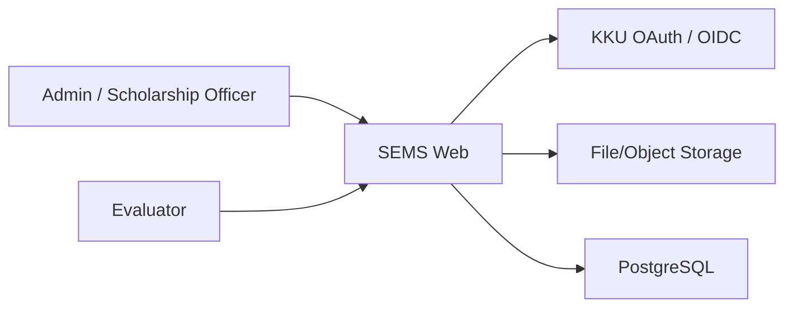
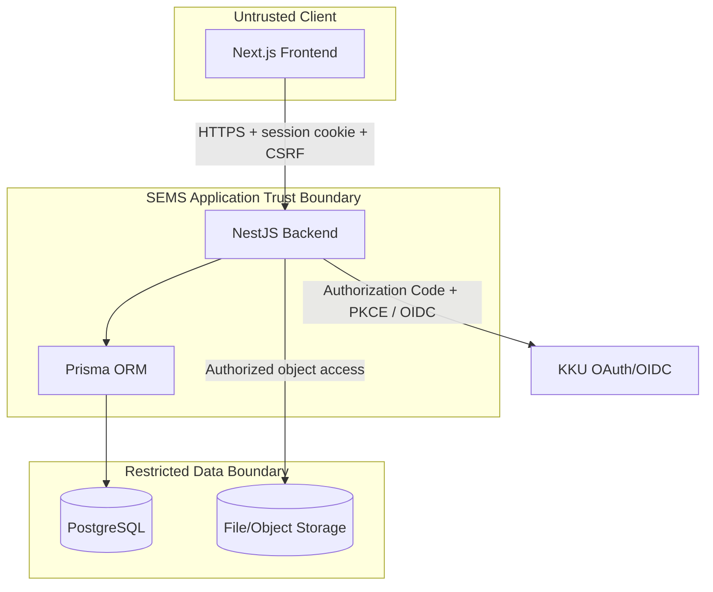

# SEMS System Architecture

| Metadata | Value |
| :--- | :--- |
| Document ID | `SEMS-ARCH-001` |
| Version | **v0.1** |
| Last Updated | **2026-07-23** |
| Status | **Draft — Pending System Design Approval** |
| Owner | SEMS Architecture Team |

## System Context

SEMS เป็นระบบภายในสำหรับจัดการรอบทุน ผู้สมัคร เอกสาร เกณฑ์ การประเมิน ผลสรุป รายงาน และ Audit โดย KKU เป็น Identity Provider แต่สิทธิ์ SEMS อยู่ในฐานข้อมูลของระบบ

## Container Architecture

## Component Responsibilities

| Component | Responsibility |
|---|---|
| Next.js Frontend | UI, accessible forms, route presentation, CSRF header; hide/disable is not security enforcement |
| NestJS Backend | Session, RBAC, object authorization, validation, state transitions, transactions, scoring, audit and safe error contract |
| Prisma | Typed persistence and migrations; business rules remain in services/DB constraints |
| PostgreSQL | Durable relational data, unique/FK/check constraints, transaction/concurrency control |
| File/Object Storage | Private applicant documents and generated exports via backend authorization |
| KKU OAuth/OIDC | Authentication and identity claims; no SEMS password storage |

## Session, CSRF and Trust Boundaries

- Backend exchanges Authorization Code using PKCE, validates issuer/audience/signature/expiry, `state` and `nonce`.
- Session cookie must be `HttpOnly`, `Secure` in non-local environments and appropriate `SameSite`.
- Every mutation requires `X-CSRF-Token`; Backend validates it before state change.
- Every API enforces role, account status, round state and object ownership. Evaluator cannot see another evaluator's score/comment.
- Storage URLs/paths, stack trace, SQL, token and secret never appear in responses or logs.

## Data Flow

1. User authenticates with KKU; Backend maps `sub` to an active SEMS account.
2. Admin configures round/criteria and imports `.xlsx`/`.csv` through validate-preview-confirm transaction.
3. Evaluator selects an applicant; Backend atomically enforces uniqueness and maximum three active evaluations.
4. Draft remains excluded. Submit validates criteria version and calculates Decimal total.
5. At 2–3 distinct Submitted evaluations, summary is recalculated; final rounding is `HALF_UP` to two decimals.
6. Admin closes round, exports authorized fields and reviews append-only audit events.

## Deployment Environments

Development, Test/UAT and Production must use separate databases, storage, OAuth clients and secrets. Production data must not be copied to lower environments without approved anonymization. Exact topology, region, sizing, domain and availability targets are **Open Architecture Decisions**.

## Failure Scenarios

| Failure | Required Behavior |
|---|---|
| KKU unavailable/invalid token | Deny login safely; no partial session; audit without token |
| Concurrent evaluator selection | One transaction succeeds; limit/duplicate conflict for the rest |
| Import validation/confirm failure | Roll back all writes; preserve safe error report and batch audit |
| Storage unavailable | No orphan metadata; retry/idempotency policy; safe error |
| DB conflict/outage | Rollback; `CONCURRENCY_CONFLICT` or service error with `traceId` |
| Third submit/recalculation failure | Atomic submit+summary or recoverable queued retry with audit; decision pending |
| Export failure | No partial download; status failed and audit without raw PII |

## Security Controls

OIDC validation, server-side RBAC/object authorization, CSRF, input/file validation, private storage, encryption in transit, least privilege, output encoding, secure headers, rate limits, dependency/secret scanning, audit integrity, retention and field-minimized export

## Observability

Structured logs and metrics correlate by `traceId`; record endpoint, result, latency and safe identifiers. Never log passwords, OAuth tokens, session IDs, secrets, raw documents or unrestricted PII. Alerts/SLO values remain pending.

## Backup/Restore Considerations

Back up PostgreSQL plus storage metadata/content consistently, encrypt backups, restrict restore authority, define RPO/RTO/retention, and run restore tests that verify FK/unique constraints, criteria version bindings, result summaries and audit continuity.

## Open Architecture Decisions

- Hosting topology, availability/SLO, capacity and rate limits
- Object storage product, malware scanning, retention and signed access approach
- Session store and revocation strategy
- Async job mechanism for import/export/recalculation
- KKU claims, redirect/logout modes and client registration
- Backup RPO/RTO and disaster-recovery owner
- PII classification, lawful need for national ID and production data masking

## Revision History

| Version | Date | Author | Change |
|---|---|---|---|
| v0.1 | 2026-07-23 | SEMS Architecture Team | Initial draft aligned with proposal and current design documents; open decisions retained. |
