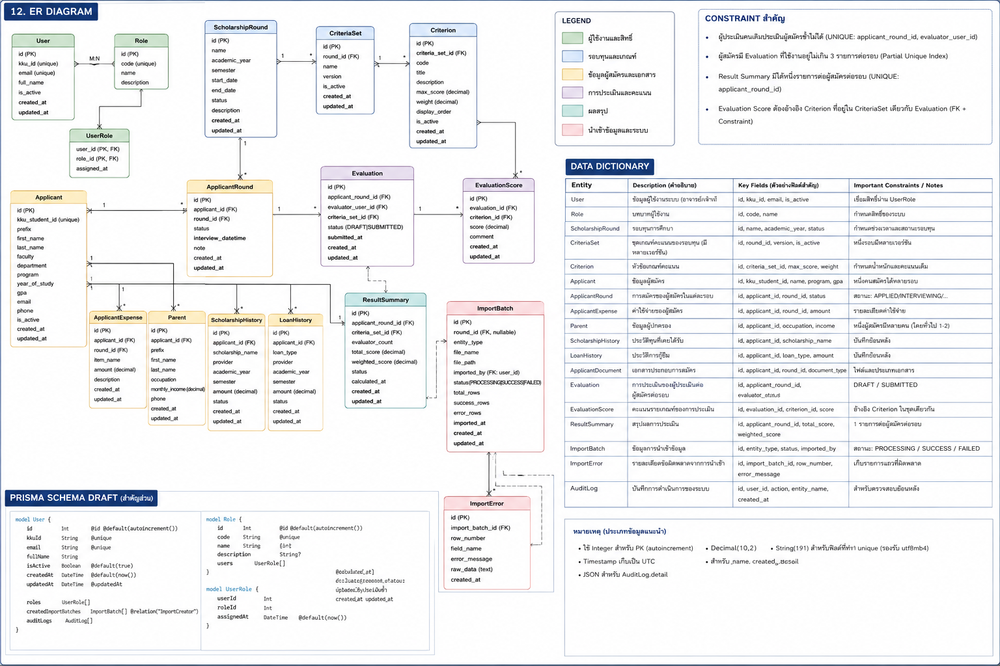
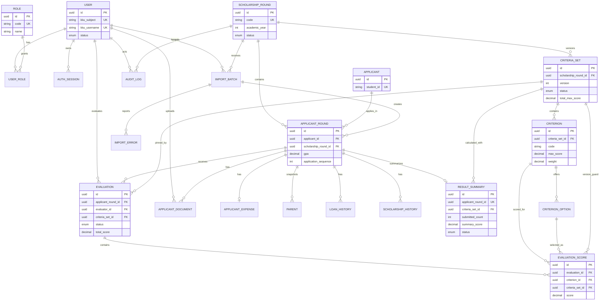

# SEMS: ER Diagram, Prisma Schema Draft และ Data Dictionary

| Metadata | Value |
| :--- | :--- |
| Version | **v1.2** |
| Last Updated | **2026-07-23** |
| Author | **SEMS Design Team** |
| Status | **Draft — Pre-Implementation Review** |
| Database / ORM | PostgreSQL / Prisma |

เอกสารฉบับนี้รวมผลลัพธ์การออกแบบฐานข้อมูลไว้ในไฟล์เดียว ประกอบด้วย ER Diagram, Prisma Schema Draft และ Data Dictionary



ข้อมูลจาก workbook ต้นฉบับที่แปลงแยกตามชีตอยู่ที่ [`SEMS_Data_Dictionary/README.md`](./SEMS_Data_Dictionary/README.md)

---

## 1. ER Diagram



### 1.1 ความสัมพันธ์หลัก

- `Applicant` เป็นข้อมูลนักศึกษาหลัก ส่วน `ApplicantRound` เป็นข้อมูลการสมัครและ Snapshot ของผู้สมัครในแต่ละรอบทุน
- `ScholarshipRound` หนึ่งรอบมีผู้สมัครหลายราย มีชุดเกณฑ์ได้หลายเวอร์ชัน และมีรายการ Import ได้หลายครั้ง
- `CriteriaSet` เป็นตัวแทนเวอร์ชันของเกณฑ์ และประกอบด้วย `Criterion` หลายรายการ
- `Evaluation` เชื่อมผู้สมัครในรอบทุน ผู้ประเมิน และเวอร์ชันเกณฑ์ที่ใช้ประเมิน
- `EvaluationScore` เก็บคำตอบหรือคะแนนรายเกณฑ์ของ Evaluation
- `ResultSummary` เป็นผลรวมล่าสุดของผู้สมัครหนึ่งรายในหนึ่งรอบทุน
- `ImportBatch` และ `ImportError` ใช้ติดตามการนำเข้าข้อมูลและข้อผิดพลาดรายแถว
- `AuditLog` ใช้ตรวจสอบย้อนหลังเหตุการณ์สำคัญของระบบ

### 1.2 Constraint สำคัญ

| กฎ | แนวทางบังคับใช้ |
|---|---|
| ผู้ประเมินคนเดิมประเมินผู้สมัครซ้ำไม่ได้ในรอบเดียวกัน | Partial Unique Index บน `Evaluation(applicant_round_id, evaluator_id)` เฉพาะสถานะที่ยังใช้งาน |
| ผู้สมัครมี Evaluation ที่ใช้งานอยู่ไม่เกิน 3 รายการต่อรอบ | PostgreSQL Trigger + Transaction/Row Lock ก่อนสร้าง Evaluation |
| Result Summary มีหนึ่งรายการต่อผู้สมัครต่อรอบ | `UNIQUE(applicant_round_id)` ใน `ResultSummary` |
| Evaluation Score ต้องอ้างอิง Criterion Version ที่ถูกต้อง | Composite Foreign Key ให้ `EvaluationScore.criteriaSetId` ตรงกับทั้ง `Evaluation` และ `Criterion` |
| ผู้สมัครหนึ่งคนมีข้อมูลการสมัครได้หนึ่งรายการต่อรอบทุน | `UNIQUE(applicant_id, scholarship_round_id)` ใน `ApplicantRound` |
| คะแนนสรุปใช้เฉพาะผลที่ Submit แล้ว | Query/Service ต้องกรอง `Evaluation.status = SUBMITTED` และไม่นับรายการที่ยกเลิก |

> หมายเหตุ: Partial Unique Index, Composite Foreign Key บางรูปแบบ และ Trigger ไม่สามารถประกาศได้ครบใน Prisma DSL จึงต้องเพิ่มใน PostgreSQL migration แบบ SQL

---

## 2. Prisma Schema Draft

```prisma
generator client {
  provider = "prisma-client-js"
}

datasource db {
  provider = "postgresql"
  url      = env("DATABASE_URL")
}

enum AccountStatus {
  ACTIVE
  INACTIVE
}

enum RoundStatus {
  DRAFT
  OPEN
  CLOSED
  ARCHIVED
}

enum ParentType {
  FATHER
  MOTHER
}

enum CriteriaSetStatus {
  DRAFT
  ACTIVE
  RETIRED
}

enum CriterionInputType {
  SELECT
  SCORE
  BOOLEAN
  TEXT
  MONEY
}

enum ScoreAggregationMethod {
  AVERAGE_EVALUATOR_TOTALS
  WEIGHTED_AVERAGE
  CUSTOM
}

enum RoundingMode {
  HALF_UP
  HALF_EVEN
  DOWN
  UP
}

enum EvaluationStatus {
  DRAFT
  SUBMITTED
  REOPENED
  CANCELLED
}

enum ApplicantResultStatus {
  NOT_STARTED
  IN_PROGRESS
  MINIMUM_COMPLETE
  FULLY_COMPLETE
  FINALIZED
  CLOSED_INCOMPLETE
}

enum ImportFileType {
  XLSX
  CSV
}

enum ImportBatchStatus {
  UPLOADED
  VALIDATING
  VALIDATED
  IMPORTING
  COMPLETED
  FAILED
  CANCELLED
}

enum ErrorSeverity {
  ERROR
  WARNING
}

enum AuditOutcome {
  SUCCESS
  FAILURE
  DENIED
}

model User {
  id              String        @id @default(uuid()) @db.Uuid
  kkuSubject      String        @unique @map("kku_subject") @db.VarChar(191)
  kkuUsername     String?       @unique @map("kku_username") @db.VarChar(100)
  email           String?       @db.VarChar(254)
  firstName       String?       @map("first_name") @db.VarChar(100)
  lastName        String?       @map("last_name") @db.VarChar(100)
  status          AccountStatus @default(ACTIVE)
  lastLoginAt     DateTime?     @map("last_login_at") @db.Timestamptz(3)
  createdAt       DateTime      @default(now()) @map("created_at") @db.Timestamptz(3)
  updatedAt       DateTime      @updatedAt @map("updated_at") @db.Timestamptz(3)

  roles           UserRole[]
  sessions        AuthSession[]
  evaluations     Evaluation[]  @relation("EvaluationEvaluator")
  reopenedItems   Evaluation[]  @relation("EvaluationReopenedBy")
  roundsCreated   ScholarshipRound[] @relation("RoundCreatedBy")
  criteriaCreated CriteriaSet[] @relation("CriteriaSetCreatedBy")
  documents       ApplicantDocument[] @relation("DocumentUploadedBy")
  imports         ImportBatch[] @relation("ImportBatchImportedBy")
  auditLogs       AuditLog[]    @relation("AuditActor")

  @@index([status])
  @@map("users")
}

model Role {
  id          String     @id @default(uuid()) @db.Uuid
  code        String     @unique @db.VarChar(50)
  name        String     @db.VarChar(100)
  description String?
  createdAt   DateTime   @default(now()) @map("created_at") @db.Timestamptz(3)

  users       UserRole[]

  @@map("roles")
}

model UserRole {
  userId     String   @map("user_id") @db.Uuid
  roleId     String   @map("role_id") @db.Uuid
  assignedAt DateTime @default(now()) @map("assigned_at") @db.Timestamptz(3)

  user User @relation(fields: [userId], references: [id], onDelete: Cascade)
  role Role @relation(fields: [roleId], references: [id], onDelete: Restrict)

  @@id([userId, roleId])
  @@index([roleId])
  @@map("user_roles")
}

model AuthSession {
  id               String    @id @default(uuid()) @db.Uuid
  userId           String    @map("user_id") @db.Uuid
  sessionTokenHash String    @unique @map("session_token_hash") @db.VarChar(128)
  expiresAt        DateTime  @map("expires_at") @db.Timestamptz(3)
  revokedAt        DateTime? @map("revoked_at") @db.Timestamptz(3)
  lastSeenAt       DateTime? @map("last_seen_at") @db.Timestamptz(3)
  ipAddress        String?   @map("ip_address") @db.Inet
  userAgent        String?   @map("user_agent")
  createdAt        DateTime  @default(now()) @map("created_at") @db.Timestamptz(3)

  user User @relation(fields: [userId], references: [id], onDelete: Cascade)

  @@index([userId, expiresAt])
  @@map("auth_sessions")
}

model ScholarshipRound {
  id           String      @id @default(uuid()) @db.Uuid
  code         String      @unique @db.VarChar(50)
  name         String      @db.VarChar(200)
  academicYear Int         @map("academic_year")
  semester     Int?
  status       RoundStatus @default(DRAFT)
  openAt       DateTime?   @map("open_at") @db.Timestamptz(3)
  closeAt      DateTime?   @map("close_at") @db.Timestamptz(3)
  archivedAt   DateTime?   @map("archived_at") @db.Timestamptz(3)
  createdById  String?     @map("created_by_id") @db.Uuid
  createdAt    DateTime    @default(now()) @map("created_at") @db.Timestamptz(3)
  updatedAt    DateTime    @updatedAt @map("updated_at") @db.Timestamptz(3)

  createdBy      User?            @relation("RoundCreatedBy", fields: [createdById], references: [id], onDelete: SetNull)
  applicantRounds ApplicantRound[]
  criteriaSets    CriteriaSet[]
  importBatches   ImportBatch[]
  auditLogs       AuditLog[]

  @@index([status])
  @@index([academicYear, semester])
  @@map("scholarship_rounds")
}

model Applicant {
  id        String   @id @default(uuid()) @db.Uuid
  studentId String   @unique @map("student_id") @db.VarChar(20)
  createdAt DateTime @default(now()) @map("created_at") @db.Timestamptz(3)
  updatedAt DateTime @updatedAt @map("updated_at") @db.Timestamptz(3)

  rounds ApplicantRound[]

  @@map("applicants")
}

model ApplicantRound {
  id                     String    @id @default(uuid()) @db.Uuid
  applicantId            String    @map("applicant_id") @db.Uuid
  scholarshipRoundId     String    @map("scholarship_round_id") @db.Uuid
  importBatchId          String?   @map("import_batch_id") @db.Uuid
  applicationSequence    Int?      @map("application_sequence")
  applicationDate        DateTime? @map("application_date") @db.Timestamptz(3)
  title                  String?   @db.VarChar(30)
  firstName              String    @map("first_name") @db.VarChar(100)
  lastName               String    @map("last_name") @db.VarChar(100)
  faculty                String?   @db.VarChar(200)
  program                String?   @db.VarChar(200)
  yearLevel              Int?      @map("year_level")
  gpa                    Decimal?  @db.Decimal(3, 2)
  phone                  String?   @db.VarChar(30)
  email                  String?   @db.VarChar(254)
  accommodationType      String?   @map("accommodation_type") @db.VarChar(200)
  electronicDevices      String?   @map("electronic_devices")
  extraIncomeDescription String?   @map("extra_income_description")
  parentRelationship     String?   @map("parent_relationship") @db.VarChar(100)
  educationPayer         String?   @map("education_payer") @db.VarChar(100)
  supporterRelationship  String?   @map("supporter_relationship") @db.VarChar(100)
  supporterOccupation    String?   @map("supporter_occupation") @db.VarChar(200)
  supporterIncome        Decimal?  @map("supporter_income") @db.Decimal(12, 2)
  siblingsWorking        Int?      @map("siblings_working")
  siblingsNotWorking     Int?      @map("siblings_not_working")
  siblingsStudying       Int?      @map("siblings_studying")
  latitude               Decimal?  @db.Decimal(10, 7)
  longitude              Decimal?  @db.Decimal(10, 7)
  mapUrl                 String?   @map("map_url")
  sourceRowNumber        Int?      @map("source_row_number")
  isActive               Boolean   @default(true) @map("is_active")
  createdAt              DateTime  @default(now()) @map("created_at") @db.Timestamptz(3)
  updatedAt              DateTime  @updatedAt @map("updated_at") @db.Timestamptz(3)

  applicant        Applicant        @relation(fields: [applicantId], references: [id], onDelete: Restrict)
  scholarshipRound ScholarshipRound @relation(fields: [scholarshipRoundId], references: [id], onDelete: Restrict)
  importBatch      ImportBatch?     @relation(fields: [importBatchId], references: [id], onDelete: SetNull)
  expense          ApplicantExpense?
  parents          Parent[]
  loanHistories    LoanHistory[]
  scholarshipHistories ScholarshipHistory[]
  documents        ApplicantDocument[]
  evaluations      Evaluation[]
  resultSummary    ResultSummary?

  @@unique([applicantId, scholarshipRoundId])
  @@unique([scholarshipRoundId, applicationSequence])
  @@index([scholarshipRoundId, lastName, firstName])
  @@index([importBatchId])
  @@map("applicant_rounds")
}

model ApplicantExpense {
  id                     String   @id @default(uuid()) @db.Uuid
  applicantRoundId       String   @unique @map("applicant_round_id") @db.Uuid
  accommodationMonthly   Decimal? @map("accommodation_monthly") @db.Decimal(12, 2)
  personalMonthly        Decimal? @map("personal_monthly") @db.Decimal(12, 2)
  educationEquipment     Decimal? @map("education_equipment") @db.Decimal(12, 2)
  createdAt              DateTime @default(now()) @map("created_at") @db.Timestamptz(3)
  updatedAt              DateTime @updatedAt @map("updated_at") @db.Timestamptz(3)

  applicantRound ApplicantRound @relation(fields: [applicantRoundId], references: [id], onDelete: Cascade)

  @@map("applicant_expenses")
}

model Parent {
  id               String     @id @default(uuid()) @db.Uuid
  applicantRoundId String     @map("applicant_round_id") @db.Uuid
  type             ParentType
  age              Int?
  occupation       String?    @db.VarChar(200)
  monthlyIncome    Decimal?   @map("monthly_income") @db.Decimal(12, 2)
  lifeStatus       String?    @map("life_status") @db.VarChar(100)
  createdAt        DateTime   @default(now()) @map("created_at") @db.Timestamptz(3)
  updatedAt        DateTime   @updatedAt @map("updated_at") @db.Timestamptz(3)

  applicantRound ApplicantRound @relation(fields: [applicantRoundId], references: [id], onDelete: Cascade)

  @@unique([applicantRoundId, type])
  @@map("parents")
}

model LoanHistory {
  id               String   @id @default(uuid()) @db.Uuid
  applicantRoundId String   @map("applicant_round_id") @db.Uuid
  academicYear     Int      @map("academic_year")
  amount           Decimal  @db.Decimal(12, 2)
  sourceText       String?  @map("source_text")
  createdAt        DateTime @default(now()) @map("created_at") @db.Timestamptz(3)

  applicantRound ApplicantRound @relation(fields: [applicantRoundId], references: [id], onDelete: Cascade)

  @@unique([applicantRoundId, academicYear])
  @@map("loan_histories")
}

model ScholarshipHistory {
  id               String   @id @default(uuid()) @db.Uuid
  applicantRoundId String   @map("applicant_round_id") @db.Uuid
  academicYear     Int      @map("academic_year")
  scholarshipName  String   @map("scholarship_name") @db.VarChar(255)
  amount           Decimal? @db.Decimal(12, 2)
  sourceText       String?  @map("source_text")
  createdAt        DateTime @default(now()) @map("created_at") @db.Timestamptz(3)

  applicantRound ApplicantRound @relation(fields: [applicantRoundId], references: [id], onDelete: Cascade)

  @@unique([applicantRoundId, academicYear, scholarshipName])
  @@index([academicYear])
  @@map("scholarship_histories")
}

model ApplicantDocument {
  id               String   @id @default(uuid()) @db.Uuid
  applicantRoundId String   @map("applicant_round_id") @db.Uuid
  uploadedById     String   @map("uploaded_by_id") @db.Uuid
  documentType     String?  @map("document_type") @db.VarChar(100)
  originalFileName String   @map("original_file_name") @db.VarChar(255)
  mimeType         String   @map("mime_type") @db.VarChar(100)
  sizeBytes        BigInt   @map("size_bytes")
  storageKey       String   @unique @map("storage_key")
  checksumSha256   String?  @map("checksum_sha256") @db.VarChar(64)
  uploadedAt       DateTime @default(now()) @map("uploaded_at") @db.Timestamptz(3)

  applicantRound ApplicantRound @relation(fields: [applicantRoundId], references: [id], onDelete: Cascade)
  uploadedBy     User           @relation("DocumentUploadedBy", fields: [uploadedById], references: [id], onDelete: Restrict)

  @@index([applicantRoundId, documentType])
  @@map("applicant_documents")
}

model CriteriaSet {
  id                  String                 @id @default(uuid()) @db.Uuid
  scholarshipRoundId  String                 @map("scholarship_round_id") @db.Uuid
  createdById         String                 @map("created_by_id") @db.Uuid
  name                String                 @db.VarChar(200)
  version             Int
  status              CriteriaSetStatus      @default(DRAFT)
  aggregationMethod   ScoreAggregationMethod @default(AVERAGE_EVALUATOR_TOTALS) @map("aggregation_method")
  roundingMode        RoundingMode           @default(HALF_UP) @map("rounding_mode")
  roundingScale       Int                    @default(2) @map("rounding_scale")
  totalMaxScore       Decimal                @default(100) @map("total_max_score") @db.Decimal(10, 2)
  activatedAt         DateTime?              @map("activated_at") @db.Timestamptz(3)
  retiredAt           DateTime?              @map("retired_at") @db.Timestamptz(3)
  createdAt           DateTime               @default(now()) @map("created_at") @db.Timestamptz(3)
  updatedAt           DateTime               @updatedAt @map("updated_at") @db.Timestamptz(3)

  scholarshipRound ScholarshipRound @relation(fields: [scholarshipRoundId], references: [id], onDelete: Restrict)
  createdBy        User             @relation("CriteriaSetCreatedBy", fields: [createdById], references: [id], onDelete: Restrict)
  criteria         Criterion[]
  evaluations      Evaluation[]
  evaluationScores EvaluationScore[]
  resultSummaries  ResultSummary[]

  @@unique([scholarshipRoundId, version])
  @@index([scholarshipRoundId, status])
  @@map("criteria_sets")
}

model Criterion {
  id             String             @id @default(uuid()) @db.Uuid
  criteriaSetId  String             @map("criteria_set_id") @db.Uuid
  code           String             @db.VarChar(50)
  name           String             @db.VarChar(200)
  description    String?
  inputType      CriterionInputType @default(SELECT) @map("input_type")
  minScore       Decimal?           @map("min_score") @db.Decimal(10, 2)
  maxScore       Decimal?           @map("max_score") @db.Decimal(10, 2)
  weight         Decimal            @default(1) @db.Decimal(8, 4)
  displayOrder   Int                @map("display_order")
  isRequired     Boolean            @default(true) @map("is_required")
  includeInTotal Boolean            @default(true) @map("include_in_total")
  createdAt      DateTime           @default(now()) @map("created_at") @db.Timestamptz(3)
  updatedAt      DateTime           @updatedAt @map("updated_at") @db.Timestamptz(3)

  criteriaSet     CriteriaSet       @relation(fields: [criteriaSetId], references: [id], onDelete: Cascade)
  options         CriterionOption[]
  evaluationScores EvaluationScore[]

  @@unique([criteriaSetId, code])
  @@unique([criteriaSetId, displayOrder])
  @@unique([id, criteriaSetId], map: "uq_criterion_id_criteria_set")
  @@map("criteria")
}

model CriterionOption {
  id           String   @id @default(uuid()) @db.Uuid
  criterionId  String   @map("criterion_id") @db.Uuid
  code         String?  @db.VarChar(50)
  label        String
  score        Decimal? @db.Decimal(10, 2)
  displayOrder Int      @map("display_order")
  metadata     Json?

  criterion       Criterion         @relation(fields: [criterionId], references: [id], onDelete: Cascade)
  evaluationScores EvaluationScore[]

  @@unique([criterionId, displayOrder])
  @@unique([id, criterionId], map: "uq_criterion_option_id_criterion")
  @@map("criterion_options")
}

model Evaluation {
  id               String           @id @default(uuid()) @db.Uuid
  applicantRoundId String           @map("applicant_round_id") @db.Uuid
  evaluatorId      String           @map("evaluator_id") @db.Uuid
  criteriaSetId    String           @map("criteria_set_id") @db.Uuid
  status           EvaluationStatus @default(DRAFT)
  totalScore       Decimal?         @map("total_score") @db.Decimal(10, 2)
  comment          String?
  revision         Int              @default(1)
  selectedAt       DateTime         @default(now()) @map("selected_at") @db.Timestamptz(3)
  submittedAt      DateTime?        @map("submitted_at") @db.Timestamptz(3)
  reopenedAt       DateTime?        @map("reopened_at") @db.Timestamptz(3)
  reopenedById     String?          @map("reopened_by_id") @db.Uuid
  cancelledAt      DateTime?        @map("cancelled_at") @db.Timestamptz(3)
  createdAt        DateTime         @default(now()) @map("created_at") @db.Timestamptz(3)
  updatedAt        DateTime         @updatedAt @map("updated_at") @db.Timestamptz(3)

  applicantRound ApplicantRound @relation(fields: [applicantRoundId], references: [id], onDelete: Restrict)
  evaluator      User           @relation("EvaluationEvaluator", fields: [evaluatorId], references: [id], onDelete: Restrict)
  criteriaSet    CriteriaSet    @relation(fields: [criteriaSetId], references: [id], onDelete: Restrict)
  reopenedBy     User?          @relation("EvaluationReopenedBy", fields: [reopenedById], references: [id], onDelete: SetNull)
  scores         EvaluationScore[]

  @@unique([id, criteriaSetId], map: "uq_evaluation_id_criteria_set")
  @@index([applicantRoundId, status])
  @@index([evaluatorId, status])
  @@index([criteriaSetId])
  @@map("evaluations")
}

model EvaluationScore {
  id               String   @id @default(uuid()) @db.Uuid
  evaluationId     String   @map("evaluation_id") @db.Uuid
  criterionId      String   @map("criterion_id") @db.Uuid
  criteriaSetId    String   @map("criteria_set_id") @db.Uuid
  selectedOptionId String?  @map("selected_option_id") @db.Uuid
  score            Decimal? @db.Decimal(10, 2)
  textValue        String?  @map("text_value")
  booleanValue     Boolean? @map("boolean_value")
  moneyValue       Decimal? @map("money_value") @db.Decimal(12, 2)
  note             String?
  createdAt        DateTime @default(now()) @map("created_at") @db.Timestamptz(3)
  updatedAt        DateTime @updatedAt @map("updated_at") @db.Timestamptz(3)

  evaluation    Evaluation      @relation(fields: [evaluationId], references: [id], onDelete: Cascade)
  criterion     Criterion       @relation(fields: [criterionId], references: [id], onDelete: Restrict)
  criteriaSet   CriteriaSet     @relation(fields: [criteriaSetId], references: [id], onDelete: Restrict)
  selectedOption CriterionOption? @relation(fields: [selectedOptionId], references: [id], onDelete: SetNull)

  @@unique([evaluationId, criterionId])
  @@index([criterionId])
  @@index([criteriaSetId])
  @@map("evaluation_scores")
}

model ResultSummary {
  id               String                @id @default(uuid()) @db.Uuid
  applicantRoundId String                @unique @map("applicant_round_id") @db.Uuid
  criteriaSetId    String                @map("criteria_set_id") @db.Uuid
  status           ApplicantResultStatus @default(NOT_STARTED)
  submittedCount   Int                   @default(0) @map("submitted_count")
  summaryScore     Decimal?              @map("summary_score") @db.Decimal(10, 2)
  isFinal          Boolean               @default(false) @map("is_final")
  calculationVersion Int                 @default(1) @map("calculation_version")
  calculationPayload Json?               @map("calculation_payload")
  calculatedAt     DateTime?             @map("calculated_at") @db.Timestamptz(3)
  finalizedAt      DateTime?             @map("finalized_at") @db.Timestamptz(3)
  createdAt        DateTime              @default(now()) @map("created_at") @db.Timestamptz(3)
  updatedAt        DateTime              @updatedAt @map("updated_at") @db.Timestamptz(3)

  applicantRound ApplicantRound @relation(fields: [applicantRoundId], references: [id], onDelete: Cascade)
  criteriaSet    CriteriaSet    @relation(fields: [criteriaSetId], references: [id], onDelete: Restrict)

  @@index([status])
  @@index([criteriaSetId])
  @@map("result_summaries")
}

model ImportBatch {
  id                 String            @id @default(uuid()) @db.Uuid
  scholarshipRoundId String            @map("scholarship_round_id") @db.Uuid
  importedById       String            @map("imported_by_id") @db.Uuid
  fileName           String            @map("file_name") @db.VarChar(255)
  fileType           ImportFileType    @map("file_type")
  storageKey         String?           @map("storage_key")
  status             ImportBatchStatus @default(UPLOADED)
  columnMapping      Json?             @map("column_mapping")
  totalRows          Int               @default(0) @map("total_rows")
  validRows          Int               @default(0) @map("valid_rows")
  invalidRows        Int               @default(0) @map("invalid_rows")
  importedRows       Int               @default(0) @map("imported_rows")
  startedAt          DateTime?         @map("started_at") @db.Timestamptz(3)
  completedAt        DateTime?         @map("completed_at") @db.Timestamptz(3)
  createdAt          DateTime          @default(now()) @map("created_at") @db.Timestamptz(3)

  scholarshipRound ScholarshipRound @relation(fields: [scholarshipRoundId], references: [id], onDelete: Restrict)
  importedBy       User             @relation("ImportBatchImportedBy", fields: [importedById], references: [id], onDelete: Restrict)
  errors           ImportError[]
  applicantRounds  ApplicantRound[]

  @@index([scholarshipRoundId, createdAt])
  @@index([status])
  @@map("import_batches")
}

model ImportError {
  id          String        @id @default(uuid()) @db.Uuid
  importBatchId String      @map("import_batch_id") @db.Uuid
  rowNumber   Int           @map("row_number")
  columnName  String?       @map("column_name") @db.VarChar(200)
  fieldName   String?       @map("field_name") @db.VarChar(100)
  errorCode   String        @map("error_code") @db.VarChar(100)
  severity    ErrorSeverity @default(ERROR)
  rawValue    String?       @map("raw_value")
  message     String
  createdAt   DateTime      @default(now()) @map("created_at") @db.Timestamptz(3)

  importBatch ImportBatch @relation(fields: [importBatchId], references: [id], onDelete: Cascade)

  @@index([importBatchId, rowNumber])
  @@index([errorCode])
  @@map("import_errors")
}

model AuditLog {
  id                 String       @id @default(uuid()) @db.Uuid
  actorId            String?      @map("actor_id") @db.Uuid
  scholarshipRoundId String?      @map("scholarship_round_id") @db.Uuid
  action             String       @db.VarChar(100)
  entityType         String       @map("entity_type") @db.VarChar(100)
  entityId           String?      @map("entity_id") @db.VarChar(100)
  outcome            AuditOutcome @default(SUCCESS)
  traceId            String?      @map("trace_id") @db.VarChar(100)
  ipAddress          String?      @map("ip_address") @db.Inet
  userAgent          String?      @map("user_agent")
  metadata           Json?
  createdAt          DateTime     @default(now()) @map("created_at") @db.Timestamptz(3)

  actor            User?             @relation("AuditActor", fields: [actorId], references: [id], onDelete: SetNull)
  scholarshipRound ScholarshipRound? @relation(fields: [scholarshipRoundId], references: [id], onDelete: SetNull)

  @@index([actorId, createdAt])
  @@index([entityType, entityId])
  @@index([scholarshipRoundId, createdAt])
  @@map("audit_logs")
}
```

---

## 3. Data Dictionary

> Draft for PostgreSQL + Prisma. Field names follow the Prisma schema; physical database names are snake_case via `@map` / `@@map`.

## 1. Core design decisions

- `Applicant` is the stable student master keyed by `studentId`; `ApplicantRound` is the per-round snapshot so historical reports do not change when profile data changes later.
- Expense, parent, loan, scholarship-history and document records belong to `ApplicantRound`, matching the imported file snapshot and its continuation rows.
- `CriteriaSet` carries the version. Every `Evaluation` is pinned to one set, and `EvaluationScore.criteriaSetId` is protected by composite foreign keys in `database_constraints.sql`.
- `CriterionOption` is added because the supplied criteria workbook contains selectable descriptions with fixed scores. Non-scoring questions are represented with `BOOLEAN`, `TEXT` or `MONEY` criteria and `includeInTotal=false`.
- `ResultSummary` is a cached/derived record. Only active `SUBMITTED` evaluations from distinct evaluators may contribute; Draft, Reopened and Cancelled evaluations never contribute.
- The same evaluator duplicate rule, one-active-criteria-set rule and max-three-evaluator concurrency rule require PostgreSQL partial indexes/trigger logic because they cannot be fully represented in Prisma DSL alone.
- OIDC identity is linked by the stable `sub` claim. SEMS stores a session-token hash, not raw KKU passwords or raw session tokens.

## 2. Field dictionary

| Entity | Field | Type | Null | Key | Description | Validation | Example | Sensitivity |
|---|---|---:|:---:|---|---|---|---|---|
| User | id | UUID | No | PK | SEMS user identifier | Generated UUID |  | Internal |
| User | kkuSubject | VARCHAR(191) | No | UK | Stable OIDC subject claim used to link KKU identity | Unique; never use email as permanent identity | OIDC sub | Confidential |
| User | kkuUsername | VARCHAR(100) | Yes | UK | KKU username/display login identifier | Unique when present | wxxxxx | Confidential |
| User | email | VARCHAR(254) | Yes |  | Email from approved OIDC claims | RFC-style email validation | user@kku.ac.th | Personal |
| User | firstName / lastName | VARCHAR(100) | Yes |  | Profile names from KKU identity | Trim whitespace |  | Personal |
| User | status | AccountStatus | No |  | SEMS authorization status | ACTIVE or INACTIVE | ACTIVE | Internal |
| Role | code | VARCHAR(50) | No | UK | Role code used by RBAC | Seed ADMIN and EVALUATOR | EVALUATOR | Internal |
| UserRole | userId + roleId | UUID + UUID | No | Composite PK | Many-to-many assignment between User and Role | Unique pair |  | Internal |
| AuthSession | sessionTokenHash | VARCHAR(128) | No | UK | Hash of SEMS session token; raw token is never stored | Unique; revoke/expire server-side |  | Restricted |
| AuthSession | expiresAt / revokedAt | TIMESTAMPTZ | No / Yes |  | Session lifetime and revocation timestamps | expiresAt > createdAt |  | Restricted |
| ScholarshipRound | code | VARCHAR(50) | No | UK | Business identifier of scholarship round | Unique | ENG-2569-01 | Internal |
| ScholarshipRound | academicYear | INTEGER | No |  | Thai academic year | Reasonable configured range | 2569 | Internal |
| ScholarshipRound | semester | INTEGER | Yes |  | Semester number | 1-3 when used | 1 | Internal |
| ScholarshipRound | status | RoundStatus | No |  | Round lifecycle state | DRAFT → OPEN → CLOSED → ARCHIVED | OPEN | Internal |
| Applicant | studentId | VARCHAR(20) | No | UK | Stable student identifier across rounds | Pattern ^\d{9}-\d$; check digit policy separately confirmed | 683040000-1 | Personal |
| ApplicantRound | applicantId + scholarshipRoundId | UUID + UUID | No | UK | One application snapshot per student per round | Unique pair |  | Internal |
| ApplicantRound | applicationSequence | INTEGER | Yes | UK within round | Source file sequence number | Positive; unique in round | 1 | Internal |
| ApplicantRound | applicationDate | TIMESTAMPTZ | Yes |  | Date/time application was submitted | Convert Buddhist Era to Common Era | 2569-07-09 13:36 | Personal |
| ApplicantRound | title / firstName / lastName | VARCHAR | Mixed |  | Applicant name snapshot used in reports | firstName and lastName required | นาย สมชาย ใจดี | Personal |
| ApplicantRound | faculty / program / yearLevel | VARCHAR / INTEGER | Yes |  | Academic context for the application | yearLevel positive | วิศวกรรมเครื่องกล / 5 | Personal |
| ApplicantRound | gpa | DECIMAL(3,2) | Yes |  | GPA snapshot | 0.00–4.00 | 3.25 | Sensitive |
| ApplicantRound | phone / email | VARCHAR | Yes |  | Contact snapshot | Normalize phone; validate email | 0812345678 | Personal |
| ApplicantRound | accommodationType | VARCHAR(200) | Yes |  | Current accommodation category | Trim and normalize master values | หอพัก มข | Sensitive |
| ApplicantRound | electronicDevices | TEXT | Yes |  | Devices available to applicant | Free text | โทรศัพท์, iPad | Sensitive |
| ApplicantRound | extraIncomeDescription | TEXT | Yes |  | Extra income/work description | Free text | ไม่มีรายได้เสริม | Sensitive |
| ApplicantRound | parentRelationship | VARCHAR(100) | Yes |  | Family/parent relationship status snapshot |  | อยู่ด้วยกัน | Sensitive |
| ApplicantRound | educationPayer | VARCHAR(100) | Yes |  | Person(s) funding education |  | บิดา-มารดา | Sensitive |
| ApplicantRound | supporterRelationship / Occupation / Income | Mixed | Yes |  | Other supporter details when applicable | Income >= 0 | ญาติ / ค้าขาย / 12000 | Sensitive |
| ApplicantRound | siblingsWorking / NotWorking / Studying | INTEGER | Yes |  | Sibling counts by status | Each >= 0 | 1 / 1 / 1 | Sensitive |
| ApplicantRound | latitude / longitude | DECIMAL(10,7) | Yes |  | Parsed home coordinates | lat -90..90; lon -180..180 | 16.3792973,104.3854202 | Sensitive |
| ApplicantRound | mapUrl | TEXT | Yes |  | Original map link if coordinates cannot be parsed immediately | Allowed HTTPS URL | https://maps.app.goo.gl/... | Sensitive |
| ApplicantExpense | accommodationMonthly | DECIMAL(12,2) | Yes |  | Monthly accommodation + utilities | >= 0 | 2200.00 | Sensitive |
| ApplicantExpense | personalMonthly | DECIMAL(12,2) | Yes |  | Monthly personal expense | >= 0 | 3500.00 | Sensitive |
| ApplicantExpense | educationEquipment | DECIMAL(12,2) | Yes |  | Education equipment expense | >= 0 | 500.00 | Sensitive |
| Parent | type | ParentType | No | UK within application | FATHER or MOTHER row | One row per type per ApplicantRound | FATHER | Sensitive |
| Parent | age / occupation / monthlyIncome / lifeStatus | Mixed | Yes |  | Parent snapshot | age >=0; income >=0 | 56 / เกษตรกร / 1200 / มีชีวิตอยู่ | Sensitive |
| LoanHistory | academicYear + amount | INTEGER + DECIMAL | No | UK by applicant-round/year | Education loan history parsed from continuation rows | Year required; amount >= 0 | 2565 / 66000 | Sensitive |
| ScholarshipHistory | academicYear + scholarshipName + amount | Mixed | Mixed | UK by applicant-round/year/name | Prior scholarship history parsed from continuation rows | Name required; amount >= 0 when present | 2568 / ทุน ข / 10000 | Sensitive |
| ApplicantDocument | storageKey | TEXT | No | UK | File/object storage reference; binary content stays outside PostgreSQL | Unique; access through backend authorization |  | Restricted |
| ApplicantDocument | mimeType / sizeBytes / checksumSha256 | Mixed | Mixed |  | File metadata | Allow approved PDF/JPG/PNG; size limit configured |  | Restricted |
| CriteriaSet | scholarshipRoundId + version | UUID + INTEGER | No | UK | Versioned criteria set for one round | Unique pair; only one ACTIVE per round | v1 | Internal |
| CriteriaSet | aggregationMethod | Enum | No |  | How 2–3 submitted evaluator totals are combined | Configured after rule confirmation | AVERAGE_EVALUATOR_TOTALS | Internal |
| CriteriaSet | roundingMode / roundingScale | Enum / INTEGER | No |  | Final score rounding policy | Scale 0–6 recommended | HALF_UP / 2 | Internal |
| CriteriaSet | totalMaxScore | DECIMAL(10,2) | No |  | Expected maximum total | > 0; source criteria currently totals 100 | 100.00 | Internal |
| Criterion | code | VARCHAR(50) | No | UK within set | Stable criterion code independent from label | Unique in criteria set | C01 | Internal |
| Criterion | inputType | CriterionInputType | No |  | SELECT, SCORE, BOOLEAN, TEXT or MONEY | Controls which EvaluationScore value column is used | SELECT | Internal |
| Criterion | minScore / maxScore / weight | DECIMAL | Yes / Yes / No |  | Score range and weight | min <= max; weight >= 0 | 0 / 10 / 1 | Internal |
| Criterion | displayOrder / isRequired / includeInTotal | Mixed | No |  | UI order, submission validation, and total inclusion | displayOrder > 0 | 1 / true / true | Internal |
| CriterionOption | label / score / displayOrder | Mixed | No / Yes / No |  | Selectable rubric option and assigned score | Unique order within criterion | ไม่มีผู้อื่นส่งเสียค่าเทอม / 10 | Internal |
| Evaluation | applicantRoundId / evaluatorId | UUID | No |  | Evaluation assignment/ownership | One active row per evaluator per applicant-round; max 3 active total |  | Confidential |
| Evaluation | criteriaSetId | UUID | No | FK | Pins the exact criteria version used by the evaluation | Cannot change after evaluation creation |  | Internal |
| Evaluation | status | EvaluationStatus | No |  | Draft/submit/reopen/cancel lifecycle | Only SUBMITTED active rows enter summary | SUBMITTED | Internal |
| Evaluation | totalScore | DECIMAL(10,2) | Yes |  | Cached evaluator total calculated from criterion scores | Within configured total range | 82.50 | Confidential |
| Evaluation | comment | TEXT | Yes |  | Evaluator comment/observation | Required only if business rule confirms | ควรได้รับทุน | Confidential |
| EvaluationScore | evaluationId + criterionId | UUID + UUID | No | UK | One response per criterion in an evaluation | Unique pair |  | Confidential |
| EvaluationScore | criteriaSetId | UUID | No | FK/version guard | Redundant version key used to enforce Evaluation and Criterion belong to same CriteriaSet | Composite foreign keys in SQL migration |  | Internal |
| EvaluationScore | selectedOptionId / score | UUID / DECIMAL | Yes |  | Selected rubric option and resulting numeric score | Option must belong to same criterion | option-1 / 10 | Confidential |
| EvaluationScore | textValue / booleanValue / moneyValue | Typed optional values | Yes |  | Non-score responses such as continuation decision or recommended amount | Exactly the value type required by Criterion.inputType |  | Confidential |
| ResultSummary | applicantRoundId | UUID | No | UK/FK | At most one latest summary per applicant per round | Unique |  | Confidential |
| ResultSummary | submittedCount | INTEGER | No |  | Count of distinct active SUBMITTED evaluations | 0–3 | 2 | Internal |
| ResultSummary | summaryScore | DECIMAL(10,2) | Yes |  | Latest aggregate score from submitted evaluations only | NULL until at least 2 submitted; NULL for CLOSED_INCOMPLETE | 84.25 | Confidential |
| ResultSummary | status | ApplicantResultStatus | No |  | Derived applicant evaluation state | Rules follow round status and draft/submitted counts | MINIMUM_COMPLETE | Internal |
| ResultSummary | isFinal / finalizedAt | BOOLEAN / TIMESTAMPTZ | No / Yes |  | Finalization marker after round closes with >=2 submitted | CLOSED_INCOMPLETE must not be final | true | Internal |
| ImportBatch | fileName / fileType / storageKey | Mixed | Mixed |  | Source file and retained storage reference | XLSX or CSV; checksum/storage policy configured | Data_import_to_web.xlsx | Internal |
| ImportBatch | columnMapping | JSONB | Yes |  | Confirmed mapping from source headers to system fields | Schema-versioned JSON |  | Internal |
| ImportBatch | totalRows / validRows / invalidRows / importedRows | INTEGER | No |  | Import counters | All >= 0 | 100 / 95 / 5 / 95 | Internal |
| ImportError | rowNumber / columnName / fieldName | Mixed | Mixed |  | Location of validation issue in source file | rowNumber > 0 | 3 / gpa / gpa | Internal |
| ImportError | errorCode | VARCHAR(100) | No |  | Machine-readable validation code | Examples: REQUIRED_FIELD_MISSING, INVALID_GPA, INVALID_DATE, DUPLICATE_STUDENT, INVALID_COORDINATE, ORPHAN_CONTINUATION_ROW | INVALID_GPA | Internal |
| AuditLog | actorId / action / entityType / entityId | Mixed | Mixed |  | Who did what to which entity | Never record password, token, secret, or full sensitive payload | user-id / EVALUATION_SUBMITTED | Restricted |
| AuditLog | outcome / traceId / ipAddress / metadata | Mixed | Mixed |  | Traceability context | Metadata allowlist; redact secrets | SUCCESS | Restricted |

## 3. Enums

| Enum | Values |
|---|---|
| `AccountStatus` | `ACTIVE`, `INACTIVE` |
| `RoundStatus` | `DRAFT`, `OPEN`, `CLOSED`, `ARCHIVED` |
| `CriteriaSetStatus` | `DRAFT`, `ACTIVE`, `RETIRED` |
| `CriterionInputType` | `SELECT`, `SCORE`, `BOOLEAN`, `TEXT`, `MONEY` |
| `EvaluationStatus` | `DRAFT`, `SUBMITTED`, `REOPENED`, `CANCELLED` |
| `ApplicantResultStatus` | `NOT_STARTED`, `IN_PROGRESS`, `MINIMUM_COMPLETE`, `FULLY_COMPLETE`, `FINALIZED`, `CLOSED_INCOMPLETE` |
| `ScoreAggregationMethod` | `AVERAGE_EVALUATOR_TOTALS`, `WEIGHTED_AVERAGE`, `CUSTOM` |
| `RoundingMode` | `HALF_UP`, `HALF_EVEN`, `DOWN`, `UP` |
| `ImportBatchStatus` | `UPLOADED`, `VALIDATING`, `VALIDATED`, `IMPORTING`, `COMPLETED`, `FAILED`, `CANCELLED` |
| `ErrorSeverity` | `ERROR`, `WARNING` |
| `AuditOutcome` | `SUCCESS`, `FAILURE`, `DENIED` |

## 4. Important keys, indexes and constraints

| Rule | Database implementation |
|---|---|
| One application per student per round | `UNIQUE(applicant_id, scholarship_round_id)` on `applicant_rounds` |
| Same evaluator cannot assess the same applicant twice while active | Partial unique index on `(applicant_round_id, evaluator_id) WHERE cancelled_at IS NULL` |
| Maximum 3 active evaluations per applicant-round, concurrency-safe | Trigger locks the `applicant_rounds` row and rejects a fourth active evaluation |
| One result summary per applicant per round | `UNIQUE(applicant_round_id)` on `result_summaries` |
| EvaluationScore uses correct criterion version | Composite FKs `(evaluation_id, criteria_set_id)` and `(criterion_id, criteria_set_id)` |
| Selected criterion option belongs to the criterion | Composite FK `(selected_option_id, criterion_id)` |
| One active criteria set per round | Partial unique index on `criteria_sets(scholarship_round_id) WHERE status='ACTIVE'` |
| Score/status validation | Check constraints for GPA, coordinates, submitted count, criterion ranges and finalization consistency |

## 5. Import source mapping (Data_import_to_web)

| Excel column | Target | Conversion / validation |
|---|---|---|
| ลำดับ | `ApplicantRound.applicationSequence` | Integer; unique within scholarship round |
| รหัส | `Applicant.studentId` | Trim; validate `^\d{9}-\d$`; duplicate check in selected round |
| คำนำหน้า | `ApplicantRound.title` | Trim |
| ชือ | `ApplicantRound.firstName` | Rename header to “ชื่อ”; required; trim |
| สกุล | `ApplicantRound.lastName` | Required; trim |
| คณะ | `ApplicantRound.faculty` | Trim / normalize |
| สาขา | `ApplicantRound.program` | Trim / normalize |
| ชั้นปี | `ApplicantRound.yearLevel` | Integer > 0 |
| วันที่สมัคร | `ApplicantRound.applicationDate` | Parse Thai date/time and convert Buddhist Era to Common Era |
| gpa | `ApplicantRound.gpa` | Decimal 0.00–4.00 |
| โทรศัพท์ | `ApplicantRound.phone` | Read as text; normalize; never preserve scientific notation |
| อีเมล์ | `ApplicantRound.email` | Trim + lowercase + validate email |
| ที่พัก | `ApplicantRound.accommodationType` | Normalize category |
| ค่าเช่าหอ/บ้าน รวมค่าน้ำ-ไฟ | `ApplicantExpense.accommodationMonthly` | Decimal >= 0 |
| ค่าใช้จ่ายส่วนตัว | `ApplicantExpense.personalMonthly` | Decimal >= 0 |
| ค่าอุปกรณ์การศึกษา | `ApplicantExpense.educationEquipment` | Decimal >= 0 |
| อุปกรณ์อิเล็กทรอนิกส์ที่มี | `ApplicantRound.electronicDevices` | Free text |
| รายได้เสริม | `ApplicantRound.extraIncomeDescription` | Free text |
| บิดา อายุ | `Parent(FATHER).age` | Integer >= 0 |
| บิดา อาชีพ | `Parent(FATHER).occupation` | Trim |
| บิดา รายได้ | `Parent(FATHER).monthlyIncome` | Decimal >= 0 |
| บิดา สภาพ | `Parent(FATHER).lifeStatus` | Normalize category |
| มารดา อายุ | `Parent(MOTHER).age` | Integer >= 0 |
| มารดา อาชีพ | `Parent(MOTHER).occupation` | Trim |
| มารดา รายได้ | `Parent(MOTHER).monthlyIncome` | Decimal >= 0 |
| มารดา สภาพ | `Parent(MOTHER).lifeStatus` | Normalize category |
| สภาพบิดา-มารดา | `ApplicantRound.parentRelationship` | Normalize category |
| คนออกเงินเรียน | `ApplicantRound.educationPayer` | Trim |
| อุปการะ-ความเกี่ยวข้อง | `ApplicantRound.supporterRelationship` | Nullable; trim |
| อุปการะ-อาชีพ | `ApplicantRound.supporterOccupation` | Nullable; trim |
| อุปการะ-รายได้ | `ApplicantRound.supporterIncome` | Nullable decimal >= 0 |
| พี่น้อง-ทำงาน | `ApplicantRound.siblingsWorking` | Integer >= 0 |
| พี่น้อง-ไม่ทำงาน | `ApplicantRound.siblingsNotWorking` | Integer >= 0 |
| พี่น้อง-เรียน | `ApplicantRound.siblingsStudying` | Integer >= 0 |
| กยศ | `LoanHistory[]` | Parse repeated “-ปี : จำนวน”; continuation rows attach to previous applicant |
| ทุน | `ScholarshipHistory[]` | Parse repeated “-ปี ชื่อทุน : จำนวน”; continuation rows attach to previous applicant |
| พิกัดแผนที่บ้าน | `ApplicantRound.latitude/longitude/mapUrl` | Split coordinate pair, or retain valid Google Maps URL for later geocoding |

## 6. Criteria workbook mapping

- The scoring rows currently total **100 points** across ten scoring criteria.
- Each scoring topic becomes one `Criterion`; each textual rubric row becomes a `CriterionOption` with its score.
- “การรับทุนต่อเนื่อง” should be a non-scoring `BOOLEAN` or `SELECT` criterion with `includeInTotal=false`.
- “มูลค่าทุนที่สมควรได้รับ” should be a non-scoring `MONEY` or `SELECT` criterion with `includeInTotal=false`.
- The source workbook repeats criterion number 10; system codes must be stable and unique (for example `C01`…`C10`, `FOLLOW_UP`, `RECOMMENDED_AMOUNT`).

## 7. Result status derivation

| Condition | ResultSummary.status | summaryScore | isFinal |
|---|---|---:|:---:|
| No active evaluation | `NOT_STARTED` | NULL | false |
| Active Draft/Reopened exists and Submitted < 2 | `IN_PROGRESS` | NULL | false |
| Round OPEN and Submitted = 2 | `MINIMUM_COMPLETE` | calculated | false |
| Round OPEN and Submitted = 3 | `FULLY_COMPLETE` | recalculated from all 3 | false |
| Round CLOSED and Submitted >= 2 | `FINALIZED` | latest calculated | true |
| Round CLOSED and Submitted < 2 | `CLOSED_INCOMPLETE` | NULL | false |

## 8. Security and retention notes

- Do not store KKU Account passwords. Do not write access tokens, refresh tokens, client secrets or session tokens into `AuditLog`.
- Treat applicant contact, GPA, household income, expenses, histories, coordinates, documents, scores and comments as personal/sensitive data.
- Store document binaries in server/object storage; PostgreSQL stores only metadata and the storage key.
- Define retention and deletion policy with the faculty before production deployment. Audit and evaluation records should normally be immutable or soft-cancelled rather than physically deleted.

## 9. Database Freeze Blockers

Database schema remains **Draft** and must not be declared Final until RD-024–RD-029 are decided with evidence.

| Decision | Open Question | Entity | Unique Constraint | Foreign Key | Import Mapping | API | Report | Migration Impact |
|---|---|---|---|---|---|---|---|---|
| RD-024 | ผู้สมัครหนึ่งคนสมัครหลายประเภททุนในรอบเดียวกันได้หรือไม่ | ApplicantRound / possible Application | Cardinality changes | Possible ScholarshipType relation | ต้องมี scholarship type column | Applicant create/list filters | แยกผลต่อประเภททุน | Existing rows need type assignment |
| RD-025 | Business key ต้องมี `scholarship_type_id` หรือไม่ | ApplicantRound/Application | `(round, student)` vs `(round, student, type)` | ScholarshipType FK if included | Duplicate rule changes | Conflict code/lookup changes | Grouping changes | Unique index migration may fail on duplicates |
| RD-026 | Loan/Scholarship History เป็น Applicant หรือ Snapshot รายรอบ | LoanHistory, ScholarshipHistory | Parent scope changes | Applicant vs ApplicantRound FK | Child-row grouping scope | Response nesting/versioning | Historical values/as-of round | Data move and deduplication |
| RD-027 | Duplicate Applicant update field ใดได้ | Applicant, ApplicantRound, histories | Upsert eligibility | Affected child FKs | Update/skip/error mapping | PATCH/confirm authorization | Historical consistency | Backfill audit/source version |
| RD-028 | Required Fields ขั้นสุดท้าย | Applicant/ApplicantRound | Nullable/business checks | Required parent relation | Blocking vs warning | Request required fields | Blank/export policy | NOT NULL migration needs clean data |
| RD-029 | ต้องจัดเก็บเลขบัตรประชาชนหรือไม่ | Applicant or restricted identity store | Unique/hash decision | Possible separate restricted entity | Column accept/reject/mask | Field exposure and authorization | Excluded by default | Encrypt/hash/remove/backfill and retention |

## Revision History

| Version | Date | Author | Change |
|---|---|---|---|
| v1.2 | 2026-07-23 | SEMS Design Team | Added Database Freeze Blockers and standardized AuditLog correlation field to `traceId`; schema remains Draft. |
| v1.1 | 2026-07-23 | SEMS Design Team | Updated ER/Prisma/Data Dictionary pre-implementation draft. |
