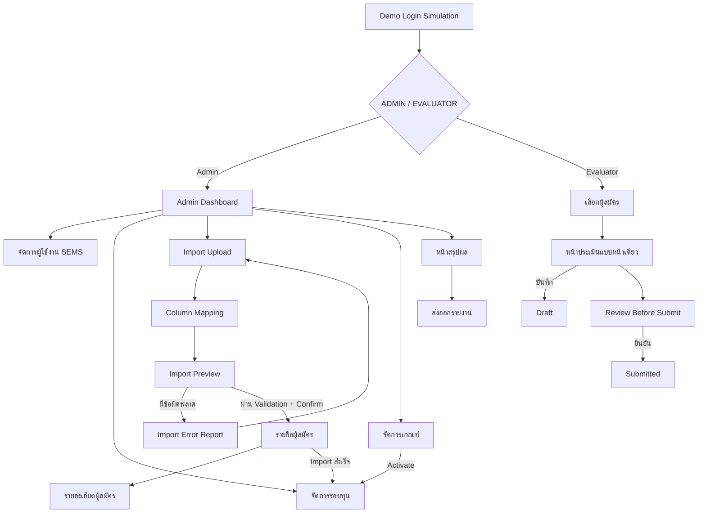

# SEMS Wireframe Specification

| Metadata | Value |
| :--- | :--- |
| Version | **v0.11** |
| Last Updated | **2026-08-05** |
| Author | **SEMS Design Team** |
| Status | **Draft — Phase 3.6 Authentication Invariant Hotfix / Formative Prototype Evaluation** |
| Primary Users | Admin and Evaluator |

[START HERE](../../START_HERE.md) › [Design/UI_UX](./README.md) › SEMS Wireframe Specification

## 1. วัตถุประสงค์

เอกสารชุดนี้ใช้ตรวจสอบโครงสร้างหน้าจอ ลำดับงาน ปริมาณข้อมูล และความสะดวกในการใช้งานก่อนเริ่มพัฒนา Frontend โดยเน้นกระบวนการหลักตั้งแต่ Login, การนำเข้าผู้สมัคร, การกำหนดเกณฑ์, การประเมิน, การสรุปผล และการส่งออกรายงาน

งานนี้ใช้สำหรับ **Stakeholder Review, Prototype Evaluation, Usability Walkthrough และ Formative Evaluation** เท่านั้น ไม่ใช่ Production Implementation และไม่ใช่ Formal UAT

## Prototype Scope Baseline

[`SEMS_MoSCoW_Stakeholder_Summary.md`](../../Requirements/SEMS_MoSCoW_Stakeholder_Summary.md) เป็น Authority สำหรับ Role, Feature Scope, MoSCoW, Release Placement, Confirmation Status, Core Workflow, Pending Decision, Future Release และ Out-of-Scope Boundary เอกสารอื่นใช้ขยายได้เฉพาะ Field, Form, Validation, State, Feedback, Permission, Error Handling, Acceptance Criteria, Business Rule ระดับรายละเอียด และ Requirement ID โดยห้ามเปลี่ยน Scope จาก Stakeholder Summary

- Role ที่ Login ได้มีเฉพาะ `ADMIN` และ `EVALUATOR`
- `SYSTEM` เป็น Validation, Feedback, State Change, Calculation, Security Notice หรือ Audit Notice ไม่ใช่ Role/Account
- นักศึกษาไม่มี Account หรือ Navigation ใน Release 1
- Should-have แสดงเป็น Pending/Disabled/Documentation Only เท่านั้น
- Could-have และ Won't-have ถูก Exclude จาก Interactive Flow

## Stakeholder Summary Coverage Matrix — Baseline with Phase 3 Evidence

| Item | Feature | MoSCoW / Release | Prototype Status | Treatment / Evidence |
|---:|---|---|---|---|
| 1 | Login, Logout และจำกัดสิทธิ์ | Must / R1 | Improved Existing Flow | Demo login, role/hash guard, logout, expired/denied states |
| 2 | จัดการบัญชีและบทบาท | Must / R1 | Implemented in Prototype | `#users`, synthetic identity, role/status actions |
| 3 | สร้าง เตรียม และเปิดรอบทุน | Must / R1 | Improved Existing Flow | Create/Edit Draft, readiness checklist, blocking และ confirmed DRAFT→OPEN |
| 4 | Import และตรวจสอบข้อมูลผู้สมัคร | Must / R1 | Improved Existing Flow | Sample datasets, mapping validation, Preview, all-or-nothing confirmation และ state mutation |
| 5 | จัดการข้อมูลและเอกสารผู้สมัคร | Must / R1 | Improved Existing Flow | Applicant/Application, normal edit, document security states และ Clean-only detail |
| 6 | กำหนด ตรวจสอบ และเปิดใช้ Criteria | Must / R1 | Improved Existing Flow | Draft edit, validation summary, confirmation, Active read-only และ readiness integration |
| 7 | ค้นหาและเลือกผู้สมัคร | Must / R1 | Preserve and Re-verify | Applicant search, duplicate และ 3/3 states |
| 8 | กรอก บันทึก Review และ Submit | Must / R1 | Preserve and Re-verify | Evaluation, Save Draft, Review, Submit, read-only |
| 9 | คำนวณและสรุปคะแนน | Must / R1 | Preserve and Re-verify | Submitted-only, 2/3 และ third-submit recalculation |
| 10 | ตรวจความครบถ้วนและปิดรอบ | Must / R1 | Not Implemented | Existing partial flow; reason/affected-list gap remains |
| 11 | Dashboard และ Export ตามสิทธิ์ | Must / R1 | Not Implemented | Existing partial flow; Excel/filter gap remains |
| 12 | Archive และ Controlled Round Reopen | Should / Pending Release | Pending Decision | Archived detail disabled; no reopen workflow |
| 13 | Controlled Correction/รายการมาตรฐาน | Should / Pending Release | Pending Decision | Disabled and labeled Pending |
| 14 | Cancel Draft | Should / Pending Release | Pending Decision | Excluded from current flow |
| 15 | Reopen Submitted Evaluation | Should / Pending Release | Pending Decision | Notice only; no action/workflow |
| 16 | Dashboard Drill-down/รายงานหลายระดับ | Should / Pending Release | Pending Decision | Detail and advanced lifecycle disabled |
| 17 | Audit Search | Should / Pending Release | Documentation Only | Audit recording shown only as system notice |
| 18 | เครื่องมือลดขั้นตอนซ้ำ | Could / Future | Future Release — Excluded | Excluded |
| 19 | เครื่องมือค้นหา/จดบันทึกสำหรับ Admin | Could / Future | Future Release — Excluded | Excluded |
| 20 | รูปแบบ/ชุดรายงานเพิ่มเติม | Could / Future | Future Release — Excluded | Excluded |
| 21 | เครื่องมือติดตามงานเพิ่มเติม | Could / Future | Future Release — Excluded | Excluded |
| 22 | นักศึกษาสมัครทุน/ดูผลโดยตรง | Won't / Out of Scope | Out of Scope — Excluded | No account/navigation |
| 23 | อนุมัติทุนขั้นสุดท้าย/จ่ายเงิน | Won't / Out of Scope | Out of Scope — Excluded | Excluded |
| 24 | เชื่อมแทนระบบกลาง/ใช้ National ID | Won't / Out of Scope | Out of Scope — Excluded | No National ID or external integration |
| 25 | จัดการรหัสผ่าน KKU | Won't / Out of Scope | Out of Scope — Excluded | No credential/password fields |
| 26 | Native Mobile Application | Won't / Out of Scope | Out of Scope — Excluded | Excluded |
| 27 | Pre-assignment, Interview/Zoom, `.xls` | Won't / Out of Scope | Out of Scope — Excluded | Excluded |

Generic Toast ที่ไม่เปลี่ยน State ไม่เปิดรายละเอียด และไม่แสดง Business Response ไม่นับเป็น Must-have coverage

### Placeholder Classification — Through Phase 3

| Existing control | Classification | Treatment |
|---|---|---|
| Load Mapping Template | Documentation Only | Disabled with reason |
| Configure Continuation Rule | Documentation Only | Rule shown as text; control disabled |
| Upload/Add applicant document | Must Interaction — Implemented | Sample selector changes document/security state |
| Open/view applicant document | Must System State — Implemented | Clean opens Detail; Scanning/Quarantined/Rejected are blocked |
| View all loan/scholarship history | Documentation Only | Existing sample rows shown; control disabled |
| Edit/expand Criteria rows | Must Interaction — Implemented | Draft editor, add/delete, validation and Active read-only |
| Summary filter | Must Interaction — Future Phase | Disabled; Summary Item 11 remains Not Implemented |
| Archive detail | Should — Pending/Disabled | Disabled with Pending label |
| Controlled Correction | Should — Pending/Disabled | Disabled with Pending label |
| Advanced result/report detail | Should — Pending/Disabled | Disabled with Pending label |

Phase 3 แทนที่ Placeholder ของ Item 3–6 ด้วย Business Interaction หรือ System State ที่เปลี่ยน Demo State จริง ไม่มี Generic Toast ใดถูกนับเป็น Feature Coverage ส่วน Item 10–11 ยังคง Disabled/Not Implemented

## Documentation Conflicts — Recorded, Not Resolved

| ID | Conflict | Stakeholder Summary Position | Prototype Treatment |
|---|---|---|---|
| DC-01 | Archive/Controlled Round Reopen ถูกเรียก R1/Must ในเอกสารอื่น | Item 12 Should/Pending | Disabled/Pending |
| DC-02 | Controlled Correction ถูกเรียก R1 control | Item 13 Should/Pending | Disabled/Pending |
| DC-03 | `FR-COD-001` เป็น Must ใน SRS | Item 13 Should/Pending | No confirmed workflow |
| DC-04 | Cancel Draft priority ไม่ตรงกัน | Item 14 Should/Pending | Excluded/Pending |
| DC-05 | Reopen Submitted ถูกเรียก R1 ใน PRD/SRS | Item 15 Should/Pending | Notice only |
| DC-06 | Dashboard Drill-down ถูกเรียก Must/confirmed | Item 16 Should/Pending | Disabled/Pending |
| DC-07 | Advanced Report Lifecycle ถูกเรียก R1 | Item 16 Should/Pending | Disabled/Pending |
| DC-08 | `US-SEL-003` เป็น Should แต่ `FR-EVA-018` เป็น Must | Item 14 Should/Pending | Use Summary |
| DC-09 | `FR-EVA-017/018` ถูกใช้ซ้ำคนละความหมาย | Summary does not resolve IDs | Reference section temporarily |
| DC-10 | `FR-CRI-004` ยัง Open แต่ Decision Register กล่าวไม่มี Critical/High Open | Pending formal review | Do not infer approval |
| DC-11 | `FR-EVA-012` ยัง Open แต่ Item 8 เป็น baseline candidate | Item 8 Confirmed for Baseline Candidate | Preserve flow; no formal-approval claim |
| DC-12 | Traceability เขียน DB key open แต่ `RD-015/024/025` ยืนยันแล้ว | No scope change | Documentation conflict only |
| DC-13 | Traceability เขียน Audit retention open แต่ `RD-030` ยืนยันแล้ว | Audit Search remains Item 17 Pending | Documentation only |
| DC-14 | Wireframe เดิมเรียก Pending features ว่า Confirmed R1 UI behavior | Items 12–17 Pending | Reword and disable |
| DC-15 | Summary Item 1 อ้าง `FR-AUT-001..006` แต่ SRS วาง Logout ที่ `FR-AUT-009` | Logout remains Must | Simulate logout; trace reference pending confirmation |

## Phase 1–2 Demo State Model

Prototype เก็บ fixture และ state แยกทางตรรกะจากการ render ภายในไฟล์ HTML เดิม และไม่ติดต่อระบบภายนอก

| State | ตัวอย่างค่าที่รองรับ |
|---|---|
| Current Role / Scenario | `ADMIN`, `EVALUATOR`; standard/error scenarios |
| Authentication / Session | signed out, authenticated, active, expired, denied |
| User Accounts | synthetic subject, role, Active/Inactive |
| Scholarship Round / Close | Draft/Open/Closed demo state |
| Import | selected, blocking error, ready, imported |
| Applicant / Document | selected synthetic applicant, document status |
| Criteria | version and Draft/Active |
| Evaluation | Draft/Submitted/read-only and saved time |
| Submitted / Calculation | 2/3, 3/3, Minimum/Fully Complete and score |
| Export | idle/exported |

`Reset Demo State` คืน fixture, role/session, navigation, dialog, temporary feedback, Draft, submitted count และ round state โดยไม่แก้ไฟล์หรือเรียก service ภายนอก

### Phase 2.5 — Role, Session and Interaction Stabilization

- Demo Login sync ค่า Role Switcher กับ `ADMIN` หรือ `EVALUATOR`; Logout/Reset คืน control เป็น `ADMIN` โดย Session ยังคง Signed Out
- `clearTemporaryUi()` ปิด dialog, ล้าง pending confirmation/selection/validation/toast และยกเลิก timeout ก่อน Login, Role Switch, Logout, Reset, Session Expired, Permission Denied และ safe redirect
- Add User ใช้ native semantic form, custom validation, prevented submit และ state mutation เดิม
- ปุ่มทุกปุ่มมี explicit `type`; Phase 3 placeholders ถูก disable พร้อม Summary Item และเหตุผล
- Summary Item 7–9 คง Business Rule เดิมและเปลี่ยนเฉพาะ stabilization/accessibility เท่านั้น

### Phase 3 — ADMIN Preparation State and Integration

- `rounds` เก็บ Round แยกตาม `round_id`, รองรับ create/edit Draft, unique code/name, date validation, readiness และ guarded DRAFT→OPEN; Close-round ไม่เปิดใช้
- `importState` เก็บ selected synthetic dataset, processing/mapping/preview/failed/imported state; Error block ทั้ง Batch และ Preview ไม่เปลี่ยน Applicant State
- `applicants` แยก Applicant จาก independent Applications ตาม round/type; Import success เพิ่มข้อมูลสังเคราะห์และอัปเดต Round applicant count
- Document state รองรับ `SCANNING`, `QUARANTINED`, `CLEAN`, `REJECTED`; เฉพาะ `CLEAN` เปิด Prototype Detail ได้
- Criteria state ใช้ Draft items จาก `SEMS_Criteria_Config.json`, ตรวจ required metadata, range, unique code/order และ total 100 ก่อน Activate; Active เป็น read-only
- Scenario fixtures สำหรับ Round, Import, Document และ Criteria ปิด temporary UI, เคารพ Role Guard และคืนค่าได้ด้วย Reset
- `FR-CRI-004` ยังคง Documentation Conflict: Prototype ใช้ `EMBEDDED_POINT` ที่มีอยู่เพื่อสาธิตเท่านั้น ไม่ถือเป็นการอนุมัติ weight rule

### Phase 3.5 — Blocking Fixes and State Integrity

- `validateImportCommitEligibility()` เป็น shared guard ที่ request, confirm และ `commitImport()` เรียกซ้ำ โดยตรวจ ADMIN/session, supported nonempty dataset, validated Preview state, mapping, blocking errors, failed simulation และ duplicate commit
- Documents อยู่ใต้ `applications[].documents[]`; selected Application เป็น context ของ list/upload/detail/security/limit และไม่มี Applicant-level document collection ใน Business Flow
- Criteria `items` เป็น Saved Draft ส่วน `editBuffer` และ `dirty` เป็น Unsaved State; Save เท่านั้นที่ commit, Cancel/route warning ทิ้ง buffer และ Activate ใช้ Saved State เท่านั้น
- Scenario ทุกตัวเริ่มจาก `freshState()` และคงเฉพาะ role/auth/session ที่ปลอดภัย; scenario ที่เลือกก่อน Login จะถูก apply หลัง Demo Login
- Item 11 Export opener และ direct route ถูก block จน Phase 4; handler ไม่สร้าง CSV และไม่เปลี่ยน `exportState`
- Static coverage กับ Browser verification เป็นคนละสถานะ; Item 3–6 ใช้ screen-level `partial` จนจบ Browser walkthrough

### Phase 3.6 — Authentication Invariant and Scenario Catalogue

Business-state handlers ของ Items 3–6 ใช้ `hasActiveDemoAuthorization(requiredRole)` เพื่อตรวจ `authenticationState === 'AUTHENTICATED'`, `sessionState === 'ACTIVE'` และ Role พร้อมกัน โดย Import ตรวจซ้ำก่อนขอ Confirmation, ใน Confirm handler และภายใน Commit อีกชั้นหนึ่ง

| Scenario ID | Required Role | Safe Route | Base Fixture | State Override | Expected Result |
|---|---|---|---|---|---|
| `round-not-ready` | ADMIN | `#rounds` | Fresh Standard fixture | Draft round ไม่มี applicant และ active criteria | Readiness แสดง Not Ready และ Open ถูก block |
| `round-ready` | ADMIN | `#rounds` | Fresh Standard fixture | Draft roundมี application, active criteria และ active evaluator ครบ | Readiness พร้อมสำหรับ confirmation/open simulation |
| `valid-import` | ADMIN | `#upload` | Fresh Standard fixture | เลือก synthetic valid dataset | เริ่ม flow mapping/preview ที่ guard ตรวจได้ |
| `import-error` | ADMIN | `#upload` | Fresh Standard fixture | เลือก synthetic required-field error dataset | Preview แสดง blocking errors และ commit ถูก block |
| `document-scanning` | ADMIN | `#applicant-detail` | Fresh Standard fixture | เลือก Application ที่มีเอกสารสถานะ `SCANNING` | เอกสารเปิดไม่ได้และแสดง security simulation state |
| `document-quarantined` | ADMIN | `#applicant-detail` | Fresh Standard fixture | เลือก Application ที่มีเอกสารสถานะ `QUARANTINED` | เอกสารเปิดไม่ได้และไม่กระทบ Application อื่น |
| `criteria-error` | ADMIN | `#criteria` | Fresh Standard fixture | Draft edit buffer มี validation error | Save/Activate แสดง error และไม่เปลี่ยน Saved/Active state |
| `criteria-ready` | ADMIN | `#criteria` | Fresh Standard fixture | Saved Draft ผ่าน validation | พร้อมขอ activation confirmation โดยยังอยู่ภายใต้ auth guard |

Scenario เป็น Prototype Control เท่านั้น ทุก Scenario เริ่มจาก `freshState()` และไม่เปลี่ยน Role, Scope หรือ Workflow ของระบบจริง

#### Round Readiness Traceability

| Readiness Rule | Classification | Reference | Blocking/Warning | Note |
|---|---|---|---|---|
| ข้อมูลรอบทุน code/name/year/date ครบ | Direct Requirement | `FR-RND-001` | Blocking | ไม่รวม `round.type` ใน direct rule |
| ประเภททุนของรอบ | Prototype Assumption | Phase 3 approved field scope; ไม่มี direct `FR-RND` mapping | Warning | ไม่ Block Open ใน readiness; ต้องยืนยัน model ระหว่าง Round กับ Application type |
| วันที่เริ่มไม่เกินวันที่สิ้นสุด | Direct Requirement | `FR-RND-001..002` | Blocking | Form validation และ readiness ตรวจซ้ำ |
| Active Criteria เชื่อมรอบ | Direct Requirement | `FR-RND-003`, `FR-RND-009` | Blocking | Criteria ต้อง ACTIVE และ ID ตรงรอบ |
| มี Application อย่างน้อยหนึ่งรายการ | Direct Requirement | `FR-RND-009` | Blocking | ใช้ round applicant/application count |
| Active Evaluator อย่างน้อยสองบัญชี | Derived Business Rule | `FR-RND-003` + `RD-001` | Blocking | อนุมานจากข้อมูลจำเป็นต่อการประเมินและ 2–3 distinct active evaluators; ไม่อ้างว่าเป็น direct FR-RND |

### Manifest Coverage Semantics

`prototype_status` และ `coverage_scope: "screen-level"` อธิบายสถานะของหน้าจอหรือ interaction ที่มีอยู่ ไม่ใช่การอนุมัติ Requirement ส่วน `feature_coverage` ใช้ `complete`, `improved`, `preserve-and-reverify` หรือ `partial` แบบ additive สถานะระดับ Feature ยึด Matrix 27 รายการด้านบน: Item 3–6 มี Static Evidence หลัง Phase 3.5 แต่ยังใช้ `partial` เพราะ Browser Verification Pending; Item 10–11 ยังคง `Not Implemented` / Must-have Gap

## 2. หลักการออกแบบ

1. **Desktop-first:** ออกแบบหน้าจอหลักสำหรับความกว้าง 1280-1440 px เนื่องจากงาน Admin และการประเมินต้องดูข้อมูลจำนวนมากพร้อมกัน
2. **Role-based navigation:** เมนูและข้อมูลแตกต่างกันตามบทบาท Admin และ Evaluator
3. **Progressive disclosure:** หน้าเลือกผู้สมัครแสดงข้อมูลขั้นต่ำ ส่วนข้อมูลส่วนบุคคล เอกสาร และข้อมูลละเอียดอ่อนจะแสดงหลังผู้ประเมินเลือกผู้สมัครแล้ว
4. **One-page evaluation:** หน้าประเมินรวมข้อมูลผู้สมัคร เอกสาร ประวัติทุน เกณฑ์ คะแนน และความคิดเห็นไว้ในหน้าเดียว ลดการสลับหลายระบบ
5. **Status always visible:** แสดงสถานะรอบทุน สถานะ Draft/Submitted จำนวนผู้ประเมิน และสถานะผู้สมัครในตำแหน่งที่เห็นได้ง่าย
6. **Safe submission:** การ Submit ต้องผ่านหน้า Review และยืนยันอีกครั้ง พร้อมแจ้งว่าหลังส่งไม่สามารถแก้ไขได้หากไม่มีการ Reopen
7. **Explicit validation:** Import และแบบประเมินต้องแสดงข้อผิดพลาดระดับแถว/ฟิลด์และวิธีแก้ไข
8. **Privacy-aware:** รายการค้นหาของ Evaluator ไม่แสดงข้อมูลอ่อนไหวเกินจำเป็น

## 3. Information Architecture

### Admin

- Dashboard
- ผู้ใช้งาน SEMS
- รอบทุน
- Import ผู้สมัคร
  - Upload
  - Column Mapping
  - Preview
  - Error Report
- ผู้สมัคร
  - รายชื่อ
  - รายละเอียด/เอกสาร
- เกณฑ์คะแนน
- สรุปผล
- ส่งออกรายงาน

### Evaluator

- เลือกผู้สมัคร
- งานประเมินของฉัน
  - Draft
  - Submitted
- หน้าประเมิน
- Review Before Submit

## 4. Screen Flow

## 5. Screen Inventory

| ID | หน้าจอ | บทบาท | เป้าหมายหลัก | Primary Action |
|---|---|---|---|---|
| WF-01 | Login | ทุกบทบาท | ยืนยันตัวตนผ่าน KKU SSO | เข้าสู่ระบบด้วย KKU Account |
| WF-02 | Admin Dashboard | Admin | เห็นภาพรวมรอบทุนและความคืบหน้า | ไปยังรายการที่ต้องดำเนินการ |
| WF-03 | จัดการรอบทุน | Admin | สร้าง/แก้ Draft และตรวจความพร้อม | สร้าง Draft / Readiness / เปิดรอบ |
| WF-04 | Import Upload | Admin | เลือกรอบทุนและอัปโหลด Excel/CSV | อัปโหลดและอ่านไฟล์ |
| WF-05 | Column Mapping | Admin | จับคู่คอลัมน์ไฟล์กับฟิลด์ระบบ | บันทึก Mapping และตรวจสอบ |
| WF-06 | Import Preview | Admin | ตรวจข้อมูลก่อนนำเข้า | ยืนยันนำเข้า |
| WF-07 | Import Error Report | Admin | ดูข้อผิดพลาดและดาวน์โหลดรายงาน | กลับไปแก้ไฟล์ / ดาวน์โหลด Error CSV |
| WF-08 | รายชื่อผู้สมัคร | Admin | ค้นหา กรอง และติดตามสถานะ | เปิดรายละเอียดผู้สมัคร |
| WF-09 | รายละเอียดผู้สมัคร | Admin | ตรวจข้อมูล เอกสาร และประวัติ | อัปโหลดเอกสาร / แก้ข้อมูลที่อนุญาต |
| WF-10 | จัดการเกณฑ์ | Admin | สร้างเกณฑ์และตรวจคะแนนเต็ม | บันทึก/เปิดใช้งานชุดเกณฑ์ |
| WF-11 | เลือกผู้สมัคร | Evaluator | ค้นหาและเริ่มรายการประเมิน | เลือกและเริ่มประเมิน |
| WF-12 | ประเมินแบบหน้าเดียว | Evaluator | ดูข้อมูลพร้อมให้คะแนนต่อเนื่อง | บันทึก Draft / ตรวจสอบก่อนส่ง |
| WF-13 | Review Before Submit | Evaluator | ตรวจคะแนนและความคิดเห็น | ยืนยัน Submit |
| WF-14 | หน้าสรุปผล | Admin | ตรวจคะแนนรายผู้ประเมินและคะแนนสรุป | เปิดรายละเอียดผล / กรองรายการ |
| WF-15 | ส่งออกรายงาน | Admin | เลือกขอบเขตและรูปแบบรายงาน | Export Excel / CSV |
| WF-16 | จัดการผู้ใช้งาน SEMS | Admin | จัดการ Synthetic Identity, Role และ Active/Inactive | เพิ่มบัญชี / เปลี่ยน Role / เปลี่ยนสถานะ |

## 6. Detailed Wireframes

### WF-01 Login

**องค์ประกอบ**
- โลโก้/ชื่อระบบ SEMS
- คำอธิบายสั้นว่าใช้สำหรับ Admin และอาจารย์ผู้ประเมิน
- ปุ่มหลัก “เข้าสู่ระบบด้วย KKU Account”
- ข้อความว่า SEMS ไม่รับหรือจัดเก็บรหัสผ่าน KKU Account
- พื้นที่แสดงข้อผิดพลาด: SSO ไม่พร้อมใช้, ผู้ใช้ไม่มีสิทธิ์, บัญชี SEMS ถูกปิด

**ข้อควรตรวจสอบกับผู้ใช้**
- ต้องการข้อความแนะนำ/ช่องทางติดต่อใครเมื่อเข้าไม่ได้
- ต้องการเลือกภาษาไทย/อังกฤษหรือไม่

### WF-02 Admin Dashboard

**องค์ประกอบ**
- ตัวเลือกรอบทุนปัจจุบันและสถานะ Draft/Open/Closed/Archived
- KPI: ผู้สมัครทั้งหมด, Submitted 0/1/2/3 คน, ครบขั้นต่ำ, ยังไม่ครบขั้นต่ำ
- KPI สถานะ: Not Started, In Progress, Minimum Complete, Fully Complete, Finalized, Closed Incomplete
- ตาราง “รายการที่ต้องดำเนินการ” เช่น Import มี Error, เกณฑ์ยังไม่พร้อม, ผู้สมัครใกล้ปิดรอบแต่ยังไม่ครบ 2 คน
- กราฟใช้เฉพาะผล Submitted

### WF-03 จัดการรอบทุน

**องค์ประกอบ**
- ตารางรอบทุน: รหัส ชื่อ ประเภท ปี ช่วงเวลา จำนวน Application, Criteria Version และสถานะ
- Semantic form สำหรับ Create/Edit Draft พร้อม required, unique code/name และ date validation
- Readiness checklist: metadata/date, Active Criteria, Application อย่างน้อยหนึ่งรายการ และ Active Evaluator accounts
- `Not Ready` block ปุ่ม Open และมี Action ไปหน้าที่แก้ได้; `Ready` ต้องยืนยันก่อน DRAFT→OPEN พร้อม System/Audit notice
- รอบ Open/Closed เดิมเป็น read-only สำหรับ lifecycle ที่อยู่นอก Phase 3; Close-round เป็น Item 10 และ Archive/Reopen เป็น Pending Decision

### WF-04 Import Upload

**องค์ประกอบ**
- Stepper: 1 Upload -> 2 Mapping -> 3 Preview -> 4 Import Result
- เลือกรอบทุนปลายทางและ Sample Dataset: valid, required-field error, unsupported, empty และ failed simulation
- แสดง No File, Selected, Unsupported, Empty, Processing และ Ready for Mapping โดยไม่อ่านไฟล์จริง
- รองรับเฉพาะ `.xlsx`/`.csv` สูงสุด 20 MB ตาม detail reference; `.xls` ถูกปฏิเสธ
- ระบุชัดว่าเป็น Prototype simulation และยังไม่สร้าง Applicant ก่อน Confirm

### WF-05 Column Mapping

**องค์ประกอบ**
- ตาราง Source Column, ตัวอย่างข้อมูล, System Field, Required, Conversion, Status
- Auto-match ชื่อใกล้เคียง เช่น `ชือ` -> `first_name`
- ฟิลด์สำคัญ: student_id, prefix, first_name, last_name, application_date, gpa, phone, email, loan_history, scholarship_history, latitude/longitude
- แสดงฟิลด์ที่ยังไม่ถูก Map และฟิลด์ซ้ำ
- Mapping สำหรับข้อมูลหลายแถว: แถวหลัก + continuation rows ของ กยศ./ทุน
- บันทึก Mapping ใน Demo State; Required missing หรือ duplicate mapping block Preview และ focus จุดผิด

### WF-06 Import Preview

**องค์ประกอบ**
- Summary: total, valid, warning, error และ skipped
- ตาราง Preview แสดง source row, row type, synthetic key, Application, normalized value และ message
- รายการ Conversion เช่น พ.ศ. -> ค.ศ., Trim/NULL, identifier-as-text และ continuation child record
- Confirmation แสดง counts และ All-or-Nothing transaction; Error block ทั้ง Batch ไม่มี Partial Import
- Success เพิ่ม Applicant/Application ใน Demo State และอัปเดต Round Readiness; failed simulation rollback โดยไม่เปลี่ยน Applicant State
- Shared commit guard ตรวจซ้ำก่อนเปิด dialog, ใน confirm handler และภายใน commit; เฉพาะ `PREVIEW_VALID`/`CONFIRMING` ที่ผ่าน role/session/file/mapping/error checks เท่านั้นที่เปลี่ยน Business State

### WF-07 Import Error Report

**องค์ประกอบ**
- สรุป Error Code และจำนวน
- ตาราง Row, Student ID, Column, Value, Error Code, Message, Suggested Fix
- Error ตัวอย่าง: REQUIRED_FIELD_MISSING, INVALID_GPA, INVALID_DATE, DUPLICATE_STUDENT, INVALID_COORDINATE, ORPHAN_CONTINUATION_ROW
- ดาวน์โหลด Error CSV
- กลับไปเลือก Dataset ใหม่; Error CSV เป็นไฟล์สังเคราะห์ที่ไม่มีข้อมูลจริง

### WF-08 รายชื่อผู้สมัคร

**องค์ประกอบ**
- ค้นหา synthetic ID, ชื่อ, สาขา, Scholarship Type/Round และกรองสถานะที่ Requirement รองรับ
- Empty Result และรายการจำนวนเอกสาร
- แยก `Applicant` (บุคคล) จาก `Application` (รายการสมัครตาม round/type) และไม่รวมสถานะข้าม Application
- ไม่มี Summary filter ของ Item 11 ใน Phase 3

### WF-09 รายละเอียดผู้สมัคร

**องค์ประกอบ**
- Header และ panels แยก Applicant identity ออกจาก independent Application cards
- Application card เป็น Document Context selector; list, upload, security state, detail และ limit อ่านจาก `application.documents` ของ Application ที่เลือกเท่านั้น
- Normal Edit ก่อนมี Evaluation ใช้ semantic form, validation, immutable business-key notice, state mutation และ Audit notice
- Controlled Correction ถูก Disabled/Pending และไม่มี Workflow
- Sample Document selector ตรวจ PDF/JPG/PNG และ size; จำลอง Uploaded/Scanning/Clean/Quarantined/Rejected
- Scanning/Quarantined/Rejected block view พร้อมเหตุผล; Clean เปิด dialog ที่แสดง metadata สังเคราะห์โดยไม่มี Storage URL
- File-limit treatment: stored records (`CLEAN`, `SCANNING`, `QUARANTINED`) นับใน 10 files/application; invalid/oversize `REJECTED` แสดง feedback/audit simulation แต่ไม่เพิ่ม Active Document List และไม่นับ limit ตาม RD-038/039. การนับ security-state record เป็น Prototype Assumption ที่ต้องทบทวนก่อน Production design

### WF-10 จัดการเกณฑ์

**องค์ประกอบ**
- ข้อมูลชุดเกณฑ์: รหัส, ชื่อ, เวอร์ชัน, รอบทุน, สถานะ
- Criteria rows: ลำดับ, ชื่อ, คำอธิบาย, min, max, weight, required
- ตัวเลือกคะแนนแบบ Radio/Dropdown ตามเกณฑ์จริง เช่น ค่าเทอม 10/5/0, การนำทุนไปใช้ประโยชน์ 20/15/10/5
- เกณฑ์เชิงข้อความ/จำนวนเงินแยกจากคะแนน เช่น รับทุนต่อเนื่อง, มูลค่าทุนที่สมควรได้รับ, ความเห็นเพิ่มเติม
- Summary: คะแนนเต็มรวม, น้ำหนักรวม, จำนวน Required
- Draft editor รองรับ add/edit/delete, description, range, weight, order, required และ expand/collapse
- Editor clone Saved Draft ไป `editBuffer`; input/add/delete เปลี่ยนเฉพาะ buffer, Cancel/route warning ทิ้ง buffer และ Save Draft จึง commit ไป Saved State
- Validation Summary ตรวจ required metadata, min≤max, unique code/order, nonempty และ total 100
- Activate ใช้ Saved State เท่านั้นและถูก block ขณะมี edit buffer; Valid ต้องยืนยันก่อน Activate, Active เป็น read-only และอัปเดต Round Readiness
- `FR-CRI-004` ยัง Open และ Versioned Code List ยัง Pending; ไม่มี Workflow ที่ตัดสินสองประเด็นนี้

### WF-11 หน้าเลือกผู้สมัครของอาจารย์

**องค์ประกอบ**
- แสดงเฉพาะรอบทุน Open
- ค้นหาด้วยรหัส/ชื่อ/นามสกุล
- ข้อมูลขั้นต่ำ: รหัส, ชื่อ, สาขา, ชั้นปี, จำนวนผู้ประเมิน 0/3-3/3, สถานะ
- ปุ่ม “เริ่มประเมิน” ปิดใช้งานเมื่อ 3/3 หรือเคยเลือกแล้ว
- กรณีเลือกพร้อมกันเกิน 3 คน แสดงข้อความและ Refresh จำนวนล่าสุด
- ส่วน “งานของฉัน” แสดง Draft ที่กลับไปทำต่อได้

### WF-12 หน้าประเมินแบบหน้าเดียว

**Layout ที่แนะนำ (Desktop)**
- คอลัมน์ซ้าย 30%: ข้อมูลพื้นฐาน ค่าใช้จ่าย ครอบครัว กยศ./ทุน
- คอลัมน์กลาง 25%: เอกสารและตัวดูเอกสาร
- คอลัมน์ขวา 45%: เกณฑ์ คะแนน ความคิดเห็น
- Header แบบ Sticky: ชื่อผู้สมัคร, รหัส, สถานะ Draft, เวลาบันทึกล่าสุด
- Footer/Action bar แบบ Sticky: บันทึก Draft, ตรวจสอบก่อนส่ง

**พฤติกรรม**
- คะแนนต้องอยู่ระหว่าง min-max
- Required ที่ยังไม่กรอกมีข้อความกำกับ
- คะแนนรวมรายผู้ประเมินอัปเดตแบบ Preview แต่ Draft ไม่ถูกนำไปสรุปผล
- Manual Save เป็น Core; Autosave เป็น Optional Feature

### WF-13 Review Before Submit

**องค์ประกอบ**
- สรุปคะแนนทุกเกณฑ์และคะแนนรวม
- ความคิดเห็น/คำตอบเชิงข้อความทั้งหมด
- รายการ Warning เช่น คะแนนดุลพินิจสูงแต่ไม่มีเหตุผล (ถ้ามีกฎ)
- Checkbox ยืนยันว่าได้ตรวจสอบข้อมูลแล้ว
- ปุ่มกลับไปแก้ไข และปุ่มยืนยัน Submit
- แจ้งผลกระทบ: หลัง Submit แก้ไม่ได้จนกว่าจะ Reopen

### WF-14 หน้าสรุปผล

**องค์ประกอบ**
- KPI และ Filter ตามรอบทุน สถานะ จำนวน Submitted คะแนน
- ตารางผู้สมัคร: Submitted 0/3-3/3, สถานะ, คะแนนผู้ประเมิน 1-3, คะแนนสรุป
- Drawer/Modal รายละเอียด: รายชื่อผู้ประเมิน คะแนนรายเกณฑ์ คะแนนรวม ความคิดเห็น
- เมื่อผู้ประเมินคนที่ 3 Submit ต้องอัปเดตคะแนนสรุปและสถานะจาก Minimum Complete เป็น Fully Complete
- Closed Incomplete ไม่มีคะแนนสรุปสุดท้าย

### WF-15 หน้าส่งออกรายงาน

**องค์ประกอบ**
- เลือกรอบทุนและรูปแบบ Excel/CSV
- เลือกข้อมูล: สรุปผู้สมัคร, คะแนนรายเกณฑ์, ความคิดเห็น, รายชื่อผู้ประเมิน
- ตัวกรองสถานะและสาขา
- Preview จำนวนแถวและคอลัมน์
- ชื่อไฟล์ที่ระบบจะสร้าง
- ประวัติ Export: ผู้ส่งออก เวลา รูปแบบ ตัวกรอง

### WF-16 จัดการผู้ใช้งาน SEMS

ภาพหน้าจอเลื่อนไป Phase 6 หลัง Interaction เสถียร

**องค์ประกอบ**
- รายการบัญชี SEMS ที่ใช้ Synthetic Identity เท่านั้น
- ค้นหาด้วยชื่อที่ใช้สาธิต, Synthetic Subject หรือ Role
- Role `ADMIN`/`EVALUATOR` และสถานะ Active/Inactive
- เพิ่มบัญชีแบบ Simulation พร้อม validation และ duplicate-subject error
- Confirmation ก่อนเปลี่ยน Role หรือสถานะ
- Success feedback และ System Audit Notice
- Empty result และ reusable Permission Denied state
- ไม่มี Password, Credential, OAuth Client Configuration หรือ Production Identity Data

## 7. Cross-Screen Components

| Component | การใช้งาน |
|---|---|
| Status Badge | Round Status, Evaluation Status, Applicant Status |
| Stepper | Import Flow |
| Filter Bar | Applicant List, Selection, Summary |
| Data Table | รายการข้อมูลหลัก พร้อม Sort/Filter/Pagination |
| Side Drawer | ดูรายละเอียดโดยไม่เสียบริบทจากตาราง |
| Confirmation Modal | Open/Close Round, Submit, Import |
| Inline Validation | Mapping, Import Preview, Evaluation Form |
| Sticky Action Bar | Evaluation และ Review |
| Empty State | ยังไม่มีรอบทุน, ไม่มีผู้สมัคร, ไม่มี Draft |

## 8. Responsive Behavior

- **>= 1280 px:** ใช้ layout เต็ม โดยหน้าประเมิน 3 คอลัมน์
- **1024-1279 px:** หน้าประเมินเหลือ 2 คอลัมน์ และเอกสารเปิดใน Drawer
- **< 1024 px:** รองรับอ่านข้อมูลและกรอกแบบเรียงส่วน แต่ไม่ใช่เป้าหมายหลักสำหรับ UAT รอบแรก

## 9. Accessibility และ Usability

- Label ทุก Form ต้องผูกกับ Input
- ไม่ใช้สีอย่างเดียวสื่อสถานะ ต้องมีข้อความ/ไอคอนร่วม
- Focus state ชัดเจนและใช้งาน Keyboard ได้
- ตารางมี Header และข้อความเมื่อไม่มีข้อมูล
- ปุ่มอันตรายใช้คำกริยาชัดเจน เช่น “ปิดรอบทุน” ไม่ใช้ “ตกลง”
- ข้อผิดพลาดต้องบอกตำแหน่ง สาเหตุ และวิธีแก้
- Prototype controls, user form และ dialog ใหม่ใช้ semantic control, associated label, visible focus และ keyboard navigation
- Native dialog ต้องมี heading, ปุ่มยกเลิก/กลับ และคืนผู้ใช้สู่หน้าที่ได้รับอนุญาตโดยไม่แสดงข้อมูลต้องห้าม
- Disabled Should-have action ต้องมีข้อความหรือ `title` อธิบายว่าเป็น Pending Decision ไม่ใช้สีอย่างเดียว

## 10. Scope-controlled Prototype behavior

| Context | Required behavior |
|---|---|
| Application identity | Admin selects scholarship type; the same student may appear in multiple type-specific applications, each clearly labeled and independently evaluated. |
| Open round | Pre-open panel shows Active Criteria, validation and applicant count. Zero applications is a Blocking Error. Open round import remains available. |
| Correction | Normal pre-evaluation update remains Must detail. Controlled Correction is Summary Item 13 — Pending Decision and is disabled in the current prototype. |
| Evaluation reopen | Summary Item 15 — Pending Decision. Show notice only; do not expose a confirmed workflow. |
| Draft cancellation | Summary Item 14 — Pending Decision. Excluded from the current flow. |
| Close/reopen round | Incomplete close is Must detail. Controlled Round Reopen/Archive detail is Summary Item 12 — Pending Decision and disabled. |
| Scoring | Custom Score accepts integer 0–10; reason appears only outside standard options/config. Custom Amount shows round/type ceiling and requires reason. Neither amount nor general comment appears in the 100-point total. |
| Evaluator isolation | Evaluator sees own Evaluation plus slot count, Submitted count and minimum-completion status only; no peer identity, scores, comments or amount recommendation. |
| Reports | Item 11 remains `Not Implemented` in Phase 3.5. Export opener/direct route are disabled until Phase 4; advanced profiles/snapshot lifecycle remain Summary Item 16 — Pending Decision. |
| Documents | Documents belong to the selected Application. Stored Quarantined/Scanning/Clean records count per Application; rejected invalid/oversize samples are feedback only. View is disabled until Clean. |
| Session | Safe expiry message distinguishes idle/absolute expiry only as needed and sends user to login without rendering protected data. |
| Data minimization | No national-ID field, column, filter, export option or sample value appears in Release 1 screens. |

Audit recording may appear as System Notice; an Audit Search screen is Summary Item 17 — Pending Decision/Documentation Only. Remaining prototype validation is formative usability work, not a Release 1 business-rule decision and not Formal UAT.

## 11. Definition of Done for Wireframe Approval

Wireframe ถือว่าผ่านเมื่อผู้แทน Admin และ Evaluator สามารถทำ Task หลักจากต้นจนจบโดย:

- หาตำแหน่งเมนูและปุ่มหลักได้โดยไม่ต้องอธิบายเกิน 1 ครั้ง
- เข้าใจสถานะ Draft/Submitted และ 0/3-3/3
- ระบุได้ว่าจุดใดเป็นการกระทำย้อนกลับไม่ได้
- พบและเข้าใจ Error ใน Import และแบบประเมิน
- ให้คะแนนความสะดวกเฉลี่ยไม่น้อยกว่า 4.00/5.00 หรือระบุรายการแก้ไขที่ตกลงร่วมกัน

## Related Documents

- Interactive artifact: [HTML Prototype](./SEMS_Wireframe_Prototype.html) and [Wireframe Overview](./SEMS_Wireframe_Overview.png)
- Validation: [Wireframe UAT Checklist](./Wireframe_UAT_Checklist.md), [Master Test Plan](../../Testing/Test_Plans/SEMS_Master_Test_Plan.md) and [SEMS UAT Baseline Checklist](../../Testing/UAT/SEMS_UAT_Baseline_Checklist.md)

## Revision History

| Version | Date | Author | Change |
|---|---|---|---|
| v0.11 | 2026-08-05 | SEMS Design Team | Added the Phase 3.6 authentication invariant, eight-scenario catalogue and retained Item 3–6 partial/browser-pending coverage. |
| v0.10 | 2026-08-05 | SEMS Design Team | Stabilized Phase 3 import commit guards, Application-owned documents, Criteria saved/edit-buffer boundary, deterministic scenarios, Item 11 export boundary, readiness traceability and static-versus-browser coverage status. |
| v0.9 | 2026-08-05 | SEMS Design Team | Added Phase 3 ADMIN preparation flows for Items 3–6, cross-flow state integration, synthetic scenarios and guarded validations while retaining Items 10–11 as gaps and pending features as non-interactive. |
| v0.8 | 2026-08-05 | SEMS Design Team | Stabilized role/session cleanup, disabled misleading Phase 3 placeholders, clarified screen-level manifest status, and documented the semantic Add User form without changing the frozen feature baseline. |
| v0.7 | 2026-08-05 | SEMS Design Team | Froze the 27-item Stakeholder Summary coverage matrix, recorded 15 unresolved documentation conflicts, and specified Phase 1–2 demo state, user management, role/session guards and formative-evaluation terminology. |
| v0.6 | 2026-07-24 | SEMS Documentation Team | เพิ่มและปรับ document navigation |
| v0.5 | 2026-07-24 | SEMS Documentation Team | ปรับภาษาไทยเป็นหลักและทำให้คำศัพท์ทางเทคนิคสอดคล้องกับนโยบายเอกสาร |
| v0.4 | 2026-07-24 | SEMS Design Team | Added direct prototype, overview, test-plan and UAT artifact links while retaining Draft — User Validation status. |
| v0.3 | 2026-07-24 | SEMS Design Team | Added confirmed application, reopen/correction, report, isolation, quarantine, session and data-minimization UI behavior. |
| v1.2 | 2026-07-23 | SEMS Design Team | Aligned Release 1 import file types with SRS/API. |
| v1.1 | 2026-07-23 | SEMS Design Team | Updated wireframe specification for user validation. |

<!-- DOC_NAV_START -->

---

## การนำทางเอกสาร

← ก่อนหน้า: [Design/UI_UX](./README.md) 
↑ หมวดเอกสาร: [Design/UI_UX](./README.md) 
⌂ หน้าหลัก: [START HERE](../../START_HERE.md) 
→ อ่านต่อ: [SEMS Wireframe UAT Checklist](./Wireframe_UAT_Checklist.md)

<!-- DOC_NAV_END -->
