# SEMS Wireframe Specification

| Metadata | Value |
| :--- | :--- |
| Version | **v0.4** |
| Last Updated | **2026-07-24** |
| Author | **SEMS Design Team** |
| Status | **Draft — User Validation** |
| Primary Users | Admin and Evaluator |

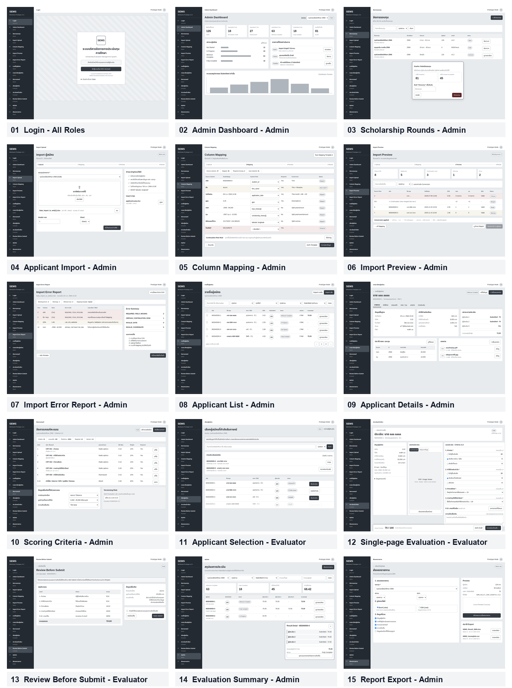

## 1. วัตถุประสงค์

เอกสารชุดนี้ใช้ตรวจสอบโครงสร้างหน้าจอ ลำดับงาน ปริมาณข้อมูล และความสะดวกในการใช้งานก่อนเริ่มพัฒนา Frontend โดยเน้นกระบวนการหลักตั้งแต่ Login, การนำเข้าผู้สมัคร, การกำหนดเกณฑ์, การประเมิน, การสรุปผล และการส่งออกรายงาน

## 2. หลักการออกแบบ

1. **Desktop-first:** ออกแบบหน้าจอหลักสำหรับความกว้าง 1280-1440 px เนื่องจากงาน Admin และการประเมินต้องดูข้อมูลจำนวนมากพร้อมกัน
2. **Role-based navigation:** เมนูและข้อมูลแตกต่างกันตามบทบาท Admin และ Evaluator
3. **Progressive disclosure:** หน้าเลือกผู้สมัครแสดงข้อมูลขั้นต่ำ ส่วนข้อมูลส่วนบุคคล เอกสาร และข้อมูลละเอียดอ่อนจะแสดงหลังผู้ประเมินเลือกผู้สมัครแล้ว
4. **One-page evaluation:** หน้าประเมินรวมข้อมูลผู้สมัคร เอกสาร ประวัติทุน เกณฑ์ คะแนน และความคิดเห็นไว้ในหน้าเดียว ลดการสลับหลายระบบ
5. **Status always visible:** แสดงสถานะรอบทุน สถานะ Draft/Submitted จำนวนผู้ประเมิน และสถานะผู้สมัครในตำแหน่งที่เห็นได้ง่าย
6. **Safe submission:** การ Submit ต้องผ่านหน้า Review และยืนยันอีกครั้ง พร้อมแจ้งว่าหลังส่งไม่สามารถแก้ไขได้หากไม่มีการ Reopen
7. **Explicit validation:** Import และแบบประเมินต้องแสดงข้อผิดพลาดระดับแถว/ฟิลด์และวิธีแก้ไข
8. **Privacy-aware:** รายการค้นหาของ Evaluator ไม่แสดงข้อมูลอ่อนไหวเกินจำเป็น

## 3. Information Architecture

### Admin

- Dashboard
- รอบทุน
- Import ผู้สมัคร
  - Upload
  - Column Mapping
  - Preview
  - Error Report
- ผู้สมัคร
  - รายชื่อ
  - รายละเอียด/เอกสาร
- เกณฑ์คะแนน
- สรุปผล
- ส่งออกรายงาน

### Evaluator

- เลือกผู้สมัคร
- งานประเมินของฉัน
  - Draft
  - Submitted
- หน้าประเมิน
- Review Before Submit

## 4. Screen Flow

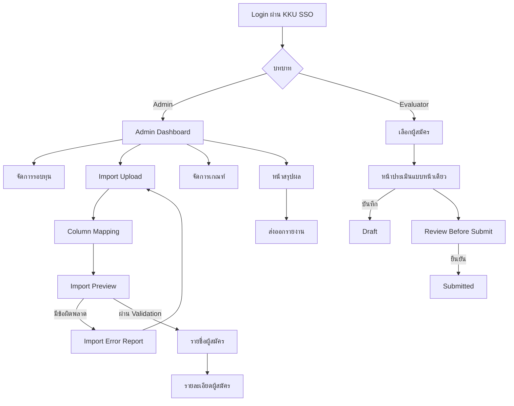
```mermaid
flowchart TD
    L[Login ผ่าน KKU SSO] --> R{บทบาท}
    R -->|Admin| AD[Admin Dashboard]
    AD --> RM[จัดการรอบทุน]
    AD --> IU[Import Upload]
    IU --> CM[Column Mapping]
    CM --> IP[Import Preview]
    IP -->|มีข้อผิดพลาด| ER[Import Error Report]
    ER --> IU
    IP -->|ผ่าน Validation| AL[รายชื่อผู้สมัคร]
    AL --> AP[รายละเอียดผู้สมัคร]
    AD --> CR[จัดการเกณฑ์]
    AD --> RS[หน้าสรุปผล]
    RS --> EX[ส่งออกรายงาน]
    R -->|Evaluator| ES[เลือกผู้สมัคร]
    ES --> EV[หน้าประเมินแบบหน้าเดียว]
    EV -->|บันทึก| DR[Draft]
    EV --> RV[Review Before Submit]
    RV -->|ยืนยัน| SU[Submitted]
```

## 5. Screen Inventory

| ID | หน้าจอ | บทบาท | เป้าหมายหลัก | Primary Action |
|---|---|---|---|---|
| WF-01 | Login | ทุกบทบาท | ยืนยันตัวตนผ่าน KKU SSO | เข้าสู่ระบบด้วย KKU Account |
| WF-02 | Admin Dashboard | Admin | เห็นภาพรวมรอบทุนและความคืบหน้า | ไปยังรายการที่ต้องดำเนินการ |
| WF-03 | จัดการรอบทุน | Admin | สร้าง/แก้ไข/เปลี่ยนสถานะรอบทุน | สร้างรอบทุน / เปิดรอบ / ปิดรอบ |
| WF-04 | Import Upload | Admin | เลือกรอบทุนและอัปโหลด Excel/CSV | อัปโหลดและอ่านไฟล์ |
| WF-05 | Column Mapping | Admin | จับคู่คอลัมน์ไฟล์กับฟิลด์ระบบ | บันทึก Mapping และตรวจสอบ |
| WF-06 | Import Preview | Admin | ตรวจข้อมูลก่อนนำเข้า | ยืนยันนำเข้า |
| WF-07 | Import Error Report | Admin | ดูข้อผิดพลาดและดาวน์โหลดรายงาน | กลับไปแก้ไฟล์ / ดาวน์โหลด Error CSV |
| WF-08 | รายชื่อผู้สมัคร | Admin | ค้นหา กรอง และติดตามสถานะ | เปิดรายละเอียดผู้สมัคร |
| WF-09 | รายละเอียดผู้สมัคร | Admin | ตรวจข้อมูล เอกสาร และประวัติ | อัปโหลดเอกสาร / แก้ข้อมูลที่อนุญาต |
| WF-10 | จัดการเกณฑ์ | Admin | สร้างเกณฑ์และตรวจคะแนนเต็ม | บันทึก/เปิดใช้งานชุดเกณฑ์ |
| WF-11 | เลือกผู้สมัคร | Evaluator | ค้นหาและเริ่มรายการประเมิน | เลือกและเริ่มประเมิน |
| WF-12 | ประเมินแบบหน้าเดียว | Evaluator | ดูข้อมูลพร้อมให้คะแนนต่อเนื่อง | บันทึก Draft / ตรวจสอบก่อนส่ง |
| WF-13 | Review Before Submit | Evaluator | ตรวจคะแนนและความคิดเห็น | ยืนยัน Submit |
| WF-14 | หน้าสรุปผล | Admin | ตรวจคะแนนรายผู้ประเมินและคะแนนสรุป | เปิดรายละเอียดผล / กรองรายการ |
| WF-15 | ส่งออกรายงาน | Admin | เลือกขอบเขตและรูปแบบรายงาน | Export Excel / CSV |

## 6. Detailed Wireframes

### WF-01 Login

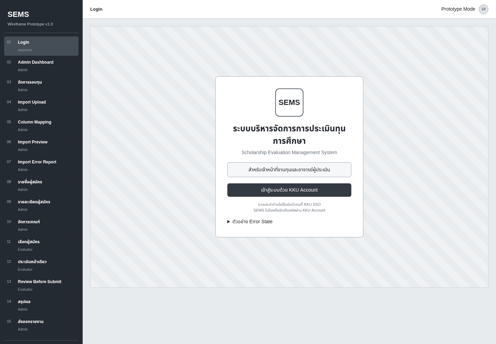

**องค์ประกอบ**
- โลโก้/ชื่อระบบ SEMS
- คำอธิบายสั้นว่าใช้สำหรับ Admin และอาจารย์ผู้ประเมิน
- ปุ่มหลัก “เข้าสู่ระบบด้วย KKU Account”
- ข้อความว่า SEMS ไม่รับหรือจัดเก็บรหัสผ่าน KKU Account
- พื้นที่แสดงข้อผิดพลาด: SSO ไม่พร้อมใช้, ผู้ใช้ไม่มีสิทธิ์, บัญชี SEMS ถูกปิด

**ข้อควรตรวจสอบกับผู้ใช้**
- ต้องการข้อความแนะนำ/ช่องทางติดต่อใครเมื่อเข้าไม่ได้
- ต้องการเลือกภาษาไทย/อังกฤษหรือไม่

### WF-02 Admin Dashboard

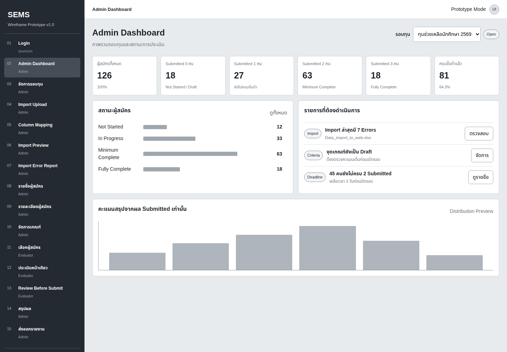

**องค์ประกอบ**
- ตัวเลือกรอบทุนปัจจุบันและสถานะ Draft/Open/Closed/Archived
- KPI: ผู้สมัครทั้งหมด, Submitted 0/1/2/3 คน, ครบขั้นต่ำ, ยังไม่ครบขั้นต่ำ
- KPI สถานะ: Not Started, In Progress, Minimum Complete, Fully Complete, Finalized, Closed Incomplete
- ตาราง “รายการที่ต้องดำเนินการ” เช่น Import มี Error, เกณฑ์ยังไม่พร้อม, ผู้สมัครใกล้ปิดรอบแต่ยังไม่ครบ 2 คน
- กราฟใช้เฉพาะผล Submitted

### WF-03 จัดการรอบทุน

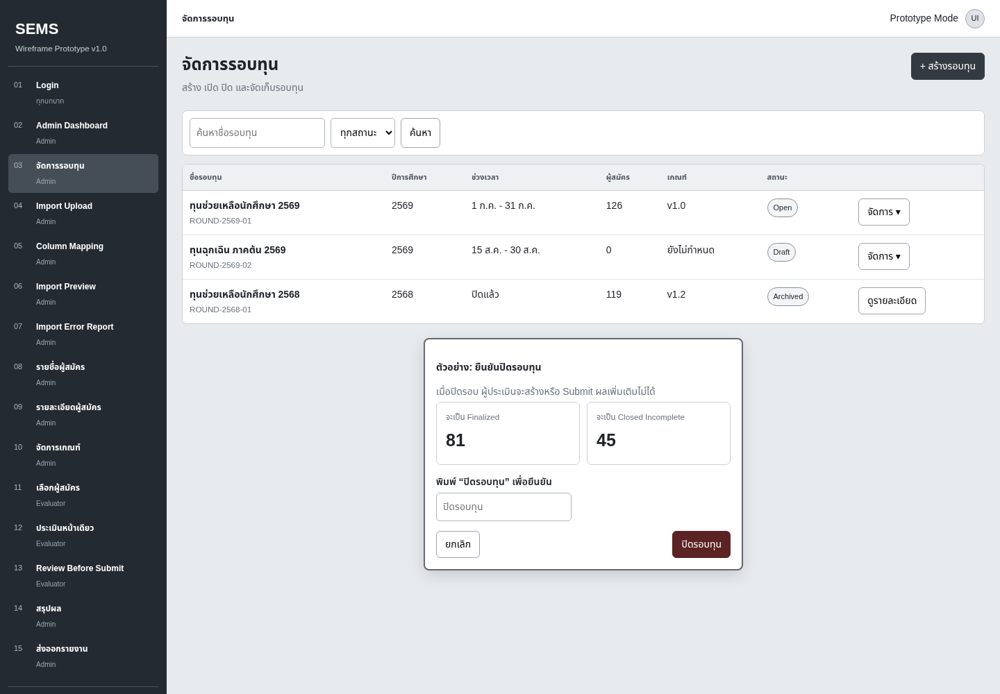

**องค์ประกอบ**
- ตารางรอบทุน: ชื่อ, ปีการศึกษา, วันที่เปิด-ปิด, สถานะ, จำนวนผู้สมัคร, เกณฑ์เวอร์ชัน
- ปุ่มสร้างรอบทุน
- เมนูต่อแถว: แก้ไข, เปิดรอบ, ปิดรอบ, Archive
- Modal ยืนยันการปิดรอบ พร้อมสรุปจำนวน Finalized และ Closed Incomplete
- ปิดการแก้ไข/ลบเมื่อมีผลประเมินแล้วตามกฎระบบ

### WF-04 Import Upload

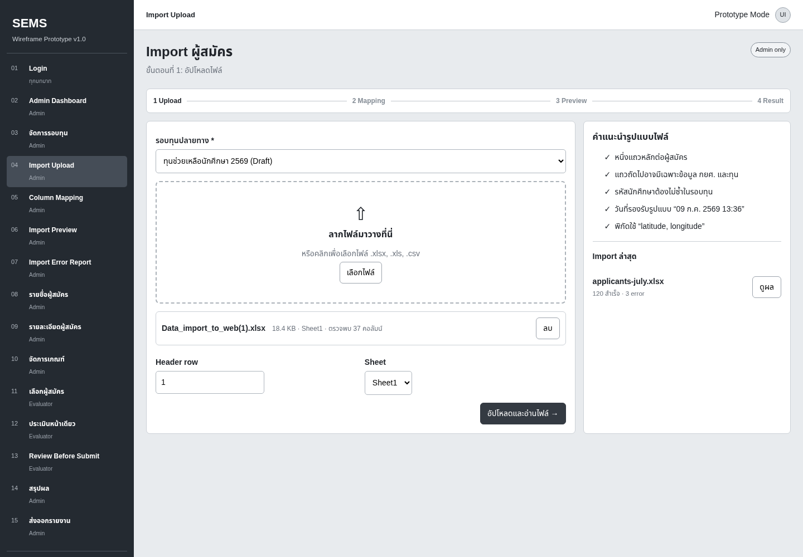

**องค์ประกอบ**
- Stepper: 1 Upload -> 2 Mapping -> 3 Preview -> 4 Import Result
- เลือกรอบทุนปลายทาง
- Drag & Drop รองรับ `.xlsx` และ `.csv` ใน Release 1; `.xls` แสดงเป็น Optional / Out of Scope
- แสดงชื่อไฟล์ ขนาด และ Sheet ที่ตรวจพบ
- ตัวเลือก Header row และ Encoding สำหรับ CSV
- ประวัติ Import ล่าสุด

### WF-05 Column Mapping

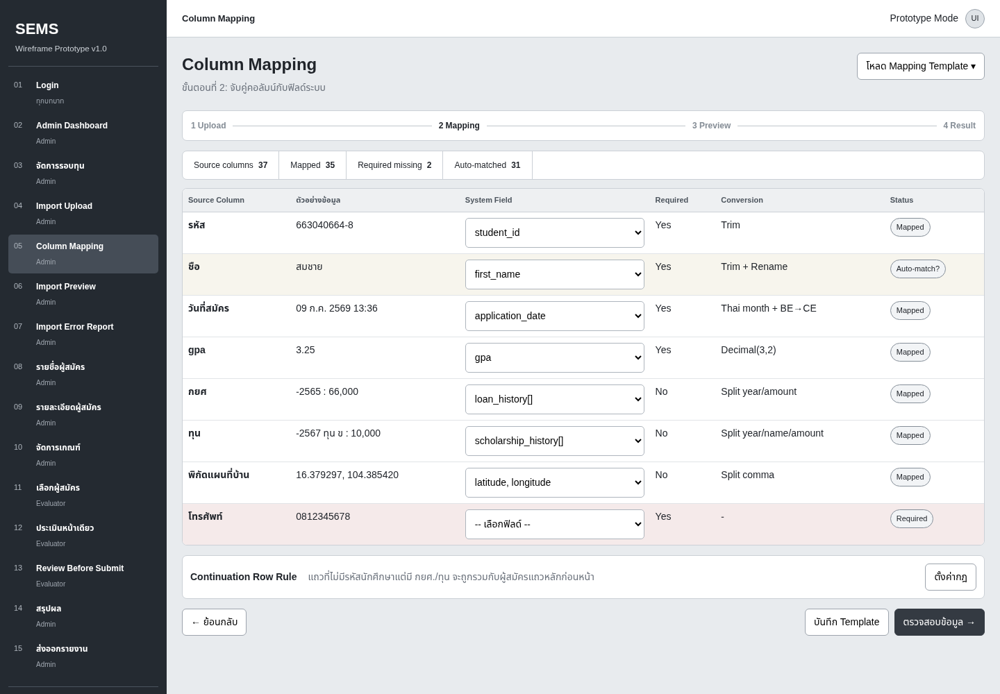

**องค์ประกอบ**
- ตาราง Source Column, ตัวอย่างข้อมูล, System Field, Required, Conversion, Status
- Auto-match ชื่อใกล้เคียง เช่น `ชือ` -> `first_name`
- ฟิลด์สำคัญ: student_id, prefix, first_name, last_name, application_date, gpa, phone, email, loan_history, scholarship_history, latitude/longitude
- แสดงฟิลด์ที่ยังไม่ถูก Map และฟิลด์ซ้ำ
- Mapping สำหรับข้อมูลหลายแถว: แถวหลัก + continuation rows ของ กยศ./ทุน
- บันทึก Mapping Template เพื่อใช้ซ้ำ

### WF-06 Import Preview

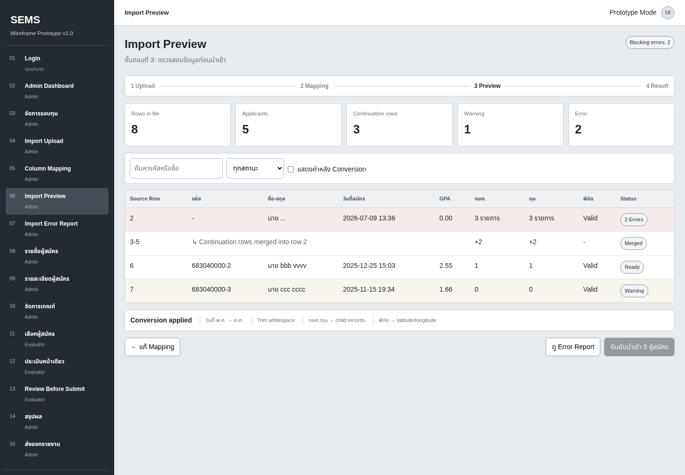

**องค์ประกอบ**
- Summary: แถวในไฟล์, ผู้สมัครที่ตรวจพบ, continuation rows, ผ่าน, warning, error
- ตาราง Preview ที่ตรึงคอลัมน์รหัส/ชื่อ
- Toggle แสดงเฉพาะ Error/Warning
- รายการ Conversion เช่น พ.ศ. -> ค.ศ., Trim, Decimal, แยกพิกัด
- ปุ่มยืนยันนำเข้าเปิดได้เมื่อไม่มี Blocking Error

### WF-07 Import Error Report

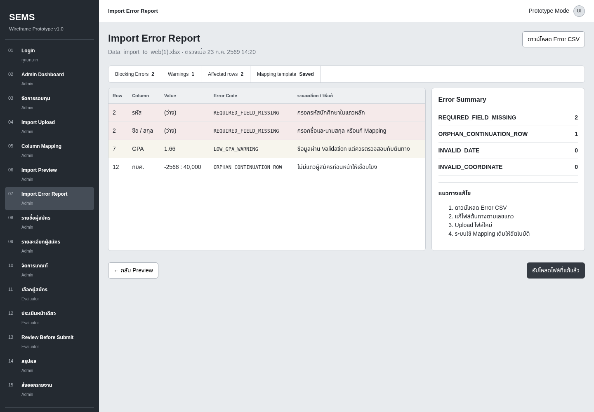

**องค์ประกอบ**
- สรุป Error Code และจำนวน
- ตาราง Row, Student ID, Column, Value, Error Code, Message, Suggested Fix
- Error ตัวอย่าง: REQUIRED_FIELD_MISSING, INVALID_GPA, INVALID_DATE, DUPLICATE_STUDENT, INVALID_COORDINATE, ORPHAN_CONTINUATION_ROW
- ดาวน์โหลด Error CSV
- กลับไป Upload ไฟล์ใหม่ โดยคง Mapping เดิม

### WF-08 รายชื่อผู้สมัคร

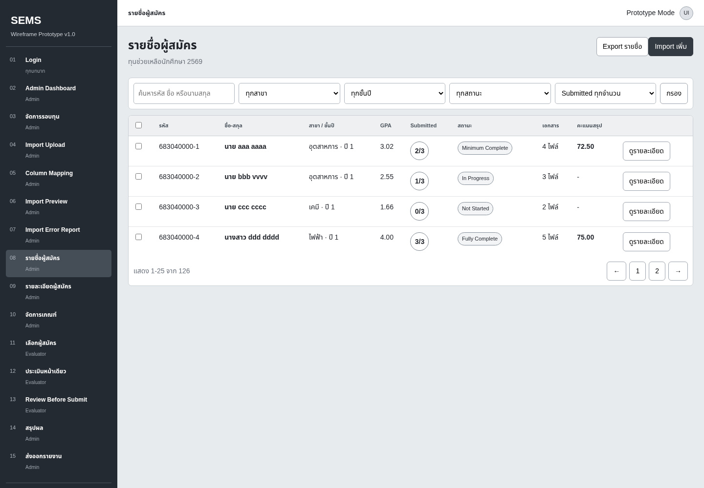

**องค์ประกอบ**
- ค้นหาด้วยรหัส ชื่อ นามสกุล
- กรองสาขา ชั้นปี สถานะ จำนวน Submitted และเอกสารครบ/ไม่ครบ
- ตาราง: รหัส, ชื่อ, สาขา, GPA, ผู้ประเมิน Submitted, สถานะ, เอกสาร, คะแนนสรุป
- คะแนนสรุปแสดงเฉพาะเมื่อ Submitted >= 2
- Bulk action ที่ปลอดภัย เช่น Export รายชื่อ ไม่ใช้แก้คะแนน

### WF-09 รายละเอียดผู้สมัคร

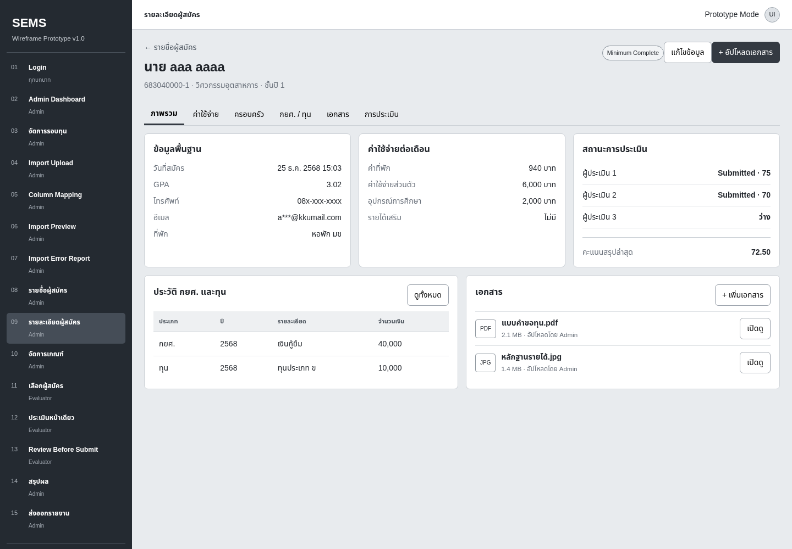

**องค์ประกอบ**
- Header: รหัส ชื่อ สาขา ชั้นปี รอบทุน สถานะ
- Tabs/Sections: ข้อมูลพื้นฐาน, ค่าใช้จ่าย, ครอบครัว, กยศ., ประวัติทุน, เอกสาร, การประเมิน
- เอกสาร PDF/JPG/PNG เปิดดูผ่านระบบตามสิทธิ์
- แสดง Audit metadata ของเอกสาร
- กล่องสถานะผู้ประเมิน 0-3 คนและ Draft/Submitted

### WF-10 จัดการเกณฑ์

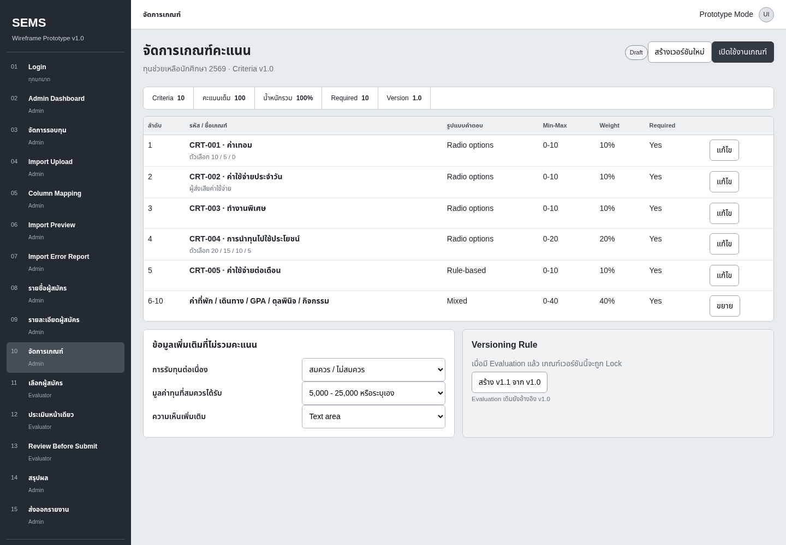

**องค์ประกอบ**
- ข้อมูลชุดเกณฑ์: รหัส, ชื่อ, เวอร์ชัน, รอบทุน, สถานะ
- Criteria rows: ลำดับ, ชื่อ, คำอธิบาย, min, max, weight, required
- ตัวเลือกคะแนนแบบ Radio/Dropdown ตามเกณฑ์จริง เช่น ค่าเทอม 10/5/0, การนำทุนไปใช้ประโยชน์ 20/15/10/5
- เกณฑ์เชิงข้อความ/จำนวนเงินแยกจากคะแนน เช่น รับทุนต่อเนื่อง, มูลค่าทุนที่สมควรได้รับ, ความเห็นเพิ่มเติม
- Summary: คะแนนเต็มรวม, น้ำหนักรวม, จำนวน Required
- Lock เมื่อเริ่มมี Evaluation และใช้ “สร้างเวอร์ชันใหม่” แทนแก้ของเดิม

### WF-11 หน้าเลือกผู้สมัครของอาจารย์

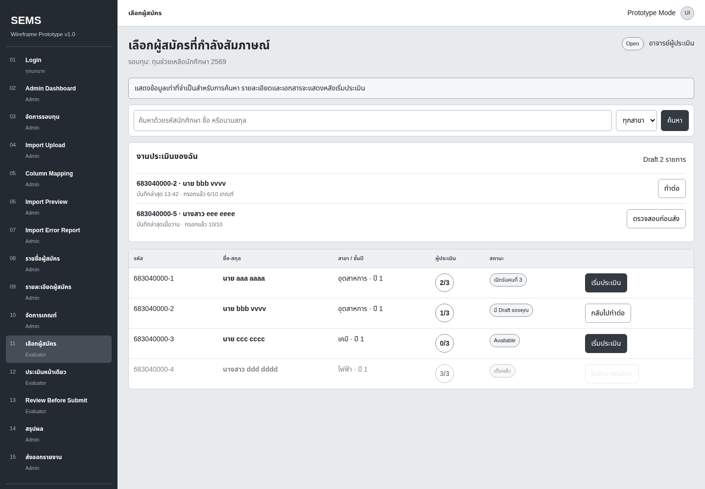

**องค์ประกอบ**
- แสดงเฉพาะรอบทุน Open
- ค้นหาด้วยรหัส/ชื่อ/นามสกุล
- ข้อมูลขั้นต่ำ: รหัส, ชื่อ, สาขา, ชั้นปี, จำนวนผู้ประเมิน 0/3-3/3, สถานะ
- ปุ่ม “เริ่มประเมิน” ปิดใช้งานเมื่อ 3/3 หรือเคยเลือกแล้ว
- กรณีเลือกพร้อมกันเกิน 3 คน แสดงข้อความและ Refresh จำนวนล่าสุด
- ส่วน “งานของฉัน” แสดง Draft ที่กลับไปทำต่อได้

### WF-12 หน้าประเมินแบบหน้าเดียว

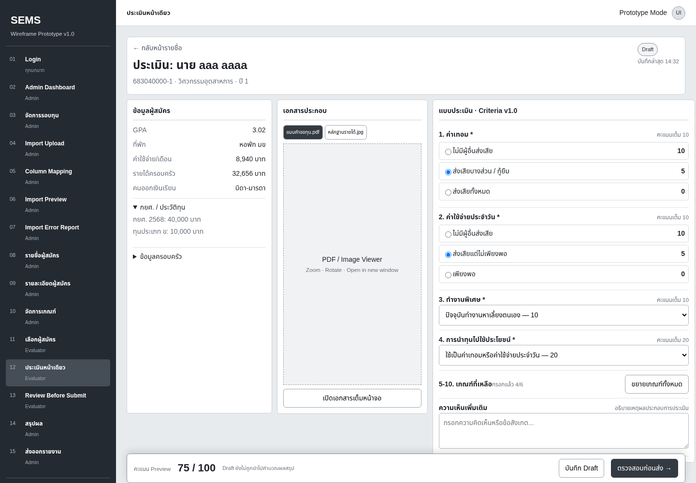

**Layout ที่แนะนำ (Desktop)**
- คอลัมน์ซ้าย 30%: ข้อมูลพื้นฐาน ค่าใช้จ่าย ครอบครัว กยศ./ทุน
- คอลัมน์กลาง 25%: เอกสารและตัวดูเอกสาร
- คอลัมน์ขวา 45%: เกณฑ์ คะแนน ความคิดเห็น
- Header แบบ Sticky: ชื่อผู้สมัคร, รหัส, สถานะ Draft, เวลาบันทึกล่าสุด
- Footer/Action bar แบบ Sticky: บันทึก Draft, ตรวจสอบก่อนส่ง

**พฤติกรรม**
- คะแนนต้องอยู่ระหว่าง min-max
- Required ที่ยังไม่กรอกมีข้อความกำกับ
- คะแนนรวมรายผู้ประเมินอัปเดตแบบ Preview แต่ Draft ไม่ถูกนำไปสรุปผล
- Manual Save เป็น Core; Autosave เป็น Optional Feature

### WF-13 Review Before Submit

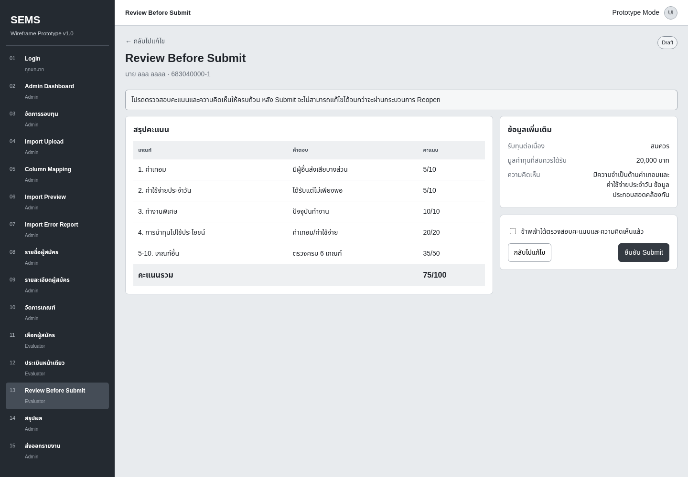

**องค์ประกอบ**
- สรุปคะแนนทุกเกณฑ์และคะแนนรวม
- ความคิดเห็น/คำตอบเชิงข้อความทั้งหมด
- รายการ Warning เช่น คะแนนดุลพินิจสูงแต่ไม่มีเหตุผล (ถ้ามีกฎ)
- Checkbox ยืนยันว่าได้ตรวจสอบข้อมูลแล้ว
- ปุ่มกลับไปแก้ไข และปุ่มยืนยัน Submit
- แจ้งผลกระทบ: หลัง Submit แก้ไม่ได้จนกว่าจะ Reopen

### WF-14 หน้าสรุปผล

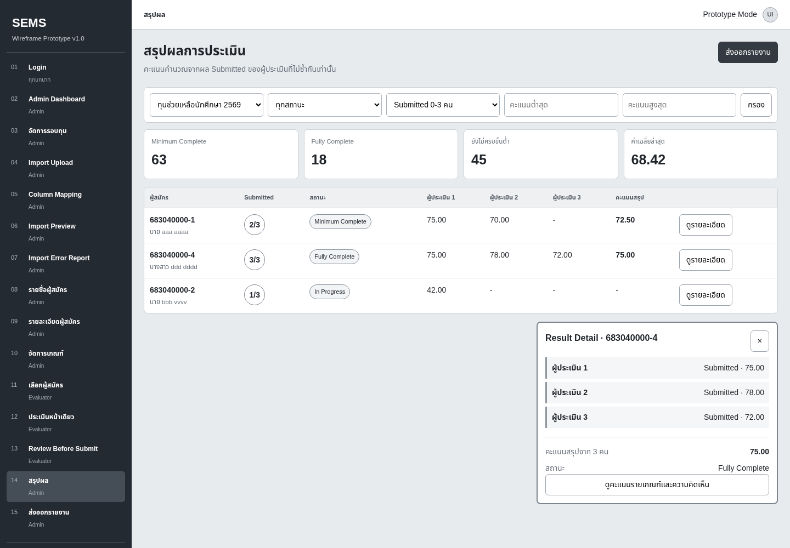

**องค์ประกอบ**
- KPI และ Filter ตามรอบทุน สถานะ จำนวน Submitted คะแนน
- ตารางผู้สมัคร: Submitted 0/3-3/3, สถานะ, คะแนนผู้ประเมิน 1-3, คะแนนสรุป
- Drawer/Modal รายละเอียด: รายชื่อผู้ประเมิน คะแนนรายเกณฑ์ คะแนนรวม ความคิดเห็น
- เมื่อผู้ประเมินคนที่ 3 Submit ต้องอัปเดตคะแนนสรุปและสถานะจาก Minimum Complete เป็น Fully Complete
- Closed Incomplete ไม่มีคะแนนสรุปสุดท้าย

### WF-15 หน้าส่งออกรายงาน

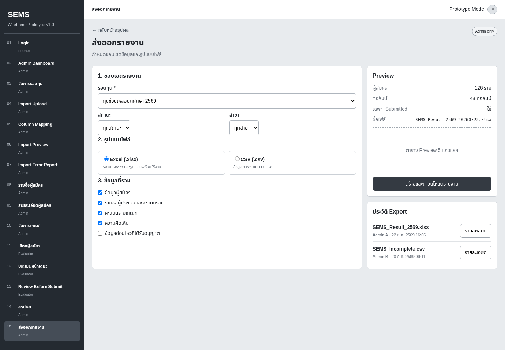

**องค์ประกอบ**
- เลือกรอบทุนและรูปแบบ Excel/CSV
- เลือกข้อมูล: สรุปผู้สมัคร, คะแนนรายเกณฑ์, ความคิดเห็น, รายชื่อผู้ประเมิน
- ตัวกรองสถานะและสาขา
- Preview จำนวนแถวและคอลัมน์
- ชื่อไฟล์ที่ระบบจะสร้าง
- ประวัติ Export: ผู้ส่งออก เวลา รูปแบบ ตัวกรอง

## 7. Cross-Screen Components

| Component | การใช้งาน |
|---|---|
| Status Badge | Round Status, Evaluation Status, Applicant Status |
| Stepper | Import Flow |
| Filter Bar | Applicant List, Selection, Summary |
| Data Table | รายการข้อมูลหลัก พร้อม Sort/Filter/Pagination |
| Side Drawer | ดูรายละเอียดโดยไม่เสียบริบทจากตาราง |
| Confirmation Modal | Open/Close Round, Submit, Import |
| Inline Validation | Mapping, Import Preview, Evaluation Form |
| Sticky Action Bar | Evaluation และ Review |
| Empty State | ยังไม่มีรอบทุน, ไม่มีผู้สมัคร, ไม่มี Draft |

## 8. Responsive Behavior

- **>= 1280 px:** ใช้ layout เต็ม โดยหน้าประเมิน 3 คอลัมน์
- **1024-1279 px:** หน้าประเมินเหลือ 2 คอลัมน์ และเอกสารเปิดใน Drawer
- **< 1024 px:** รองรับอ่านข้อมูลและกรอกแบบเรียงส่วน แต่ไม่ใช่เป้าหมายหลักสำหรับ UAT รอบแรก

## 9. Accessibility และ Usability

- Label ทุก Form ต้องผูกกับ Input
- ไม่ใช้สีอย่างเดียวสื่อสถานะ ต้องมีข้อความ/ไอคอนร่วม
- Focus state ชัดเจนและใช้งาน Keyboard ได้
- ตารางมี Header และข้อความเมื่อไม่มีข้อมูล
- ปุ่มอันตรายใช้คำกริยาชัดเจน เช่น “ปิดรอบทุน” ไม่ใช้ “ตกลง”
- ข้อผิดพลาดต้องบอกตำแหน่ง สาเหตุ และวิธีแก้

## 10. Confirmed Release 1 UI behavior

| Context | Required behavior |
|---|---|
| Application identity | Admin selects scholarship type; the same student may appear in multiple type-specific applications, each clearly labeled and independently evaluated. |
| Open round | Pre-open panel shows Active Criteria, validation and applicant count. Zero applications is a Blocking Error. Open round import remains available. |
| Correction | Normal update is available only before any Evaluation. After Draft/Submitted exists, score-affecting fields route to Controlled Correction with reason, before/after diff and approval status. |
| Evaluation reopen | Owner sees Request Reopen; staff can request on behalf with actor/reason. Head/delegate sees Approve/Reject. Technical requester cannot self-approve. Approved work returns to Draft and shows prior revision read-only. |
| Draft cancellation | Owner confirmation requires reason, explains slot release and states that history is retained. |
| Close/reopen round | Incomplete close modal lists affected applications, warns no Final Score, and requires explicit confirmation/reason. Closed reopen is exceptional; Archived has no reopen action. |
| Scoring | Custom Score accepts integer 0–10; reason appears only outside standard options/config. Custom Amount shows round/type ceiling and requires reason. Neither amount nor general comment appears in the 100-point total. |
| Evaluator isolation | Evaluator sees own Evaluation plus slot count, Submitted count and minimum-completion status only; no peer identity, scores, comments or amount recommendation. |
| Reports | Profile selector offers `INTERNAL_FULL` and `SUMMARY_MASKED`; Excel describes two sheets and CSV two files/optional ZIP. Snapshot history shows Final/Superseded and never offers overwrite/delete. |
| Documents | Status badge shows Quarantined/Scanning/Clean/Rejected/Scanner unavailable. View/download is disabled until Clean. |
| Session | Safe expiry message distinguishes idle/absolute expiry only as needed and sends user to login without rendering protected data. |
| Data minimization | No national-ID field, column, filter, export option or sample value appears in Release 1 screens. |

Remaining wireframe validation is usability only (layout, wording, document side-by-side behavior and autosave), not a Release 1 business-rule decision.

## 11. Definition of Done for Wireframe Approval

Wireframe ถือว่าผ่านเมื่อผู้แทน Admin และ Evaluator สามารถทำ Task หลักจากต้นจนจบโดย:

- หาตำแหน่งเมนูและปุ่มหลักได้โดยไม่ต้องอธิบายเกิน 1 ครั้ง
- เข้าใจสถานะ Draft/Submitted และ 0/3-3/3
- ระบุได้ว่าจุดใดเป็นการกระทำย้อนกลับไม่ได้
- พบและเข้าใจ Error ใน Import และแบบประเมิน
- ให้คะแนนความสะดวกเฉลี่ยไม่น้อยกว่า 4.00/5.00 หรือระบุรายการแก้ไขที่ตกลงร่วมกัน

## Related Documents

- Interactive artifact: [HTML Prototype](./SEMS_Wireframe_Prototype.html) and [Wireframe Overview](./SEMS_Wireframe_Overview.png)
- Validation: [Wireframe UAT Checklist](./Wireframe_UAT_Checklist.md), [Master Test Plan](../../Testing/Test_Plans/SEMS_Master_Test_Plan.md) and [SEMS UAT Baseline Checklist](../../Testing/UAT/SEMS_UAT_Baseline_Checklist.md)

## Revision History

| Version | Date | Author | Change |
|---|---|---|---|
| v0.4 | 2026-07-24 | SEMS Design Team | Added direct prototype, overview, test-plan and UAT artifact links while retaining Draft — User Validation status. |
| v0.3 | 2026-07-24 | SEMS Design Team | Added confirmed application, reopen/correction, report, isolation, quarantine, session and data-minimization UI behavior. |
| v1.2 | 2026-07-23 | SEMS Design Team | Aligned Release 1 import file types with SRS/API. |
| v1.1 | 2026-07-23 | SEMS Design Team | Updated wireframe specification for user validation. |
